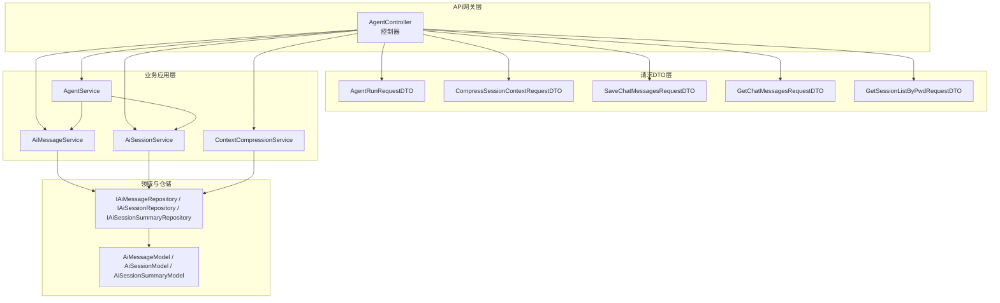
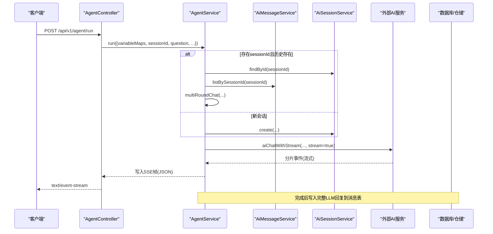
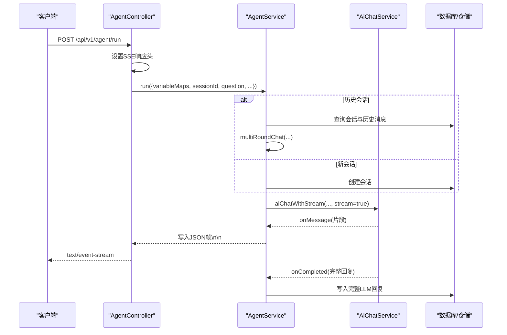
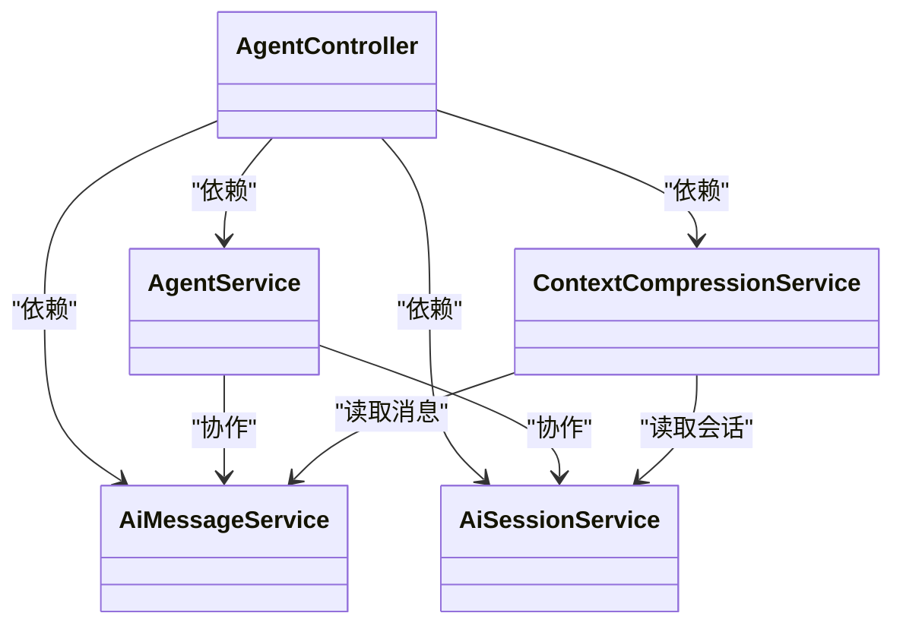

# Agent服务API

<cite>
**本文引用的文件**
- [AgentController.ts](file://src/ApiGateway/aiController/AgentController.ts)
- [AgentRunRequestDTO.ts](file://src/ApiGateway/aiController/RequestDTO/AgentRunRequestDTO.ts)
- [CompressSessionContextRequestDTO.ts](file://src/ApiGateway/aiController/RequestDTO/CompressSessionContextRequestDTO.ts)
- [SaveChatMessagesRequestDTO.ts](file://src/ApiGateway/aiController/RequestDTO/SaveChatMessagesRequestDTO.ts)
- [GetChatMessagesRequestDTO.ts](file://src/ApiGateway/aiController/RequestDTO/GetChatMessagesRequestDTO.ts)
- [GetSessionListByPwdRequestDTO.ts](file://src/ApiGateway/aiController/RequestDTO/GetSessionListByPwdRequestDTO.ts)
- [AgentService.ts](file://src/BussinessLayer/Agent/Application/Service/AgentService.ts)
- [AiMessageService.ts](file://src/BussinessLayer/Agent/Application/Service/AiMessageService.ts)
- [AiSessionService.ts](file://src/BussinessLayer/Agent/Application/Service/AiSessionService.ts)
- [contextCompressionService.ts](file://src/BussinessLayer/AiSummary/Application/service/contextCompressionService.ts)
- [agent.ts](file://src/Helper/Types/agent.ts)
- [chat.ts](file://src/Helper/Types/chat.ts)
- [README.md](file://README.md)
</cite>

## 目录
1. [简介](#简介)
2. [项目结构](#项目结构)
3. [核心组件](#核心组件)
4. [架构总览](#架构总览)
5. [详细组件分析](#详细组件分析)
6. [依赖关系分析](#依赖关系分析)
7. [性能与流式传输特性](#性能与流式传输特性)
8. [故障排查指南](#故障排查指南)
9. [结论](#结论)

## 简介
本文件为 schooberAi 项目中 Agent 服务的 API 文档，覆盖以下端点：
- GET /api/v1/agent/get-chatmessages
- POST /api/v1/agent/save-chatmessages
- POST /api/v1/agent/compress-context
- POST /api/v1/agent/get-session-list-by-pwd
- POST /api/v1/agent/run（SSE 流式 AI 聊天）

文档对每个端点提供 HTTP 方法、URL 路径、请求参数/体、DTO 字段说明、响应格式、错误处理策略与日志记录方式，并重点阐述 /run 端点的 SSE 流式传输机制与客户端处理建议。

## 项目结构
Agent 服务位于 API 网关层与业务层之间，控制器负责接收请求、校验 DTO、调用业务服务；业务服务再与领域模型与仓储交互，最终通过外部 AI 服务完成推理与流式输出。

图表来源
- [AgentController.ts](file://src/ApiGateway/aiController/AgentController.ts#L1-L170)
- [AgentRunRequestDTO.ts](file://src/ApiGateway/aiController/RequestDTO/AgentRunRequestDTO.ts#L1-L75)
- [CompressSessionContextRequestDTO.ts](file://src/ApiGateway/aiController/RequestDTO/CompressSessionContextRequestDTO.ts#L1-L25)
- [SaveChatMessagesRequestDTO.ts](file://src/ApiGateway/aiController/RequestDTO/SaveChatMessagesRequestDTO.ts#L1-L10)
- [GetChatMessagesRequestDTO.ts](file://src/ApiGateway/aiController/RequestDTO/GetChatMessagesRequestDTO.ts#L1-L7)
- [GetSessionListByPwdRequestDTO.ts](file://src/ApiGateway/aiController/RequestDTO/GetSessionListByPwdRequestDTO.ts#L1-L7)
- [AgentService.ts](file://src/BussinessLayer/Agent/Application/Service/AgentService.ts#L1-L294)
- [AiMessageService.ts](file://src/BussinessLayer/Agent/Application/Service/AiMessageService.ts#L1-L191)
- [AiSessionService.ts](file://src/BussinessLayer/Agent/Application/Service/AiSessionService.ts#L1-L133)
- [contextCompressionService.ts](file://src/BussinessLayer/AiSummary/Application/service/contextCompressionService.ts#L1-L177)

章节来源
- [AgentController.ts](file://src/ApiGateway/aiController/AgentController.ts#L1-L170)

## 核心组件
- 控制器：集中暴露 Agent 相关 API，负责参数校验、调用业务服务、统一错误处理与日志记录。
- 业务服务：
  - AgentService：负责会话生命周期管理、消息持久化、多轮对话与流式输出。
  - AiMessageService：负责消息的增删改查、多轮对话消息保存与读取。
  - AiSessionService：负责会话创建、查询与按工作目录筛选。
  - ContextCompressionService：负责会话上下文压缩、摘要生成与存储。
- 类型与工具：
  - AiPrompt、AimessageType：统一消息结构与类型枚举。
  - AiChatInputCommand/AiStreamChatInputCommand：统一推理输入与回调签名。

章节来源
- [AgentService.ts](file://src/BussinessLayer/Agent/Application/Service/AgentService.ts#L1-L294)
- [AiMessageService.ts](file://src/BussinessLayer/Agent/Application/Service/AiMessageService.ts#L1-L191)
- [AiSessionService.ts](file://src/BussinessLayer/Agent/Application/Service/AiSessionService.ts#L1-L133)
- [contextCompressionService.ts](file://src/BussinessLayer/AiSummary/Application/service/contextCompressionService.ts#L1-L177)
- [agent.ts](file://src/Helper/Types/agent.ts#L1-L9)
- [chat.ts](file://src/Helper/Types/chat.ts#L1-L25)

## 架构总览
下图展示 Agent 服务端到端调用链路，从控制器到业务服务再到外部推理服务与数据库。

图表来源
- [AgentController.ts](file://src/ApiGateway/aiController/AgentController.ts#L33-L56)
- [AgentService.ts](file://src/BussinessLayer/Agent/Application/Service/AgentService.ts#L133-L163)
- [AiMessageService.ts](file://src/BussinessLayer/Agent/Application/Service/AiMessageService.ts#L1-L191)
- [AiSessionService.ts](file://src/BussinessLayer/Agent/Application/Service/AiSessionService.ts#L1-L133)

## 详细组件分析

### 端点：GET /api/v1/agent/get-chatmessages
- 方法与路径
  - 方法：GET
  - 路径：/api/v1/agent/get-chatmessages
- 请求参数（Query）
  - sessionId: string（必填）
- 请求体：无
- 响应格式
  - 成功：{
      success: true,
      data: Array,
      message: string
    }
  - 失败：{
      success: false,
      data: null,
      message: string
    }
- 业务逻辑
  - 调用 AiMessageService.getChatMessages(sessionId)，返回多轮对话消息列表。
- 错误处理与日志
  - 统一 try/catch 包裹，失败时记录错误并返回标准失败响应。
- 示例
  - 请求：GET /api/v1/agent/get-chatmessages?sessionId=xxx
  - 成功响应：{"success":true,"data":[],"message":"获取会话消息列表成功"}
  - 失败响应：{"success":false,"data":null,"message":"获取失败: ..."}

章节来源
- [AgentController.ts](file://src/ApiGateway/aiController/AgentController.ts#L120-L143)
- [GetChatMessagesRequestDTO.ts](file://src/ApiGateway/aiController/RequestDTO/GetChatMessagesRequestDTO.ts#L1-L7)
- [AiMessageService.ts](file://src/BussinessLayer/Agent/Application/Service/AiMessageService.ts#L168-L191)

### 端点：POST /api/v1/agent/save-chatmessages
- 方法与路径
  - 方法：POST
  - 路径：/api/v1/agent/save-chatmessages
- 请求参数（Body）
  - sessionId: string（必填）
  - chatMessage: any（必填）
- 请求体结构（DTO）
  - SaveChatMessagesRequestDTO
- 响应格式
  - 成功：{"success":true,"data":null,"message":"历史对话chatmessages保存成功"}
  - 失败：{"success":false,"data":null,"message":"保存失败: ..."}
- 业务逻辑
  - AiMessageService.saveChatMessage(sessionId, chatMessage)；若 msgId 已存在则跳过。
- 错误处理与日志
  - 统一 try/catch 包裹，失败时记录错误并返回标准失败响应。
- 示例
  - 请求体：{"sessionId":"xxx","chatMessage":{"msgId":"...","content":"..."}}
  - 成功响应：{"success":true,"data":null,"message":"历史对话chatmessages保存成功"}

章节来源
- [AgentController.ts](file://src/ApiGateway/aiController/AgentController.ts#L94-L118)
- [SaveChatMessagesRequestDTO.ts](file://src/ApiGateway/aiController/RequestDTO/SaveChatMessagesRequestDTO.ts#L1-L10)
- [AiMessageService.ts](file://src/BussinessLayer/Agent/Application/Service/AiMessageService.ts#L136-L167)

### 端点：POST /api/v1/agent/compress-context
- 方法与路径
  - 方法：POST
  - 路径：/api/v1/agent/compress-context
- 请求参数（Body）
  - sessionId: string（必填）
  - apiKey: string（可选）
- 请求体结构（DTO）
  - CompressSessionContextRequestDTO
- 响应格式
  - 成功：{
      success: true,
      data: {
        sessionId: string,
        lastMessageId: string,
        compressedUsage: any
      },
      message: string
    }
  - 失败：{
      success: false,
      data: null,
      message: string
    }
- 业务逻辑
  - ContextCompressionService.compressSessionContext(sessionId, apiKey)
  - 步骤：查询消息 -> 过滤/格式化 -> 构造用户提示 -> 调用压缩 Agent -> 保存摘要
- 错误处理与日志
  - 统一 try/catch 包裹，失败时记录错误并返回标准失败响应。
- 示例
  - 请求体：{"sessionId":"xxx","apiKey":"sk-..."}
  - 成功响应：{"success":true,"data":{"sessionId":"xxx","lastMessageId":"...","compressedUsage":{...}},"message":"会话上下文压缩成功"}

章节来源
- [AgentController.ts](file://src/ApiGateway/aiController/AgentController.ts#L57-L93)
- [CompressSessionContextRequestDTO.ts](file://src/ApiGateway/aiController/RequestDTO/CompressSessionContextRequestDTO.ts#L1-L25)
- [contextCompressionService.ts](file://src/BussinessLayer/AiSummary/Application/service/contextCompressionService.ts#L1-L177)

### 端点：POST /api/v1/agent/get-session-list-by-pwd
- 方法与路径
  - 方法：POST
  - 路径：/api/v1/agent/get-session-list-by-pwd
- 请求参数（Body）
  - pwd: string（必填）
- 请求体结构（DTO）
  - GetSessionListByPwdRequestDTO
- 响应格式
  - 成功：{"success":true,"data":[],"message":"获取会话列表成功"}
  - 失败：{"success":false,"data":null,"message":"获取失败: ..."}
- 业务逻辑
  - AiSessionService.listByCurPwd(pwd) 返回按当前工作目录筛选的会话列表。
- 错误处理与日志
  - 统一 try/catch 包裹，失败时记录错误并返回标准失败响应。
- 示例
  - 请求体：{"pwd":"/home/user/project"}
  - 成功响应：{"success":true,"data":[],"message":"获取会话列表成功"}

章节来源
- [AgentController.ts](file://src/ApiGateway/aiController/AgentController.ts#L145-L168)
- [GetSessionListByPwdRequestDTO.ts](file://src/ApiGateway/aiController/RequestDTO/GetSessionListByPwdRequestDTO.ts#L1-L7)
- [AiSessionService.ts](file://src/BussinessLayer/Agent/Application/Service/AiSessionService.ts#L75-L89)

### 端点：POST /api/v1/agent/run（SSE 流式 AI 聊天）
- 方法与路径
  - 方法：POST
  - 路径：/api/v1/agent/run
- 请求参数（Body）
  - 参见 AgentRunRequestDTO
- 请求体结构（DTO）
  - AgentRunRequestDTO
- 响应格式
  - Content-Type: text/event-stream
  - 每条数据帧为 JSON 对象，末尾带有两个换行符作为帧分隔符
  - 客户端需逐帧解析 JSON 并拼接内容
- SSE 响应头设置
  - Content-Type: text/event-stream
  - X-Accel-Buffering: no
  - Cache-Control: no-cache
  - Connection: keep-alive
- 业务逻辑
  - 控制器设置 SSE 头并转发到 AgentService.run
  - AgentService.run：
    - 若传入 sessionId 且存在历史会话，则进入多轮对话分支，结合会话摘要与历史消息构造最终提示
    - 否则创建新会话并记录用户输入
    - 调用 AiChatService.aiChatWithStream(stream=true)，在 onMessage 回调中将解析后的片段写入响应流
    - onCompleted 时将完整回复写入消息表
- 错误处理与日志
  - 统一 try/catch 包裹，失败时记录错误并抛出异常
- 客户端处理建议
  - 使用 EventSource 或 fetch + ReadableStream 接收 text/event-stream
  - 解析每帧 JSON，识别 eventType 判断是否为消息片段并拼接 content
  - 监听 close 事件，必要时重连或提示用户
- 示例
  - 请求体（JSON）：参见“请求体结构（DTO）”与“字段说明”
  - 成功响应（SSE 帧）：每帧为 JSON 对象，末尾两个换行作为帧分隔
  - 失败响应：控制器捕获异常并返回标准失败 JSON

图表来源
- [AgentController.ts](file://src/ApiGateway/aiController/AgentController.ts#L33-L56)
- [AgentService.ts](file://src/BussinessLayer/Agent/Application/Service/AgentService.ts#L133-L163)
- [chat.ts](file://src/Helper/Types/chat.ts#L1-L25)

章节来源
- [AgentController.ts](file://src/ApiGateway/aiController/AgentController.ts#L33-L56)
- [AgentRunRequestDTO.ts](file://src/ApiGateway/aiController/RequestDTO/AgentRunRequestDTO.ts#L1-L75)
- [AgentService.ts](file://src/BussinessLayer/Agent/Application/Service/AgentService.ts#L1-L294)
- [chat.ts](file://src/Helper/Types/chat.ts#L1-L25)

## 依赖关系分析
- 控制器依赖注入业务服务，业务服务依赖仓储接口，仓储接口对接具体实现。
- AgentService 与 AiMessageService、AiSessionService 协作，实现会话与消息的全生命周期管理。
- ContextCompressionService 依赖消息仓储与会话摘要仓储，完成上下文压缩与摘要落库。

图表来源
- [AgentController.ts](file://src/ApiGateway/aiController/AgentController.ts#L1-L170)
- [AgentService.ts](file://src/BussinessLayer/Agent/Application/Service/AgentService.ts#L1-L294)
- [AiMessageService.ts](file://src/BussinessLayer/Agent/Application/Service/AiMessageService.ts#L1-L191)
- [AiSessionService.ts](file://src/BussinessLayer/Agent/Application/Service/AiSessionService.ts#L1-L133)
- [contextCompressionService.ts](file://src/BussinessLayer/AiSummary/Application/service/contextCompressionService.ts#L1-L177)

## 性能与流式传输特性
- SSE 流式传输
  - 控制器显式设置响应头以避免缓冲，确保实时性
  - 服务端在 onMessage 中逐帧写入 JSON，客户端按帧消费
- 多轮对话优化
  - 若存在会话摘要，优先使用摘要与最近历史消息，减少上下文长度
  - 历史消息按创建时间排序，避免重复或错序
- 日志与可观测性
  - 关键步骤均记录 info/warn/error 日志，便于定位问题
  - 统一错误包装与返回，便于前端处理

章节来源
- [AgentController.ts](file://src/ApiGateway/aiController/AgentController.ts#L43-L55)
- [AgentService.ts](file://src/BussinessLayer/Agent/Application/Service/AgentService.ts#L200-L247)
- [README.md](file://README.md#L32-L37)

## 故障排查指南
- 常见错误与定位
  - 会话不存在：AiSessionService.findById 返回 null，可能由数据库错误或会话不存在导致
  - 历史消息为空：AiMessageService.listBySessionId 返回空数组，检查 sessionId 是否正确
  - 压缩失败：ContextCompressionService.compressSessionContext 抛出异常，检查消息过滤与压缩 Agent 配置
  - 流式输出中断：检查外部 AI 服务可用性与网络状况
- 日志建议
  - 在控制器与业务服务的关键节点增加日志，包含 sessionId、workerId、消息数量等上下文
  - 对异常进行结构化记录，包含错误堆栈与关键参数快照

章节来源
- [AiSessionService.ts](file://src/BussinessLayer/Agent/Application/Service/AiSessionService.ts#L56-L73)
- [AiMessageService.ts](file://src/BussinessLayer/Agent/Application/Service/AiMessageService.ts#L108-L134)
- [contextCompressionService.ts](file://src/BussinessLayer/AiSummary/Application/service/contextCompressionService.ts#L25-L79)
- [AgentController.ts](file://src/ApiGateway/aiController/AgentController.ts#L94-L168)

## 结论
本 API 文档梳理了 Agent 服务的五个核心端点，明确了请求/响应结构、业务流程与错误处理策略。其中 /run 端点采用 SSE 实现流式输出，客户端需按帧解析 JSON 并处理事件类型。建议在生产环境加强超时控制、重试与断线重连策略，并完善监控与告警。