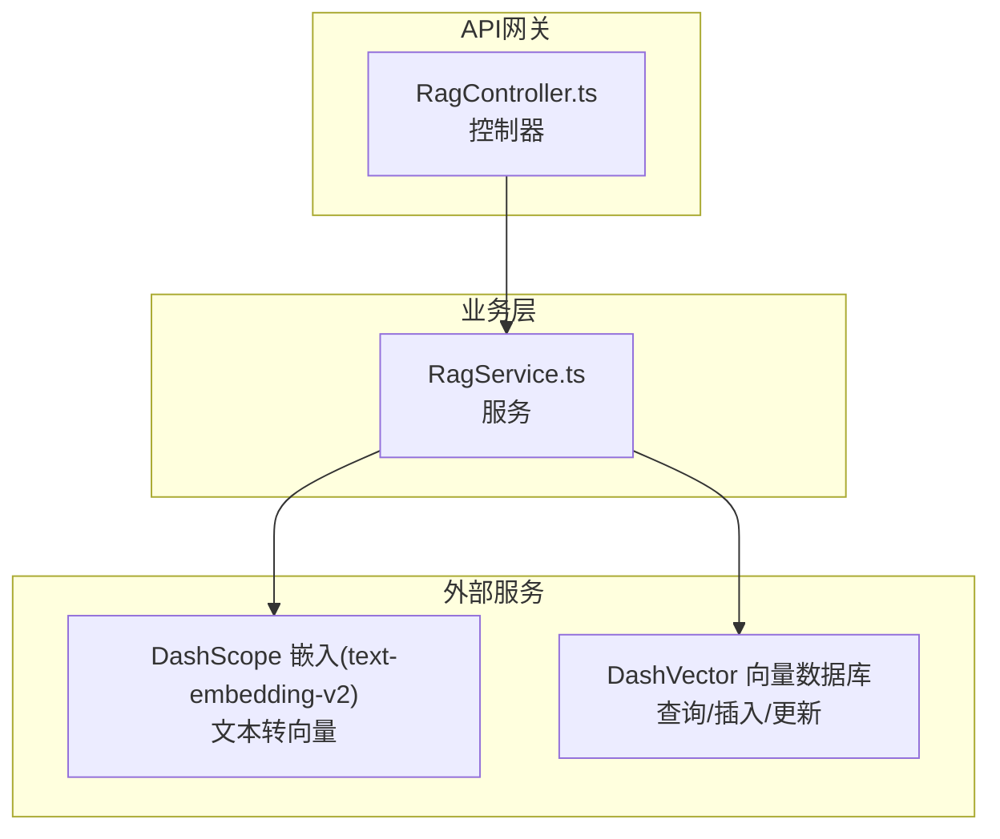
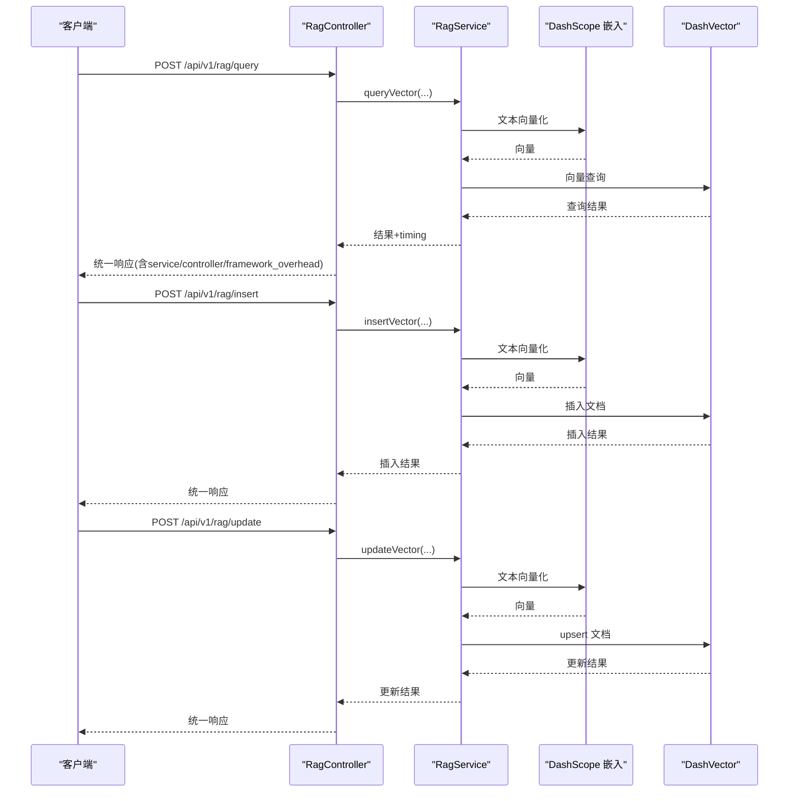
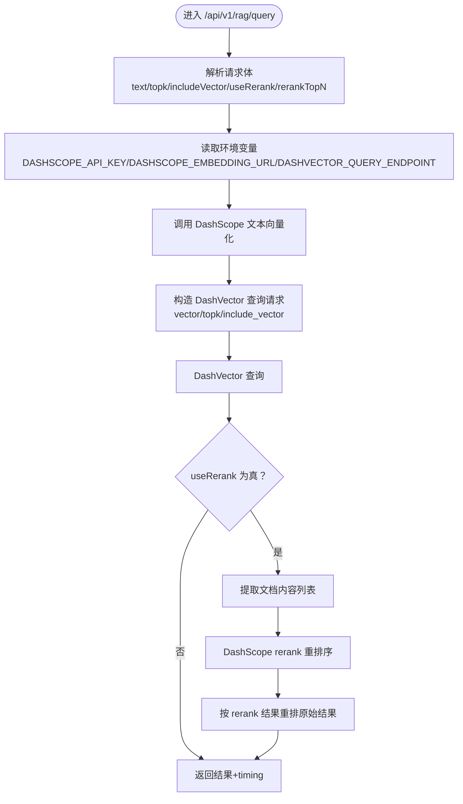
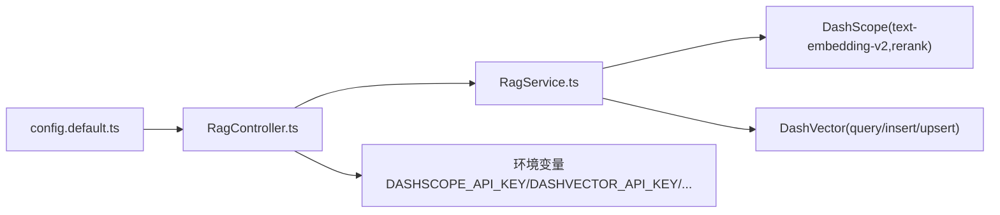

# RAG服务API

<cite>
**本文引用的文件**
- [RagController.ts](file://src/ApiGateway/controller/RagController.ts)
- [RagQueryRequestDTO.ts](file://src/ApiGateway/controller/RequestDTO/RagQueryRequestDTO.ts)
- [RagInsertRequestDTO.ts](file://src/ApiGateway/controller/RequestDTO/RagInsertRequestDTO.ts)
- [RagUpdateRequestDTO.ts](file://src/ApiGateway/controller/RequestDTO/RagUpdateRequestDTO.ts)
- [RagService.ts](file://src/BussinessLayer/Rag/Application/service/RagService.ts)
- [README.md](file://README.md)
- [config.default.ts](file://src/config/config.default.ts)
- [README.zh-CN.md](file://README.zh-CN.md)
</cite>

## 目录
1. [简介](#简介)
2. [项目结构](#项目结构)
3. [核心组件](#核心组件)
4. [架构总览](#架构总览)
5. [详细组件分析](#详细组件分析)
6. [依赖关系分析](#依赖关系分析)
7. [性能考量](#性能考量)
8. [故障排查指南](#故障排查指南)
9. [结论](#结论)
10. [附录](#附录)

## 简介
本文件为 schooberAi 项目中 RAG 服务的 API 文档，覆盖以下三个核心端点：
- POST /api/v1/rag/query：RAG 查询接口，支持 topk 控制返回数量、includeVector 是否包含向量、useRerank 启用重排序以及 rerankTopN 参数。
- POST /api/v1/rag/insert：向量插入接口，将文本向量化后写入 DashVector。
- POST /api/v1/rag/update：向量更新接口，按 docId 更新或插入（Upsert）。

文档还说明了各接口的请求体结构、响应模式、性能统计字段含义、环境变量的作用与配置方式，以及 curl 示例。

## 项目结构
RAG 服务由控制器层与业务层组成，控制器负责接收请求、解析 DTO、读取环境变量并调用服务层；服务层封装 DashScope 嵌入与 DashVector 查询/插入/更新逻辑。

图表来源
- [RagController.ts](file://src/ApiGateway/controller/RagController.ts#L1-L181)
- [RagService.ts](file://src/BussinessLayer/Rag/Application/service/RagService.ts#L1-L385)

章节来源
- [RagController.ts](file://src/ApiGateway/controller/RagController.ts#L1-L181)
- [RagService.ts](file://src/BussinessLayer/Rag/Application/service/RagService.ts#L1-L385)

## 核心组件
- 控制器：提供三个 HTTP POST 端点，分别对应查询、插入与更新；负责读取环境变量、记录日志与性能统计、组装统一响应。
- 请求 DTO：严格定义请求体字段类型与默认值，便于前端与测试校验。
- 服务层：封装 DashScope 文本向量化与 DashVector 的查询/插入/更新调用，支持可选的 rerank 重排序。

章节来源
- [RagController.ts](file://src/ApiGateway/controller/RagController.ts#L1-L181)
- [RagQueryRequestDTO.ts](file://src/ApiGateway/controller/RequestDTO/RagQueryRequestDTO.ts#L1-L51)
- [RagInsertRequestDTO.ts](file://src/ApiGateway/controller/RequestDTO/RagInsertRequestDTO.ts#L1-L21)
- [RagUpdateRequestDTO.ts](file://src/ApiGateway/controller/RequestDTO/RagUpdateRequestDTO.ts#L1-L19)
- [RagService.ts](file://src/BussinessLayer/Rag/Application/service/RagService.ts#L1-L385)

## 架构总览
下图展示从客户端到控制器、服务层再到外部服务的完整调用链路。

图表来源
- [RagController.ts](file://src/ApiGateway/controller/RagController.ts#L1-L181)
- [RagService.ts](file://src/BussinessLayer/Rag/Application/service/RagService.ts#L1-L385)

## 详细组件分析

### /api/v1/rag/query 查询接口
- 方法与路径：POST /api/v1/rag/query
- 请求体结构（基于 RagQueryRequestDTO）：
  - text: string（必填）
  - topk: number（可选，默认值见 DTO）
  - includeVector: boolean（可选，默认值见 DTO）
  - useRerank: boolean（可选，默认值见 DTO）
  - rerankTopN: number（可选，当 useRerank 为真时生效）
- 响应模式：
  - success: boolean
  - data: 包含查询结果与性能统计
    - query: string
    - topk: number
    - results: array（查询结果列表）
    - total: number（返回条数）
    - timing: 对象，包含 vectorization、query、rerank、total 等字段
    - rerank_enabled: boolean
    - dashvectorResponse: 原始 DashVector 查询响应
    - 新增 timing 字段补充：
      - service: number（服务层耗时）
      - controller: number（控制器总耗时，含框架开销）
      - framework_overhead: number（框架开销）
  - message: string
- 高级功能说明：
  - topk：控制返回最相似的结果数量。
  - includeVector：是否返回向量数据。
  - useRerank：是否启用 rerank 重排序；若启用，会调用 DashScope 的 rerank 模型对结果进行二次排序。
  - rerankTopN：当 useRerank 为真时，指定 rerank 返回的 Top N 数量。
- 性能统计字段含义：
  - vectorization：文本向量化耗时（毫秒）
  - query：DashVector 查询耗时（毫秒）
  - rerank：rerank 重排序耗时（毫秒，仅 useRerank 为真时出现）
  - total：服务层总耗时（毫秒）
  - service：服务层总耗时（毫秒）
  - controller：控制器总耗时（毫秒，含框架开销）
  - framework_overhead：框架开销（毫秒）
- curl 示例：
  - 基本查询（返回前 10 条，不包含向量，不启用 rerank）
    - curl -X POST http://localhost:7001/api/v1/rag/query -H "Content-Type: application/json" -d '{"text":"如何使用向量数据库","topk":10}'
  - 启用 rerank（返回前 5 条 rerank 结果）
    - curl -X POST http://localhost:7001/api/v1/rag/query -H "Content-Type: application/json" -d '{"text":"如何使用向量数据库","topk":10,"useRerank":true,"rerankTopN":5}'
- 环境变量：
  - DASHSCOPE_API_KEY：DashScope 文本向量化与 rerank 所需的 API Key。
  - DASHSCOPE_EMBEDDING_URL：可选，自定义 DashScope 嵌入接口地址。
  - DASHVECTOR_QUERY_ENDPOINT：可选，自定义 DashVector 查询端点。
- 错误处理：
  - 控制器捕获异常并返回统一错误响应，包含 success=false、data=null、message 为错误信息。

章节来源
- [RagController.ts](file://src/ApiGateway/controller/RagController.ts#L18-L95)
- [RagQueryRequestDTO.ts](file://src/ApiGateway/controller/RequestDTO/RagQueryRequestDTO.ts#L1-L51)
- [RagService.ts](file://src/BussinessLayer/Rag/Application/service/RagService.ts#L185-L308)

### /api/v1/rag/insert 插入接口
- 方法与路径：POST /api/v1/rag/insert
- 请求体结构（基于 RagInsertRequestDTO）：
  - text: string（必填）
  - docId: string（可选；若不提供，服务层会自动生成 UUID）
- 响应模式：
  - success: boolean
  - data: 对象
    - docId: string（实际使用的文档 ID）
    - vectorDimension: number（向量维度）
    - text: string（原始文本）
    - timestamp: string（ISO 时间戳）
    - dashvectorResponse: 原始 DashVector 插入响应
  - message: string
- 语义说明：
  - docId 的语义：用于标识向量文档；若请求未提供，服务层会自动生成一个唯一 ID 并返回。
- curl 示例：
  - 不传 docId（自动生成）
    - curl -X POST http://localhost:7001/api/v1/rag/insert -H "Content-Type: application/json" -d '{"text":"这是一段需要向量化存储的文本内容"}'
  - 指定 docId
    - curl -X POST http://localhost:7001/api/v1/rag/insert -H "Content-Type: application/json" -d '{"text":"这是一段需要向量化存储的文本内容","docId":"custom_doc_id"}'
- 环境变量：
  - DASHVECTOR_API_KEY：DashVector 写入所需的认证密钥。
  - DASHSCOPE_API_KEY：DashScope 文本向量化所需 API Key。
  - DASHSCOPE_EMBEDDING_URL：可选，自定义嵌入接口地址。
  - DASHVECTOR_ENDPOINT：可选，自定义 DashVector 插入端点。
- 错误处理：
  - 控制器捕获异常并返回统一错误响应。

章节来源
- [RagController.ts](file://src/ApiGateway/controller/RagController.ts#L97-L137)
- [RagInsertRequestDTO.ts](file://src/ApiGateway/controller/RequestDTO/RagInsertRequestDTO.ts#L1-L21)
- [RagService.ts](file://src/BussinessLayer/Rag/Application/service/RagService.ts#L116-L183)

### /api/v1/rag/update 更新接口
- 方法与路径：POST /api/v1/rag/update
- 请求体结构（基于 RagUpdateRequestDTO）：
  - docId: string（必填）
  - text: string（必填）
- 响应模式：
  - success: boolean
  - data: 对象
    - docId: string（更新/插入的文档 ID）
    - vectorDimension: number（向量维度）
    - text: string（原始文本）
    - timestamp: string（ISO 时间戳）
    - dashvectorResponse: 原始 DashVector upsert 响应
  - message: string
- 语义说明：
  - docId 的语义：作为更新键；若该 ID 已存在则更新，否则插入新文档（Upsert 行为）。
- curl 示例：
  - 更新现有 docId
    - curl -X POST http://localhost:7001/api/v1/rag/update -H "Content-Type: application/json" -d '{"docId":"existing_doc_id","text":"这是更新后的文本内容"}'
- 环境变量：
  - DASHVECTOR_API_KEY：DashVector upsert 所需认证密钥。
  - DASHSCOPE_API_KEY：DashScope 文本向量化所需 API Key。
  - DASHSCOPE_EMBEDDING_URL：可选，自定义嵌入接口地址。
  - DASHVECTOR_UPSERT_ENDPOINT：可选，自定义 DashVector upsert 端点。
- 错误处理：
  - 控制器捕获异常并返回统一错误响应。

章节来源
- [RagController.ts](file://src/ApiGateway/controller/RagController.ts#L139-L179)
- [RagUpdateRequestDTO.ts](file://src/ApiGateway/controller/RequestDTO/RagUpdateRequestDTO.ts#L1-L19)
- [RagService.ts](file://src/BussinessLayer/Rag/Application/service/RagService.ts#L310-L383)

### 数据流与处理逻辑（查询流程）

图表来源
- [RagController.ts](file://src/ApiGateway/controller/RagController.ts#L18-L95)
- [RagService.ts](file://src/BussinessLayer/Rag/Application/service/RagService.ts#L185-L308)

## 依赖关系分析
- 控制器依赖服务层：
  - RagController 在三个端点中注入 RagService 并调用其方法。
- 服务层依赖外部服务：
  - RagService 调用 DashScope 的文本向量化与 rerank 接口。
  - RagService 调用 DashVector 的查询、插入与 upsert 接口。
- 环境变量：
  - DASHSCOPE_API_KEY：DashScope 文本向量化与 rerank。
  - DASHVECTOR_API_KEY：DashVector 写入/查询/更新。
  - DASHSCOPE_EMBEDDING_URL：可选，自定义嵌入接口。
  - DASHVECTOR_ENDPOINT/DASHVECTOR_QUERY_ENDPOINT/DASHVECTOR_UPSERT_ENDPOINT：可选，自定义 DashVector 端点。
- CORS 与跨域：
  - 项目配置允许跨域访问，便于前端或本地调试。

图表来源
- [RagController.ts](file://src/ApiGateway/controller/RagController.ts#L1-L181)
- [RagService.ts](file://src/BussinessLayer/Rag/Application/service/RagService.ts#L1-L385)
- [config.default.ts](file://src/config/config.default.ts#L1-L40)

章节来源
- [RagController.ts](file://src/ApiGateway/controller/RagController.ts#L1-L181)
- [RagService.ts](file://src/BussinessLayer/Rag/Application/service/RagService.ts#L1-L385)
- [config.default.ts](file://src/config/config.default.ts#L1-L40)

## 性能考量
- 性能统计字段：
  - vectorization：文本向量化耗时（毫秒）
  - query：DashVector 查询耗时（毫秒）
  - rerank：rerank 重排序耗时（毫秒，仅 useRerank 为真时出现）
  - total：服务层总耗时（毫秒）
  - service：服务层总耗时（毫秒）
  - controller：控制器总耗时（毫秒，含框架开销）
  - framework_overhead：框架开销（毫秒）
- 影响因素：
  - 文本长度与 token 上限（DashScope 模型限制）
  - topk 值越大，查询与 rerank 成本越高
  - useRerank 会增加一次 rerank 调用，带来额外耗时
- 优化建议：
  - 合理设置 topk 与 rerankTopN
  - 控制单次查询文本长度，避免超限
  - 在生产环境配置合适的 DashVector 端点与 DashScope URL

章节来源
- [RagController.ts](file://src/ApiGateway/controller/RagController.ts#L45-L95)
- [RagService.ts](file://src/BussinessLayer/Rag/Application/service/RagService.ts#L185-L308)

## 故障排查指南
- 常见错误与定位：
  - DashScope 文本向量化失败：检查 DASHSCOPE_API_KEY 是否正确配置，确认 DashScope 服务已开通且可用。
  - DashVector 写入/查询/更新失败：检查 DASHVECTOR_API_KEY 是否正确配置，确认 DashVector 集合名称与端点正确。
  - rerank 返回格式异常：确认 DashScope rerank 返回结构符合预期。
- 日志与响应：
  - 控制器与服务层均记录详细日志，包括耗时统计与关键参数。
  - 统一响应包含 success、data、message；错误时 data 为 null，message 为错误描述。
- 环境变量配置：
  - 在项目根目录创建 .env 或通过系统环境变量设置以下键：
    - DASHVECTOR_API_KEY
    - DASHSCOPE_API_KEY
    - DASHSCOPE_EMBEDDING_URL（可选）
    - DASHVECTOR_ENDPOINT（可选）
    - DASHVECTOR_QUERY_ENDPOINT（可选）
    - DASHVECTOR_UPSERT_ENDPOINT（可选）

章节来源
- [RagController.ts](file://src/ApiGateway/controller/RagController.ts#L96-L179)
- [RagService.ts](file://src/BussinessLayer/Rag/Application/service/RagService.ts#L1-L385)
- [README.md](file://README.md#L1-L37)

## 结论
本文件系统性梳理了 RAG 服务的三个核心接口：查询、插入与更新。通过严格的 DTO 校验、清晰的性能统计与完善的错误处理，配合可配置的环境变量与可选的 rerank 重排序能力，满足从“文本向量化”到“向量检索/存储”的完整链路需求。建议在生产环境中合理设置 topk 与 rerankTopN，控制文本长度，并确保 DashScope 与 DashVector 的 API Key 正确配置。

## 附录

### 环境变量清单与用途
- DASHVECTOR_API_KEY：DashVector 写入/查询/更新所需的认证密钥。
- DASHSCOPE_API_KEY：DashScope 文本向量化与 rerank 所需的 API Key。
- DASHSCOPE_EMBEDDING_URL：可选，自定义 DashScope 嵌入接口地址。
- DASHVECTOR_ENDPOINT：可选，自定义 DashVector 插入端点。
- DASHVECTOR_QUERY_ENDPOINT：可选，自定义 DashVector 查询端点。
- DASHVECTOR_UPSERT_ENDPOINT：可选，自定义 DashVector upsert 端点。

章节来源
- [RagController.ts](file://src/ApiGateway/controller/RagController.ts#L96-L179)
- [RagService.ts](file://src/BussinessLayer/Rag/Application/service/RagService.ts#L116-L183)
- [README.md](file://README.md#L1-L37)

### curl 快速示例索引
- 查询（基础）
  - curl -X POST http://localhost:7001/api/v1/rag/query -H "Content-Type: application/json" -d '{"text":"如何使用向量数据库","topk":10}'
- 查询（启用 rerank）
  - curl -X POST http://localhost:7001/api/v1/rag/query -H "Content-Type: application/json" -d '{"text":"如何使用向量数据库","topk":10,"useRerank":true,"rerankTopN":5}'
- 插入（自动生成 docId）
  - curl -X POST http://localhost:7001/api/v1/rag/insert -H "Content-Type: application/json" -d '{"text":"这是一段需要向量化存储的文本内容"}'
- 插入（指定 docId）
  - curl -X POST http://localhost:7001/api/v1/rag/insert -H "Content-Type: application/json" -d '{"text":"这是一段需要向量化存储的文本内容","docId":"custom_doc_id"}'
- 更新
  - curl -X POST http://localhost:7001/api/v1/rag/update -H "Content-Type: application/json" -d '{"docId":"existing_doc_id","text":"这是更新后的文本内容"}'

章节来源
- [RagController.ts](file://src/ApiGateway/controller/RagController.ts#L18-L179)
- [README.md](file://README.md#L1-L37)