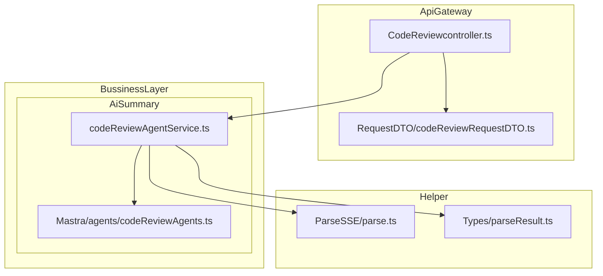
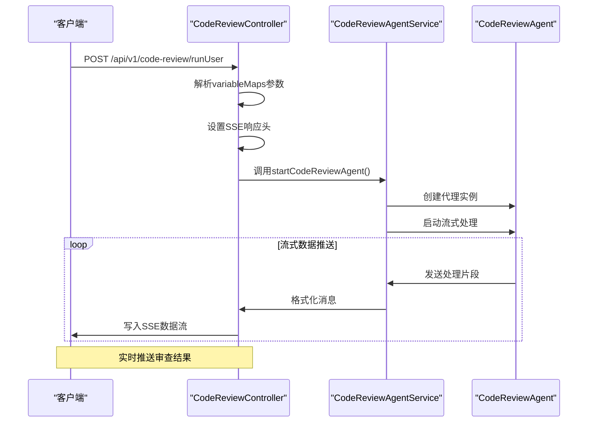
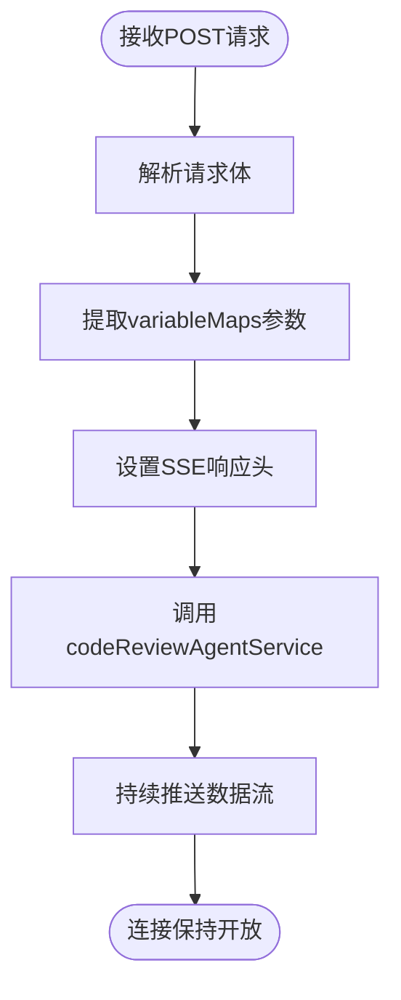
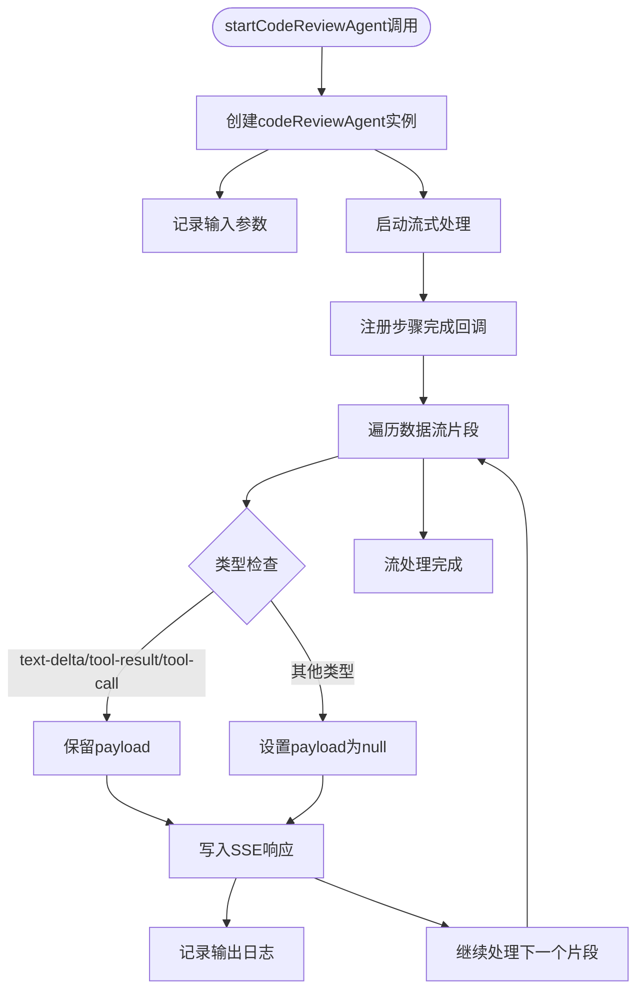
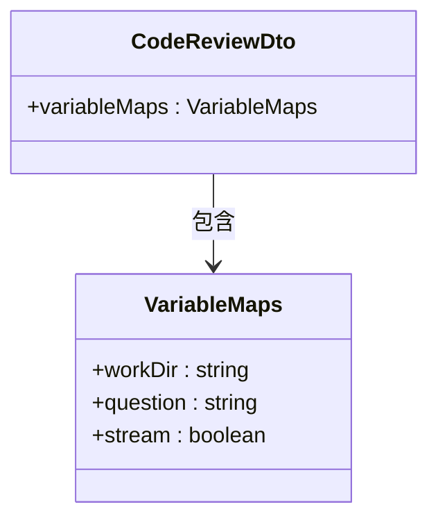
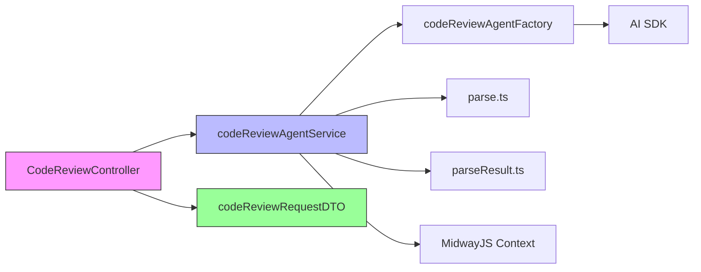

# 代码审查API

<cite>
**本文档引用的文件**
- [CodeReviewcontroller.ts](file://src/ApiGateway/controller/CodeReviewcontroller.ts)
- [codeReviewAgentService.ts](file://src/BussinessLayer/AiSummary/Application/service/codeReviewAgentService.ts)
- [codeReviewRequestDTO.ts](file://src/ApiGateway/controller/RequestDTO/codeReviewRequestDTO.ts)
- [codeReviewAgents.ts](file://src/BussinessLayer/AiSummary/Mastra/agents/codeReviewAgents.ts)
- [parse.ts](file://src/Helper/ParseSSE/parse.ts)
- [parseResult.ts](file://src/Helper/Types/parseResult.ts)
</cite>

## 目录
1. [简介](#简介)
2. [项目结构](#项目结构)
3. [核心组件](#核心组件)
4. [架构概述](#架构概述)
5. [详细组件分析](#详细组件分析)
6. [依赖分析](#依赖分析)
7. [性能考虑](#性能考虑)
8. [故障排除指南](#故障排除指南)
9. [结论](#结论)

## 简介
本文档详细描述了schooberAi项目中代码审查功能的API设计与实现，重点关注`/api/v1/code-review/runUser`端点。该接口是一个流式API，采用SSE（服务器发送事件）协议实现实时结果推送，允许客户端接收代码审查过程中的中间结果。

## 项目结构

**图示来源**
- [CodeReviewcontroller.ts](file://src/ApiGateway/controller/CodeReviewcontroller.ts)
- [codeReviewAgentService.ts](file://src/BussinessLayer/AiSummary/Application/service/codeReviewAgentService.ts)
- [codeReviewAgents.ts](file://src/BussinessLayer/AiSummary/Mastra/agents/codeReviewAgents.ts)

**本节来源**
- [CodeReviewcontroller.ts](file://src/ApiGateway/controller/CodeReviewcontroller.ts)
- [codeReviewAgentService.ts](file://src/BussinessLayer/AiSummary/Application/service/codeReviewAgentService.ts)

## 核心组件

代码审查功能的核心组件包括API控制器、服务层、请求数据传输对象（DTO）以及代理工厂。`CodeReviewcontroller`负责接收HTTP请求并设置SSE响应头，`codeReviewAgentService`处理业务逻辑并与AI代理交互，`codeReviewRequestDTO`定义了请求体结构，而`codeReviewAgents`则负责创建实际的代码审查代理实例。

**本节来源**
- [CodeReviewcontroller.ts](file://src/ApiGateway/controller/CodeReviewcontroller.ts#L1-L39)
- [codeReviewAgentService.ts](file://src/BussinessLayer/AiSummary/Application/service/codeReviewAgentService.ts#L1-L44)

## 架构概述

**图示来源**
- [CodeReviewcontroller.ts](file://src/ApiGateway/controller/CodeReviewcontroller.ts#L21-L37)
- [codeReviewAgentService.ts](file://src/BussinessLayer/AiSummary/Application/service/codeReviewAgentService.ts#L9-L43)

## 详细组件分析

### API控制器分析

`CodeReviewcontroller`实现了`/api/v1/code-review/runUser`端点，该端点使用MidwayJS框架的装饰器进行路由和API文档配置。控制器接收包含`variableMaps`的请求体，并设置必要的SSE响应头以支持流式传输。

#### 请求处理流程

**图示来源**
- [CodeReviewcontroller.ts](file://src/ApiGateway/controller/CodeReviewcontroller.ts#L21-L37)

**本节来源**
- [CodeReviewcontroller.ts](file://src/ApiGateway/controller/CodeReviewcontroller.ts#L1-L39)

### 服务层分析

`codeReviewAgentService`是代码审查功能的核心业务逻辑层，负责协调AI代理的执行过程，并将处理结果实时推送给客户端。

#### 服务执行流程

**图示来源**
- [codeReviewAgentService.ts](file://src/BussinessLayer/AiSummary/Application/service/codeReviewAgentService.ts#L9-L43)

**本节来源**
- [codeReviewAgentService.ts](file://src/BussinessLayer/AiSummary/Application/service/codeReviewAgentService.ts#L1-L44)

### 请求数据结构分析

`codeReviewRequestDTO`定义了API请求的数据结构，采用TypeScript类和Swagger装饰器来描述请求参数。

#### 请求DTO结构

**图示来源**
- [codeReviewRequestDTO.ts](file://src/ApiGateway/controller/RequestDTO/codeReviewRequestDTO.ts#L29-L35)

**本节来源**
- [codeReviewRequestDTO.ts](file://src/ApiGateway/controller/RequestDTO/codeReviewRequestDTO.ts#L1-L36)

## 依赖分析

**图示来源**
- [CodeReviewcontroller.ts](file://src/ApiGateway/controller/CodeReviewcontroller.ts)
- [codeReviewAgentService.ts](file://src/BussinessLayer/AiSummary/Application/service/codeReviewAgentService.ts)
- [codeReviewRequestDTO.ts](file://src/ApiGateway/controller/RequestDTO/codeReviewRequestDTO.ts)

**本节来源**
- [CodeReviewcontroller.ts](file://src/ApiGateway/controller/CodeReviewcontroller.ts)
- [codeReviewAgentService.ts](file://src/BussinessLayer/AiSummary/Application/service/codeReviewAgentService.ts)

## 性能考虑

代码审查API的性能主要受以下因素影响：
- **流式传输效率**：SSE协议减少了HTTP连接开销，允许服务器持续推送数据
- **代理处理能力**：AI代理的响应速度和处理能力直接影响整体性能
- **日志记录开销**：详细日志记录可能影响高并发场景下的性能表现
- **内存使用**：流式处理需要管理持续的数据流，需注意内存使用情况

建议在生产环境中监控这些性能指标，并根据实际负载进行优化。

## 故障排除指南

当代码审查API出现问题时，可参考以下排查步骤：

1. **检查请求格式**：确保请求体包含正确的`variableMaps`结构
2. **验证SSE连接**：确认客户端正确处理了`text/event-stream`响应类型
3. **查看服务日志**：检查`codeReviewAgentService`中的日志输出，特别是`onStepFinish`回调
4. **验证代理配置**：确认`codeReviewAgentFactory`中的AI模型配置正确
5. **检查网络连接**：确保服务器与AI服务之间的网络连接正常

**本节来源**
- [codeReviewAgentService.ts](file://src/BussinessLayer/AiSummary/Application/service/codeReviewAgentService.ts#L22-L25)
- [CodeReviewcontroller.ts](file://src/ApiGateway/controller/CodeReviewcontroller.ts#L29-L34)

## 结论

schooberAi项目的代码审查API通过SSE协议实现了高效的流式响应机制，能够实时推送代码审查结果。该设计结合了清晰的分层架构和详细的错误处理策略，为用户提供流畅的代码审查体验。通过`variableMaps`参数的灵活设计，API能够适应不同的审查场景，而详细的日志记录则为系统维护和问题排查提供了有力支持。