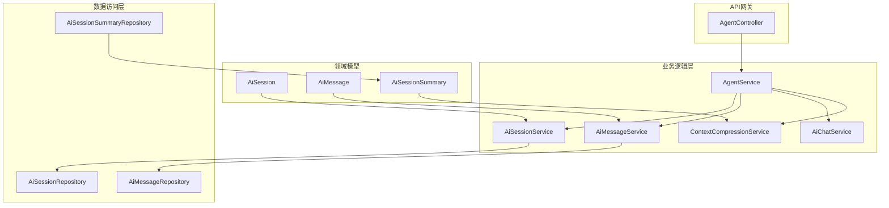
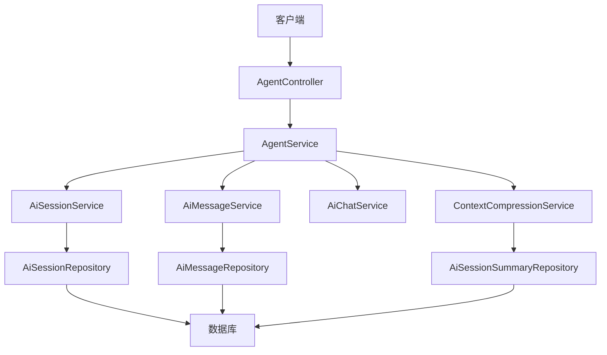
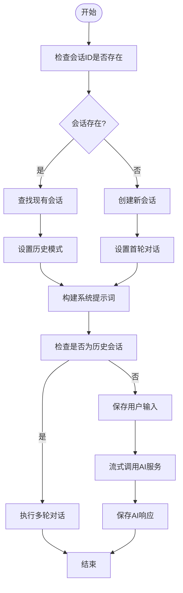
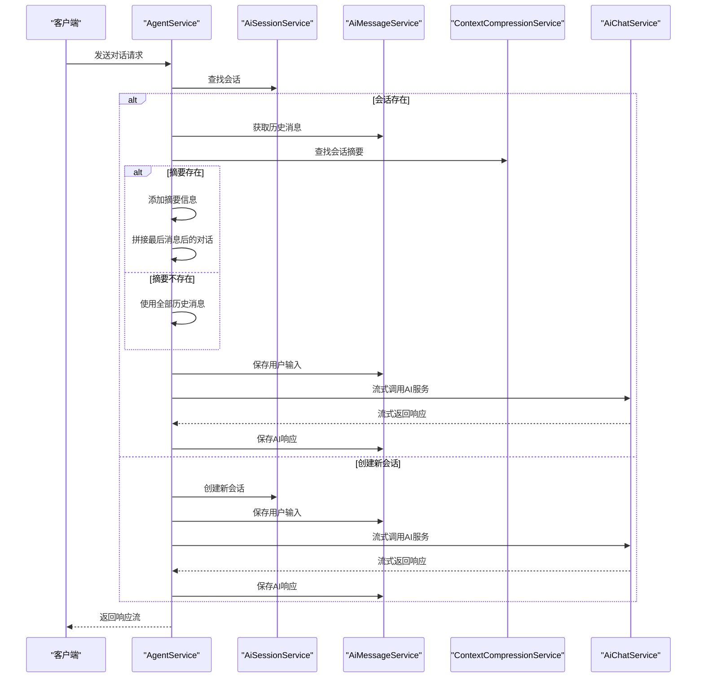
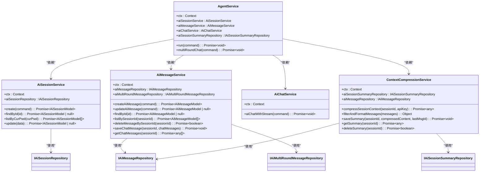

# AI Agent服务

<cite>
**本文档引用文件**  
- [AgentService.ts](file://src/BussinessLayer/Agent/Application/Service/AgentService.ts)
- [AiChatService.ts](file://src/BussinessLayer/Agent/Application/Service/AiChatService.ts)
- [AiSessionService.ts](file://src/BussinessLayer/Agent/Application/Service/AiSessionService.ts)
- [AiMessageService.ts](file://src/BussinessLayer/Agent/Application/Service/AiMessageService.ts)
- [contextCompressionService.ts](file://src/BussinessLayer/AiSummary/Application/service/contextCompressionService.ts)
- [AgentController.ts](file://src/ApiGateway/aiController/AgentController.ts)
- [systemPrompt.ts](file://src/Helper/prompt/basePrompt/systemPrompt/systemPrompt.ts)
- [AiSession.ts](file://src/BussinessLayer/Agent/Domain/Agent/AiSession.ts)
- [AiMessage.ts](file://src/BussinessLayer/Agent/Domain/Agent/AiMessage.ts)
- [AiSessionSummary.ts](file://src/BussinessLayer/Agent/Domain/Agent/AiSessionSummary.ts)
</cite>

## 目录
1. [简介](#简介)
2. [项目结构](#项目结构)
3. [核心组件](#核心组件)
4. [架构概述](#架构概述)
5. [详细组件分析](#详细组件分析)
6. [依赖分析](#依赖分析)
7. [性能考虑](#性能考虑)
8. [故障排除指南](#故障排除指南)
9. [结论](#结论)

## 简介
AI Agent服务是schooberAi项目的核心协调模块，负责整合多个AI服务组件，实现完整的对话流程。该服务通过AgentService作为主要入口，协调会话管理、消息处理、大模型交互和上下文压缩等功能，为用户提供连贯的多轮对话体验。

## 项目结构
AI Agent服务位于`src/BussinessLayer/Agent`目录下，采用分层架构设计，包含应用服务层、领域模型层和数据访问层。服务通过依赖注入与上下文压缩、会话管理、消息处理等组件通信，形成一个松耦合但高度协同的系统。

**图示来源**  
- [AgentController.ts](file://src/ApiGateway/aiController/AgentController.ts)
- [AgentService.ts](file://src/BussinessLayer/Agent/Application/Service/AgentService.ts)
- [AiSessionService.ts](file://src/BussinessLayer/Agent/Application/Service/AiSessionService.ts)
- [AiMessageService.ts](file://src/BussinessLayer/Agent/Application/Service/AiMessageService.ts)
- [contextCompressionService.ts](file://src/BussinessLayer/AiSummary/Application/service/contextCompressionService.ts)

**本节来源**  
- [AgentService.ts](file://src/BussinessLayer/Agent/Application/Service/AgentService.ts)
- [AgentController.ts](file://src/ApiGateway/aiController/AgentController.ts)

## 核心组件
AI Agent服务的核心组件包括AgentService、AiSessionService、AiMessageService、AiChatService和ContextCompressionService。这些组件通过依赖注入机制协同工作，AgentService作为协调者，负责整合各服务并实现完整的AI对话流程。

**本节来源**  
- [AgentService.ts](file://src/BussinessLayer/Agent/Application/Service/AgentService.ts)
- [AiChatService.ts](file://src/BussinessLayer/Agent/Application/Service/AiChatService.ts)
- [AiSessionService.ts](file://src/BussinessLayer/Agent/Application/Service/AiSessionService.ts)

## 架构概述
AI Agent服务采用领域驱动设计（DDD）模式，将业务逻辑与数据访问分离。服务通过MidwayJS框架的依赖注入机制，实现组件间的松耦合。系统架构分为表现层、应用服务层、领域层和基础设施层，确保代码的可维护性和可扩展性。

**图示来源**  
- [AgentController.ts](file://src/ApiGateway/aiController/AgentController.ts)
- [AgentService.ts](file://src/BussinessLayer/Agent/Application/Service/AgentService.ts)
- [AiSessionService.ts](file://src/BussinessLayer/Agent/Application/Service/AiSessionService.ts)
- [AiMessageService.ts](file://src/BussinessLayer/Agent/Application/Service/AiMessageService.ts)
- [contextCompressionService.ts](file://src/BussinessLayer/AiSummary/Application/service/contextCompressionService.ts)

## 详细组件分析

### AgentService分析
AgentService作为核心协调者，负责整合各个AI服务组件，实现完整的对话流程。服务通过run方法处理AI请求，根据会话状态决定是创建新会话还是继续历史会话。

#### 执行逻辑

**图示来源**  
- [AgentService.ts](file://src/BussinessLayer/Agent/Application/Service/AgentService.ts)

#### 多轮对话处理

**图示来源**  
- [AgentService.ts](file://src/BussinessLayer/Agent/Application/Service/AgentService.ts)
- [AiSessionService.ts](file://src/BussinessLayer/Agent/Application/Service/AiSessionService.ts)
- [AiMessageService.ts](file://src/BussinessLayer/Agent/Application/Service/AiMessageService.ts)
- [contextCompressionService.ts](file://src/BussinessLayer/AiSummary/Application/service/contextCompressionService.ts)

**本节来源**  
- [AgentService.ts](file://src/BussinessLayer/Agent/Application/Service/AgentService.ts)

### AiSessionService分析
AiSessionService负责会话的生命周期管理，包括会话的创建、查询和更新。服务通过AiSessionRepository与数据库交互，实现会话数据的持久化。

**本节来源**  
- [AiSessionService.ts](file://src/BussinessLayer/Agent/Application/Service/AiSessionService.ts)
- [AiSession.ts](file://src/BussinessLayer/Agent/Domain/Agent/AiSession.ts)

### AiMessageService分析
AiMessageService负责消息的存储和检索，支持用户输入和AI响应的持久化。服务还提供多轮对话消息的保存和获取功能，支持复杂的对话场景。

**本节来源**  
- [AiMessageService.ts](file://src/BussinessLayer/Agent/Application/Service/AiMessageService.ts)
- [AiMessage.ts](file://src/BussinessLayer/Agent/Domain/Agent/AiMessage.ts)

### AiChatService分析
AiChatService封装了与大模型的交互逻辑，支持流式响应处理。服务通过OpenAI SDK调用大模型API，实现低延迟的实时对话体验。

**本节来源**  
- [AiChatService.ts](file://src/BussinessLayer/Agent/Application/Service/AiChatService.ts)

### ContextCompressionService分析
ContextCompressionService负责会话上下文的压缩和摘要生成，通过减少历史消息的数量来优化对话性能。服务使用专门的Agent来生成会话摘要，并将其与增量消息结合，实现高效的上下文管理。

**本节来源**  
- [contextCompressionService.ts](file://src/BussinessLayer/AiSummary/Application/service/contextCompressionService.ts)
- [AiSessionSummary.ts](file://src/BussinessLayer/Agent/Domain/Agent/AiSessionSummary.ts)

## 依赖分析
AI Agent服务通过依赖注入机制与各组件通信，形成清晰的依赖关系。AgentService依赖于AiSessionService、AiMessageService、AiChatService和ContextCompressionService，而这些服务又分别依赖于各自的Repository组件。

**图示来源**  
- [AgentService.ts](file://src/BussinessLayer/Agent/Application/Service/AgentService.ts)
- [AiSessionService.ts](file://src/BussinessLayer/Agent/Application/Service/AiSessionService.ts)
- [AiMessageService.ts](file://src/BussinessLayer/Agent/Application/Service/AiMessageService.ts)
- [AiChatService.ts](file://src/BussinessLayer/Agent/Application/Service/AiChatService.ts)
- [contextCompressionService.ts](file://src/BussinessLayer/AiSummary/Application/service/contextCompressionService.ts)

**本节来源**  
- [AgentService.ts](file://src/BussinessLayer/Agent/Application/Service/AgentService.ts)
- [AiSessionService.ts](file://src/BussinessLayer/Agent/Application/Service/AiSessionService.ts)
- [AiMessageService.ts](file://src/BussinessLayer/Agent/Application/Service/AiMessageService.ts)
- [AiChatService.ts](file://src/BussinessLayer/Agent/Application/Service/AiChatService.ts)
- [contextCompressionService.ts](file://src/BussinessLayer/AiSummary/Application/service/contextCompressionService.ts)

## 性能考虑
AI Agent服务在设计时考虑了多项性能优化策略。通过会话摘要机制，服务能够有效减少传输到大模型的历史消息数量，降低API调用成本和响应延迟。流式响应处理确保用户能够实时接收AI的回复，提升交互体验。此外，服务采用异步处理模式，避免阻塞主线程，提高系统吞吐量。

## 故障排除指南
当AI Agent服务出现问题时，可以按照以下步骤进行排查：
1. 检查日志输出，查看是否有错误信息
2. 验证会话ID是否正确传递
3. 确认大模型API密钥和URL配置正确
4. 检查数据库连接是否正常
5. 验证请求参数是否符合预期格式

**本节来源**  
- [AgentService.ts](file://src/BussinessLayer/Agent/Application/Service/AgentService.ts)
- [AiChatService.ts](file://src/BussinessLayer/Agent/Application/Service/AiChatService.ts)

## 结论
AI Agent服务通过精心设计的架构和组件协作，实现了高效、可靠的AI对话功能。服务的核心在于AgentService的协调能力，它整合了会话管理、消息处理、大模型交互和上下文压缩等多个功能模块，为用户提供流畅的多轮对话体验。通过依赖注入和领域驱动设计，服务保持了良好的可维护性和可扩展性，为未来的功能演进奠定了坚实基础。