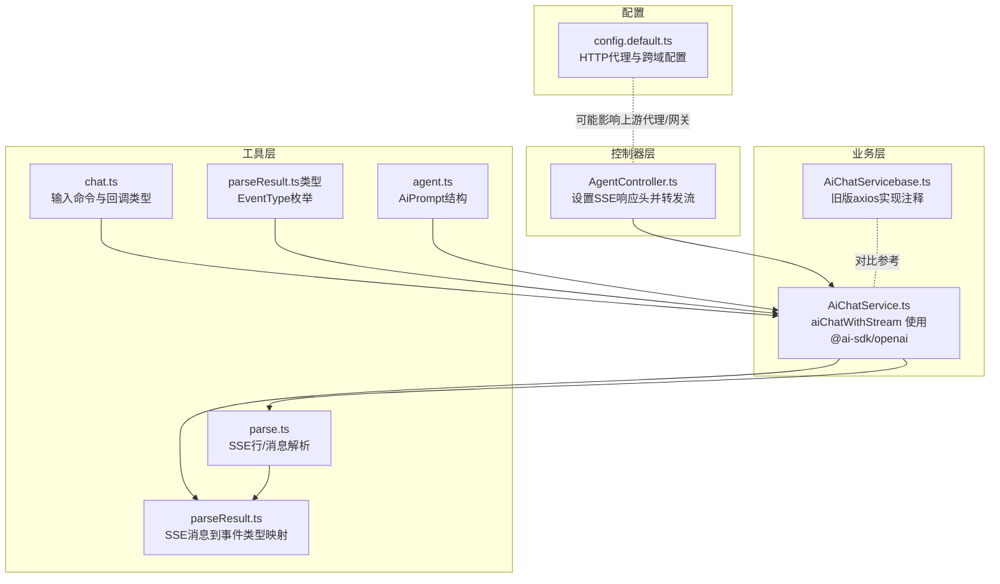
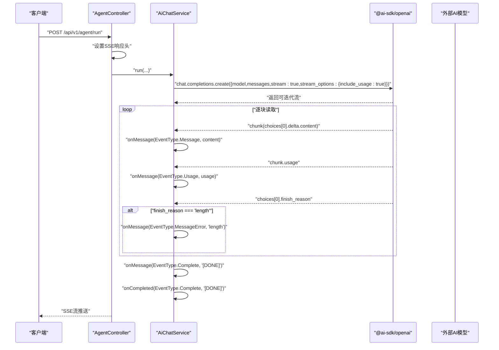
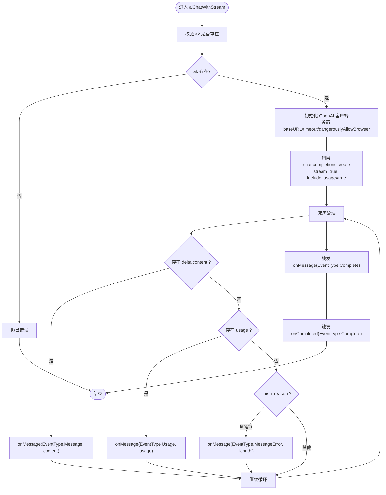
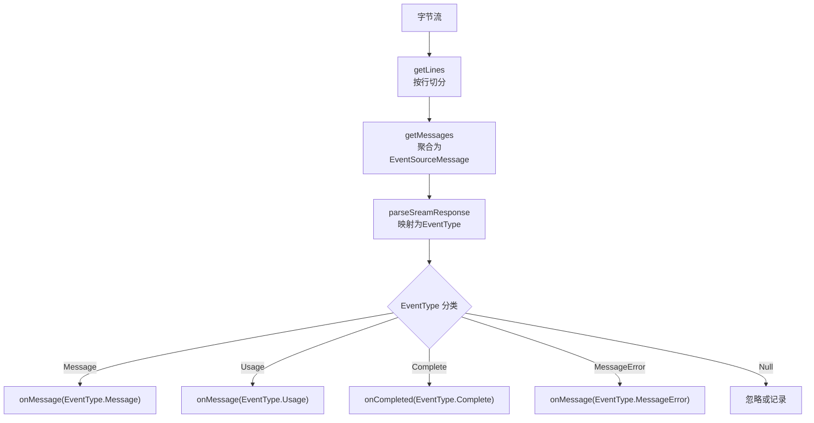
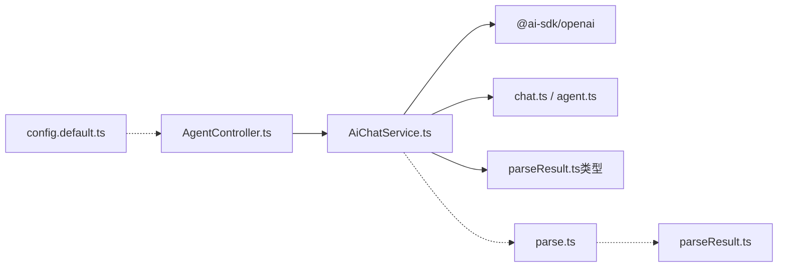

# AI聊天服务

<cite>
**本文引用的文件**
- [AiChatService.ts](file://src/BussinessLayer/Agent/Application/Service/AiChatService.ts)
- [AiChatServicebase.ts](file://src/BussinessLayer/Agent/Application/Service/AiChatServicebase.ts)
- [parse.ts](file://src/Helper/ParseSSE/parse.ts)
- [parseResult.ts](file://src/Helper/ParseSSE/parseResult.ts)
- [chat.ts](file://src/Helper/Types/chat.ts)
- [parseResult.ts（类型定义）](file://src/Helper/Types/parseResult.ts)
- [agent.ts](file://src/Helper/Types/agent.ts)
- [config.default.ts](file://src/config/config.default.ts)
- [AgentController.ts](file://src/ApiGateway/aiController/AgentController.ts)
</cite>

## 目录
1. [简介](#简介)
2. [项目结构](#项目结构)
3. [核心组件](#核心组件)
4. [架构总览](#架构总览)
5. [详细组件分析](#详细组件分析)
6. [依赖关系分析](#依赖关系分析)
7. [性能考量](#性能考量)
8. [故障排查指南](#故障排查指南)
9. [结论](#结论)
10. [附录](#附录)

## 简介
本文件面向开发者与运维人员，系统化梳理 AI 聊天服务的技术实现，重点围绕 AiChatService 的 aiChatWithStream 方法展开，说明其如何通过 @ai-sdk/openai 库与外部 AI 模型进行流式通信；解释请求参数构建、SSE 流处理机制、onMessage/onCompleted 回调的使用；对比当前实现与被注释的 axios 实现差异；阐述错误处理策略、流式响应事件类型与数据格式，以及如何集成 OpenAI 兼容的 API 端点并支持自定义 baseURL。

## 项目结构
该仓库采用分层+领域驱动设计，AI 聊天服务位于业务层应用服务目录，配合工具层的 SSE 解析器与类型定义，控制器负责将服务结果以 SSE 形式返回给前端。

图表来源
- [AgentController.ts](file://src/ApiGateway/aiController/AgentController.ts#L33-L55)
- [AiChatService.ts](file://src/BussinessLayer/Agent/Application/Service/AiChatService.ts#L124-L193)
- [AiChatServicebase.ts](file://src/BussinessLayer/Agent/Application/Service/AiChatServicebase.ts#L33-L87)
- [parse.ts](file://src/Helper/ParseSSE/parse.ts#L1-L184)
- [parseResult.ts](file://src/Helper/ParseSSE/parseResult.ts#L1-L60)
- [chat.ts](file://src/Helper/Types/chat.ts#L1-L25)
- [parseResult.ts（类型定义）](file://src/Helper/Types/parseResult.ts#L1-L12)
- [agent.ts](file://src/Helper/Types/agent.ts#L1-L9)
- [config.default.ts](file://src/config/config.default.ts#L1-L40)

章节来源
- [AgentController.ts](file://src/ApiGateway/aiController/AgentController.ts#L33-L55)
- [AiChatService.ts](file://src/BussinessLayer/Agent/Application/Service/AiChatService.ts#L124-L193)
- [AiChatServicebase.ts](file://src/BussinessLayer/Agent/Application/Service/AiChatServicebase.ts#L33-L87)
- [parse.ts](file://src/Helper/ParseSSE/parse.ts#L1-L184)
- [parseResult.ts](file://src/Helper/ParseSSE/parseResult.ts#L1-L60)
- [chat.ts](file://src/Helper/Types/chat.ts#L1-L25)
- [parseResult.ts（类型定义）](file://src/Helper/Types/parseResult.ts#L1-L12)
- [agent.ts](file://src/Helper/Types/agent.ts#L1-L9)
- [config.default.ts](file://src/config/config.default.ts#L1-L40)

## 核心组件
- AiChatService.aiChatWithStream：基于 @ai-sdk/openai 的流式聊天实现，负责创建 OpenAI 客户端、发起流式请求、逐块处理响应并触发回调。
- SSE 解析器：parse.ts 提供 getLines/getMessages 将字节流解析为事件消息；parseResult.ts 将事件消息映射为 EventType（message/usage/complete/error/null）。
- 类型与命令：chat.ts 定义 AiStreamChatInputCommand（含 onMessage/onCompleted/onError/onUsage），agent.ts 定义 AiPrompt 结构。
- 控制器：AgentController.ts 将服务结果以 text/event-stream 返回，设置必要的响应头以保证实时性。

章节来源
- [AiChatService.ts](file://src/BussinessLayer/Agent/Application/Service/AiChatService.ts#L124-L193)
- [parse.ts](file://src/Helper/ParseSSE/parse.ts#L1-L184)
- [parseResult.ts](file://src/Helper/ParseSSE/parseResult.ts#L1-L60)
- [chat.ts](file://src/Helper/Types/chat.ts#L1-L25)
- [agent.ts](file://src/Helper/Types/agent.ts#L1-L9)
- [AgentController.ts](file://src/ApiGateway/aiController/AgentController.ts#L33-L55)

## 架构总览
下图展示从控制器到服务再到 OpenAI SDK 的整体调用链路，以及流式响应在服务内部的事件分发。

图表来源
- [AgentController.ts](file://src/ApiGateway/aiController/AgentController.ts#L33-L55)
- [AiChatService.ts](file://src/BussinessLayer/Agent/Application/Service/AiChatService.ts#L124-L193)

## 详细组件分析

### AiChatService.aiChatWithStream 方法
- 请求参数构建与校验
  - 必填 ak 校验，若缺失抛出错误。
  - 基于命令对象构造 OpenAI 客户端，支持自定义 baseURL、超时与浏览器环境允许。
- 流式请求
  - 调用 chat.completions.create 并开启 stream 与 include_usage。
- 响应处理
  - 遍历流块，提取 choices[0].delta.content 作为增量内容，触发 onMessage(EventType.Message)。
  - 若存在 usage 字段，触发 onMessage(EventType.Usage)。
  - 若 finish_reason 为 length，触发 onMessage(EventType.MessageError)。
  - 流结束时，触发 onMessage(EventType.Complete) 与 onCompleted(EventType.Complete)。
- 错误处理
  - 捕获异常并记录日志，抛出统一错误。

图表来源
- [AiChatService.ts](file://src/BussinessLayer/Agent/Application/Service/AiChatService.ts#L124-L193)

章节来源
- [AiChatService.ts](file://src/BussinessLayer/Agent/Application/Service/AiChatService.ts#L124-L193)

### SSE 流处理与事件映射
- 行解析与消息聚合
  - getLines 将字节流按行切分，支持回车换行组合。
  - getMessages 将行解析为 EventSourceMessage，聚合 data、event、id、retry。
- 事件类型映射
  - parseSreamResponse 将 EventSourceMessage 映射为 EventType：
    - data 为 "[DONE]" -> Complete
    - data 中包含 usage -> Usage
    - choices[0].delta.content 存在 -> Message
    - finish_reason 为 "max_tokens" -> MessageError
    - 其他 -> Null
- 与 axios 版本的差异
  - 当前版本直接消费 OpenAI SDK 的流对象，无需手动拆分行/消息。
  - axios 版本需要 getLines/getMessages/parseSreamResponse 三者协作，将原始 SSE 文本流解析为事件对象。

图表来源
- [parse.ts](file://src/Helper/ParseSSE/parse.ts#L1-L184)
- [parseResult.ts](file://src/Helper/ParseSSE/parseResult.ts#L1-L60)
- [parseResult.ts（类型定义）](file://src/Helper/Types/parseResult.ts#L1-L12)

章节来源
- [parse.ts](file://src/Helper/ParseSSE/parse.ts#L1-L184)
- [parseResult.ts](file://src/Helper/ParseSSE/parseResult.ts#L1-L60)
- [parseResult.ts（类型定义）](file://src/Helper/Types/parseResult.ts#L1-L12)

### 请求参数与命令类型
- AiChatInputCommand/AiStreamChatInputCommand
  - 包含 model、messages、temperature、max_tokens、timeout、stream、ak、ApiUrl 等字段。
  - AiStreamChatInputCommand 还包含 onMessage/onError/onCompleted/onUsage 回调。
- AiPrompt
  - 角色（system/user/assistant）与内容（字符串或数组）。

章节来源
- [chat.ts](file://src/Helper/Types/chat.ts#L1-L25)
- [agent.ts](file://src/Helper/Types/agent.ts#L1-L9)

### 控制器与 SSE 输出
- AgentController 在 /api/v1/agent/run 接口设置 text/event-stream 响应头，flushHeaders 后将服务流透传给客户端，确保实时性与不缓存。

章节来源
- [AgentController.ts](file://src/ApiGateway/aiController/AgentController.ts#L33-L55)

### 与被注释的 axios 实现对比
- 技术栈
  - 当前：@ai-sdk/openai 直接消费流对象，简化了行/消息解析与事件映射。
  - axios 版本：依赖 parse.ts 与 parseResult.ts 手动解析 SSE 文本流。
- 参数与认证
  - 当前：通过 OpenAI 客户端构造 baseURL 与 apiKey，更贴近 OpenAI 生态。
  - axios：显式传递 Authorization 头与 responseType: 'stream'。
- 事件回调
  - 当前：直接在流块上判断 content/usage/finish_reason，触发对应回调。
  - axios：通过 parseSreamResponse 统一映射 EventType 后再触发回调。
- 适用场景
  - 当前实现更适合 OpenAI 兼容 API；axios 版本更通用但复杂度更高。

章节来源
- [AiChatService.ts](file://src/BussinessLayer/Agent/Application/Service/AiChatService.ts#L124-L193)
- [AiChatServicebase.ts](file://src/BussinessLayer/Agent/Application/Service/AiChatServicebase.ts#L33-L87)
- [parse.ts](file://src/Helper/ParseSSE/parse.ts#L1-L184)
- [parseResult.ts](file://src/Helper/ParseSSE/parseResult.ts#L1-L60)

### 错误处理策略
- 网络异常与API调用失败
  - 服务层捕获异常并记录日志，抛出统一错误，便于上层统一处理。
- finish_reason 特殊处理
  - 当 finish_reason 为 length 时，视为长度限制错误，触发 MessageError 事件，便于前端提示用户。
- 建议
  - 在控制器或上层中间件增加重试与降级策略（如切换备用模型/端点）。
  - 对超时与连接中断进行分类处理，区分可重试与不可重试错误。

章节来源
- [AiChatService.ts](file://src/BussinessLayer/Agent/Application/Service/AiChatService.ts#L170-L177)
- [AiChatService.ts](file://src/BussinessLayer/Agent/Application/Service/AiChatService.ts#L189-L193)

### 流式响应数据格式与事件类型
- 事件类型（EventType）
  - message：增量内容到达，content 为字符串片段。
  - usage：token 使用统计，content 为 JSON 字符串。
  - complete：流结束标记，content 为 "[DONE]"。
  - error：模型终止原因错误，content 为具体原因（如 "length"）。
  - null：无法识别的事件或空数据。
- 数据格式
  - message：choices[0].delta.content 字段。
  - usage：choices[0].usage 字段（当 include_usage 开启时）。
  - complete：流结束时的最终事件。
  - error：finish_reason 为特定值时触发。

章节来源
- [parseResult.ts（类型定义）](file://src/Helper/Types/parseResult.ts#L1-L12)
- [AiChatService.ts](file://src/BussinessLayer/Agent/Application/Service/AiChatService.ts#L151-L188)

### 集成 OpenAI 兼容 API 端点与自定义 baseURL
- baseURL 支持
  - 通过命令对象 ApiUrl 注入，AiChatService 初始化 OpenAI 客户端时传入 baseURL，从而适配不同供应商的兼容端点。
- 代理与跨域
  - config.default.ts 提供 httpProxy 与 cors 配置，可用于上游代理或跨域场景（与控制器设置的 SSE 头共同保障客户端访问）。

章节来源
- [AiChatService.ts](file://src/BussinessLayer/Agent/Application/Service/AiChatService.ts#L134-L140)
- [config.default.ts](file://src/config/config.default.ts#L26-L38)

## 依赖关系分析
- 组件耦合
  - AiChatService 依赖 @ai-sdk/openai 与内部类型/回调接口。
  - SSE 解析器与事件映射独立于具体 SDK，便于替换实现。
- 外部依赖
  - @ai-sdk/openai：提供流式聊天能力与流对象迭代。
  - axios（仅作对比参考）：用于旧版实现，展示手动解析 SSE 的方式。
- 潜在风险
  - 若 baseURL 不正确或 ak 缺失，将直接抛错。
  - finish_reason 为 length 时需在前端做截断提示。

图表来源
- [AiChatService.ts](file://src/BussinessLayer/Agent/Application/Service/AiChatService.ts#L124-L193)
- [parse.ts](file://src/Helper/ParseSSE/parse.ts#L1-L184)
- [parseResult.ts](file://src/Helper/ParseSSE/parseResult.ts#L1-L60)
- [chat.ts](file://src/Helper/Types/chat.ts#L1-L25)
- [agent.ts](file://src/Helper/Types/agent.ts#L1-L9)
- [AgentController.ts](file://src/ApiGateway/aiController/AgentController.ts#L33-L55)
- [config.default.ts](file://src/config/config.default.ts#L1-L40)

## 性能考量
- 流式传输
  - 使用流式接口减少首字节延迟，提升交互体验。
- 事件粒度
  - 增量 message 与 usage 分发有助于前端即时渲染与统计。
- 资源控制
  - 合理设置 timeout 与 max_tokens，避免长时间占用连接。
- 建议
  - 在控制器侧启用长连接与非缓存策略，确保 SSE 实时性。
  - 对高频调用增加限流与熔断，防止下游过载。

## 故障排查指南
- ak 缺失
  - 现象：启动即抛错。
  - 处理：检查调用方是否传入 ak。
- baseURL 错误
  - 现象：连接失败或 404/401。
  - 处理：确认 ApiUrl 正确且与供应商兼容。
- finish_reason 为 length
  - 现象：前端收到 MessageError 事件。
  - 处理：提示用户调整提示词或增加 max_tokens。
- 网络异常
  - 现象：服务层捕获异常并抛出统一错误。
  - 处理：检查网络连通性、代理配置与超时设置。
- SSE 无输出
  - 现象：客户端未收到事件。
  - 处理：确认控制器已设置正确的 SSE 响应头并 flushHeaders。

章节来源
- [AiChatService.ts](file://src/BussinessLayer/Agent/Application/Service/AiChatService.ts#L130-L133)
- [AiChatService.ts](file://src/BussinessLayer/Agent/Application/Service/AiChatService.ts#L170-L177)
- [AiChatService.ts](file://src/BussinessLayer/Agent/Application/Service/AiChatService.ts#L189-L193)
- [AgentController.ts](file://src/ApiGateway/aiController/AgentController.ts#L33-L55)

## 结论
AiChatService 的 aiChatWithStream 采用 @ai-sdk/openai 的原生流式能力，结合简洁的事件分发与错误处理，实现了对 OpenAI 兼容 API 的高效集成。通过自定义 baseURL 与回调机制，既能满足多供应商适配，也能灵活扩展前端交互。对比旧版 axios 实现，当前方案在复杂度与可维护性上更具优势；但仍需关注 finish_reason 与超时等边界情况，建议在上层增加重试与降级策略以提升鲁棒性。

## 附录
- 关键实现路径
  - aiChatWithStream 主流程：[AiChatService.ts](file://src/BussinessLayer/Agent/Application/Service/AiChatService.ts#L124-L193)
  - SSE 行/消息解析：[parse.ts](file://src/Helper/ParseSSE/parse.ts#L1-L184)
  - 事件映射与错误判定：[parseResult.ts](file://src/Helper/ParseSSE/parseResult.ts#L1-L60)
  - 命令与回调类型：[chat.ts](file://src/Helper/Types/chat.ts#L1-L25)
  - 事件类型枚举：[parseResult.ts（类型定义）](file://src/Helper/Types/parseResult.ts#L1-L12)
  - Prompt 结构：[agent.ts](file://src/Helper/Types/agent.ts#L1-L9)
  - 控制器 SSE 输出：[AgentController.ts](file://src/ApiGateway/aiController/AgentController.ts#L33-L55)
  - 代理与跨域配置：[config.default.ts](file://src/config/config.default.ts#L26-L38)