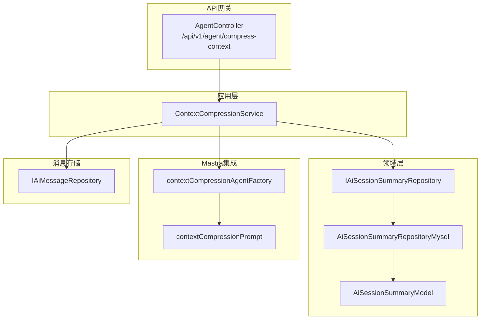
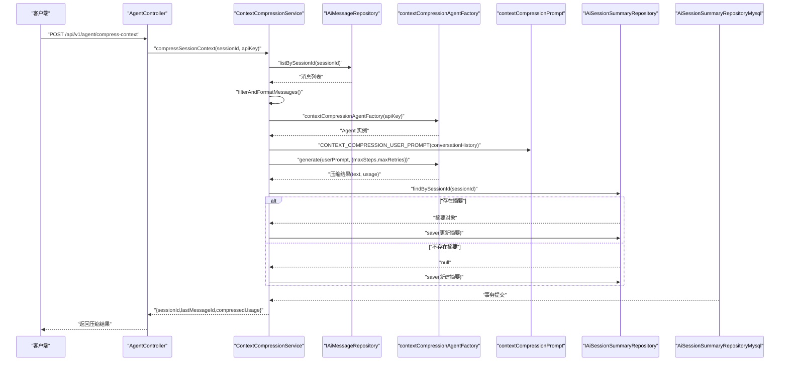
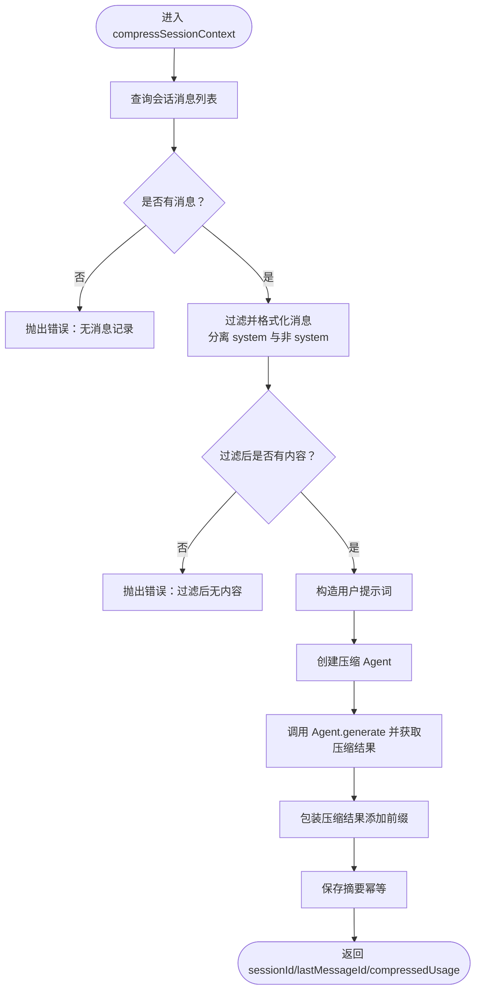
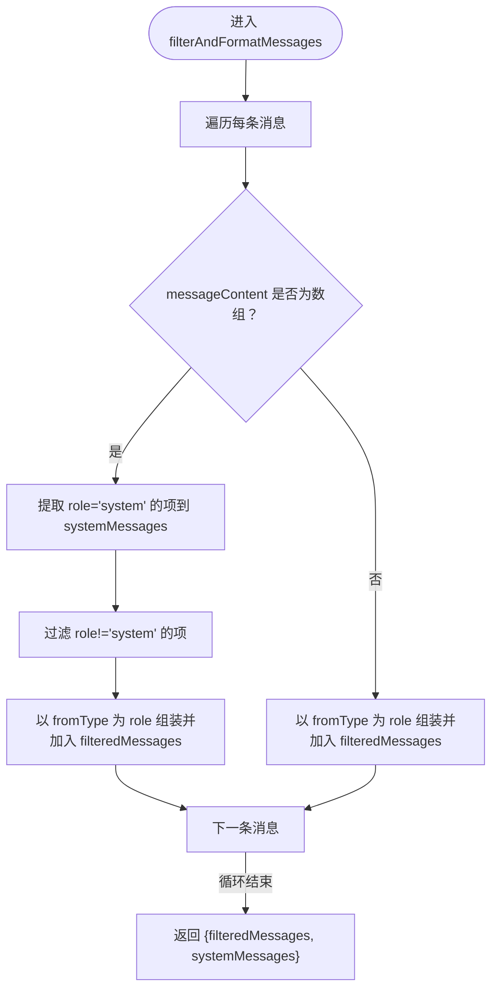
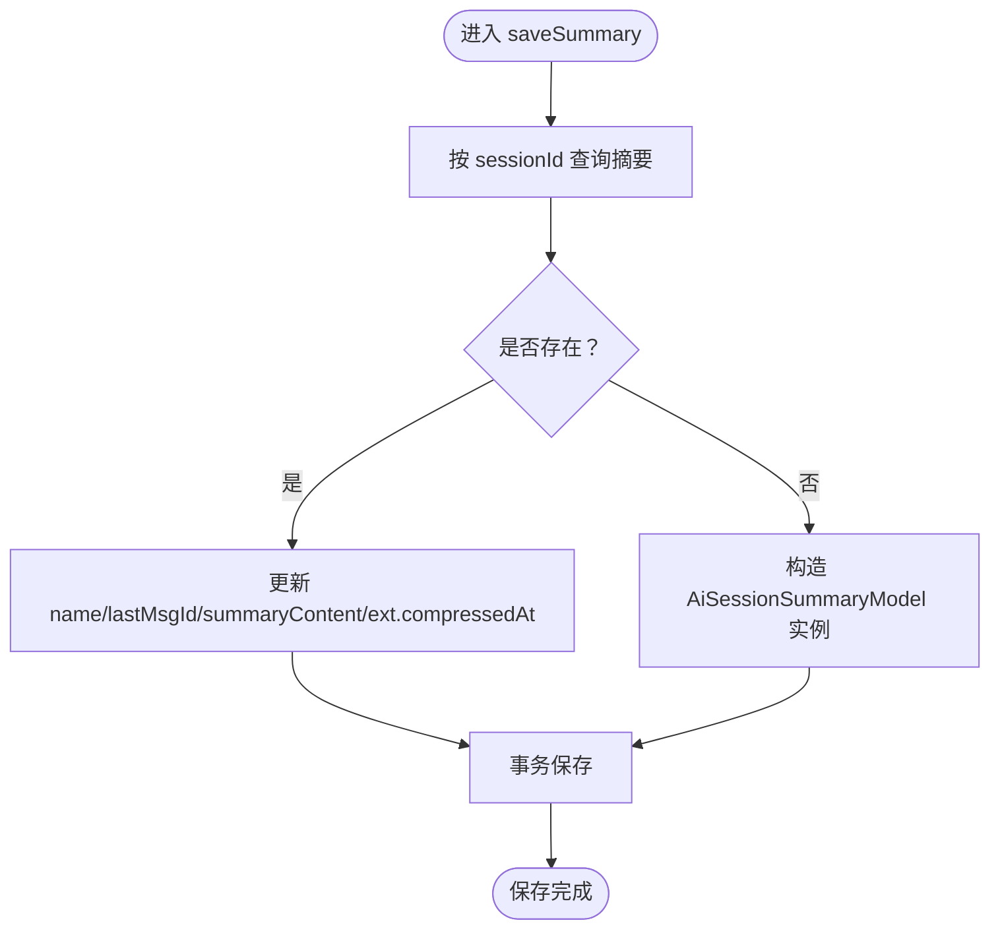
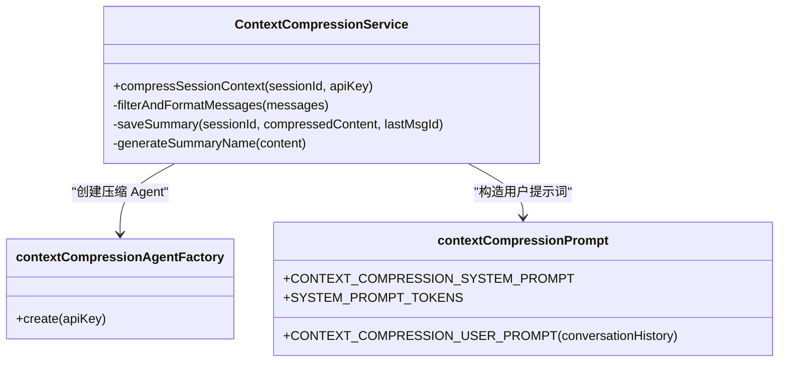
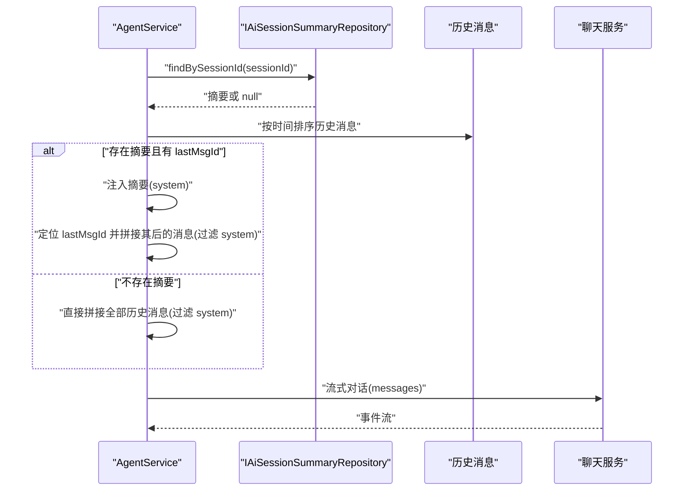
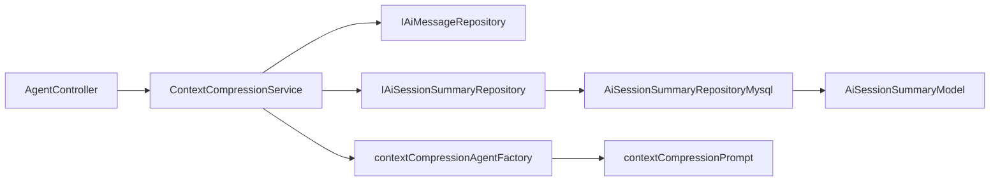

# 上下文压缩服务

<cite>
**本文引用的文件**
- [contextCompressionService.ts](file://src/BussinessLayer/AiSummary/Application/service/contextCompressionService.ts)
- [contextCompressionAgent.ts](file://src/BussinessLayer/AiSummary/Mastra/agents/contextCompressionAgent.ts)
- [contextCompressionPrompt.ts](file://src/BussinessLayer/AiSummary/Mastra/prompts/contextCompressionPrompt.ts)
- [AgentService.ts](file://src/BussinessLayer/Agent/Application/Service/AgentService.ts)
- [AiSessionSummary.ts](file://src/BussinessLayer/Agent/Domain/Agent/AiSessionSummary.ts)
- [AiSessionSummaryRepository.ts](file://src/BussinessLayer/Agent/Domain/Agent/AiSessionSummaryRepository.ts)
- [AiSessionSummaryRepositoryMysql.ts](file://src/BussinessLayer/Agent/Repository/AiSessionSummaryRepositoryMysql.ts)
- [AgentController.ts](file://src/ApiGateway/aiController/AgentController.ts)
- [CompressSessionContextRequestDTO.ts](file://src/ApiGateway/aiController/RequestDTO/CompressSessionContextRequestDTO.ts)
- [agent.ts](file://src/Helper/Types/agent.ts)
</cite>

## 目录
1. [简介](#简介)
2. [项目结构](#项目结构)
3. [核心组件](#核心组件)
4. [架构总览](#架构总览)
5. [详细组件分析](#详细组件分析)
6. [依赖关系分析](#依赖关系分析)
7. [性能考量](#性能考量)
8. [故障排查指南](#故障排查指南)
9. [结论](#结论)
10. [附录](#附录)

## 简介
本文件面向“上下文压缩服务”的深度技术文档，聚焦于 ContextCompressionService 的 compressSessionContext 方法执行流程，涵盖从数据库查询消息、过滤 system 消息、调用 Mastra Agent 进行内容压缩、到保存摘要的完整过程；解释 filterAndFormatMessages 如何分离 system 消息与用户对话内容；说明 saveSummary 的幂等性设计（存在则更新、不存在则创建）；描述 generateSummaryName 如何从压缩内容生成摘要标题；并提供上下文压缩工作流的序列图，展示与 Mastra 框架的集成点。最后阐述压缩结果如何被 AgentService 在多轮对话中使用，以实现长对话历史的记忆优化。

## 项目结构
围绕上下文压缩的关键目录与文件如下：
- 应用层服务：ContextCompressionService 负责压缩流程编排
- Mastra 集成：contextCompressionAgentFactory 创建压缩 Agent，contextCompressionPrompt 提供系统与用户提示词
- 领域模型与仓储：AiSessionSummaryModel、IAiSessionSummaryRepository、AiSessionSummaryRepositoryMysql
- 控制器：AgentController 对外暴露 /api/v1/agent/compress-context 接口
- 类型定义：AiPrompt 角色类型

图表来源
- [AgentController.ts](file://src/ApiGateway/aiController/AgentController.ts#L73-L93)
- [contextCompressionService.ts](file://src/BussinessLayer/AiSummary/Application/service/contextCompressionService.ts#L25-L79)
- [contextCompressionAgent.ts](file://src/BussinessLayer/AiSummary/Mastra/agents/contextCompressionAgent.ts#L13-L23)
- [contextCompressionPrompt.ts](file://src/BussinessLayer/AiSummary/Mastra/prompts/contextCompressionPrompt.ts#L1-L69)
- [AiSessionSummaryRepository.ts](file://src/BussinessLayer/Agent/Domain/Agent/AiSessionSummaryRepository.ts#L1-L13)
- [AiSessionSummaryRepositoryMysql.ts](file://src/BussinessLayer/Agent/Repository/AiSessionSummaryRepositoryMysql.ts#L65-L71)
- [AiSessionSummary.ts](file://src/BussinessLayer/Agent/Domain/Agent/AiSessionSummary.ts#L1-L89)

章节来源
- [AgentController.ts](file://src/ApiGateway/aiController/AgentController.ts#L73-L93)
- [contextCompressionService.ts](file://src/BussinessLayer/AiSummary/Application/service/contextCompressionService.ts#L25-L79)
- [contextCompressionAgent.ts](file://src/BussinessLayer/AiSummary/Mastra/agents/contextCompressionAgent.ts#L13-L23)
- [contextCompressionPrompt.ts](file://src/BussinessLayer/AiSummary/Mastra/prompts/contextCompressionPrompt.ts#L1-L69)
- [AiSessionSummaryRepository.ts](file://src/BussinessLayer/Agent/Domain/Agent/AiSessionSummaryRepository.ts#L1-L13)
- [AiSessionSummaryRepositoryMysql.ts](file://src/BussinessLayer/Agent/Repository/AiSessionSummaryRepositoryMysql.ts#L65-L71)
- [AiSessionSummary.ts](file://src/BussinessLayer/Agent/Domain/Agent/AiSessionSummary.ts#L1-L89)

## 核心组件
- ContextCompressionService：负责压缩流程的编排，包括查询消息、过滤与格式化、调用 Mastra Agent、保存摘要、生成标题等
- contextCompressionAgentFactory：基于 Mastra 的 Agent 创建工厂，注入 OpenAI 兼容客户端与模型
- contextCompressionPrompt：提供系统提示词与用户提示词模板，并定义系统提示词的 token 预估
- AgentService：在多轮对话中读取历史消息与摘要，拼接最终提示词并调用聊天服务
- AiSessionSummaryModel/Repository：会话摘要的实体与持久化实现，支持按会话查询、保存、删除
- AgentController：对外提供压缩接口 /api/v1/agent/compress-context

章节来源
- [contextCompressionService.ts](file://src/BussinessLayer/AiSummary/Application/service/contextCompressionService.ts#L25-L177)
- [contextCompressionAgent.ts](file://src/BussinessLayer/AiSummary/Mastra/agents/contextCompressionAgent.ts#L13-L23)
- [contextCompressionPrompt.ts](file://src/BussinessLayer/AiSummary/Mastra/prompts/contextCompressionPrompt.ts#L1-L69)
- [AgentService.ts](file://src/BussinessLayer/Agent/Application/Service/AgentService.ts#L165-L294)
- [AiSessionSummary.ts](file://src/BussinessLayer/Agent/Domain/Agent/AiSessionSummary.ts#L1-L89)
- [AiSessionSummaryRepository.ts](file://src/BussinessLayer/Agent/Domain/Agent/AiSessionSummaryRepository.ts#L1-L13)
- [AiSessionSummaryRepositoryMysql.ts](file://src/BussinessLayer/Agent/Repository/AiSessionSummaryRepositoryMysql.ts#L65-L71)
- [AgentController.ts](file://src/ApiGateway/aiController/AgentController.ts#L73-L93)

## 架构总览
上下文压缩服务通过 API 控制器触发，调用应用层服务，应用层服务从消息仓储读取历史消息，过滤 system 消息后交给 Mastra Agent 压缩，再将压缩结果写入会话摘要仓储。多轮对话阶段，AgentService 会优先加载摘要并将其作为系统提示的一部分，从而减少上下文长度并保留关键信息。

图表来源
- [AgentController.ts](file://src/ApiGateway/aiController/AgentController.ts#L73-L93)
- [contextCompressionService.ts](file://src/BussinessLayer/AiSummary/Application/service/contextCompressionService.ts#L25-L79)
- [contextCompressionAgent.ts](file://src/BussinessLayer/AiSummary/Mastra/agents/contextCompressionAgent.ts#L13-L23)
- [contextCompressionPrompt.ts](file://src/BussinessLayer/AiSummary/Mastra/prompts/contextCompressionPrompt.ts#L61-L69)
- [AiSessionSummaryRepository.ts](file://src/BussinessLayer/Agent/Domain/Agent/AiSessionSummaryRepository.ts#L1-L13)
- [AiSessionSummaryRepositoryMysql.ts](file://src/BussinessLayer/Agent/Repository/AiSessionSummaryRepositoryMysql.ts#L65-L71)

## 详细组件分析

### ContextCompressionService 组件分析
- compressSessionContext：主流程入口，包含查询、过滤、调用 Agent、保存摘要与返回统计信息
- filterAndFormatMessages：将消息数组中的 system 内容分离出来，其余内容按 fromType 组织为统一格式
- saveSummary：幂等保存，存在则更新字段（含扩展字段），不存在则创建新摘要
- generateSummaryName：从压缩内容清洗后截断生成标题
- getSummary/deleteSummary：提供摘要查询与删除能力

图表来源
- [contextCompressionService.ts](file://src/BussinessLayer/AiSummary/Application/service/contextCompressionService.ts#L25-L79)
- [contextCompressionService.ts](file://src/BussinessLayer/AiSummary/Application/service/contextCompressionService.ts#L82-L115)
- [contextCompressionService.ts](file://src/BussinessLayer/AiSummary/Application/service/contextCompressionService.ts#L118-L177)

章节来源
- [contextCompressionService.ts](file://src/BussinessLayer/AiSummary/Application/service/contextCompressionService.ts#L25-L177)

#### filterAndFormatMessages 方法详解
- 输入：消息数组（每条可能包含 messageContent 数组或字符串）
- 输出：{ filteredMessages, systemMessages }
- 行为：
  - 遍历消息，若 messageContent 为数组，提取 role 为 system 的项加入 systemMessages
  - 过滤掉 role 为 system 的项，将剩余项以 fromType 为 role 组装为对象并加入 filteredMessages
  - 若 messageContent 非数组，直接以 fromType 为 role 组装加入 filteredMessages

图表来源
- [contextCompressionService.ts](file://src/BussinessLayer/AiSummary/Application/service/contextCompressionService.ts#L82-L115)

章节来源
- [contextCompressionService.ts](file://src/BussinessLayer/AiSummary/Application/service/contextCompressionService.ts#L82-L115)

#### saveSummary 方法详解（幂等性设计）
- 查询：按 sessionId 查找摘要
- 存在：更新 name、lastMsgId、summaryContent、ext.compressedAt
- 不存在：构造 AiSessionSummaryModel 新实例并填充字段
- 保存：通过事务持久化

图表来源
- [contextCompressionService.ts](file://src/BussinessLayer/AiSummary/Application/service/contextCompressionService.ts#L118-L177)
- [AiSessionSummaryRepositoryMysql.ts](file://src/BussinessLayer/Agent/Repository/AiSessionSummaryRepositoryMysql.ts#L65-L71)
- [AiSessionSummary.ts](file://src/BussinessLayer/Agent/Domain/Agent/AiSessionSummary.ts#L1-L89)

章节来源
- [contextCompressionService.ts](file://src/BussinessLayer/AiSummary/Application/service/contextCompressionService.ts#L118-L177)
- [AiSessionSummaryRepositoryMysql.ts](file://src/BussinessLayer/Agent/Repository/AiSessionSummaryRepositoryMysql.ts#L65-L71)
- [AiSessionSummary.ts](file://src/BussinessLayer/Agent/Domain/Agent/AiSessionSummary.ts#L1-L89)

#### generateSummaryName 方法详解
- 清洗：去除换行并 trim
- 截断：超过 50 字符取前 50 并加省略号，否则返回原内容

章节来源
- [contextCompressionService.ts](file://src/BussinessLayer/AiSummary/Application/service/contextCompressionService.ts#L156-L163)

### Mastra 集成点
- contextCompressionAgentFactory：创建 Agent，注入系统提示词与模型（OpenAI 兼容客户端）
- contextCompressionPrompt：提供系统提示词与用户提示词模板，以及系统提示词 token 预估

图表来源
- [contextCompressionService.ts](file://src/BussinessLayer/AiSummary/Application/service/contextCompressionService.ts#L25-L79)
- [contextCompressionAgent.ts](file://src/BussinessLayer/AiSummary/Mastra/agents/contextCompressionAgent.ts#L13-L23)
- [contextCompressionPrompt.ts](file://src/BussinessLayer/AiSummary/Mastra/prompts/contextCompressionPrompt.ts#L1-L69)

章节来源
- [contextCompressionAgent.ts](file://src/BussinessLayer/AiSummary/Mastra/agents/contextCompressionAgent.ts#L13-L23)
- [contextCompressionPrompt.ts](file://src/BussinessLayer/AiSummary/Mastra/prompts/contextCompressionPrompt.ts#L1-L69)

### AgentService 在多轮对话中的使用
- 多轮对话时，AgentService 会先查询历史消息，按创建时间排序
- 若存在摘要且包含 lastMsgId，则将摘要内容作为 system 提示注入，随后拼接 lastMsgId 之后的历史消息（过滤 system）
- 若不存在摘要，则回退到原始历史消息拼接方式
- 最终将拼接后的提示词传给聊天服务进行流式对话

图表来源
- [AgentService.ts](file://src/BussinessLayer/Agent/Application/Service/AgentService.ts#L201-L247)
- [AgentService.ts](file://src/BussinessLayer/Agent/Application/Service/AgentService.ts#L249-L292)

章节来源
- [AgentService.ts](file://src/BussinessLayer/Agent/Application/Service/AgentService.ts#L165-L294)

## 依赖关系分析
- 控制器依赖应用层服务
- 应用层服务依赖消息仓储与摘要仓储
- 摘要仓储实现基于 TypeORM 事务
- Mastra Agent 通过工厂创建，注入系统提示词与模型

图表来源
- [AgentController.ts](file://src/ApiGateway/aiController/AgentController.ts#L73-L93)
- [contextCompressionService.ts](file://src/BussinessLayer/AiSummary/Application/service/contextCompressionService.ts#L25-L79)
- [AiSessionSummaryRepository.ts](file://src/BussinessLayer/Agent/Domain/Agent/AiSessionSummaryRepository.ts#L1-L13)
- [AiSessionSummaryRepositoryMysql.ts](file://src/BussinessLayer/Agent/Repository/AiSessionSummaryRepositoryMysql.ts#L65-L71)
- [AiSessionSummary.ts](file://src/BussinessLayer/Agent/Domain/Agent/AiSessionSummary.ts#L1-L89)
- [contextCompressionAgent.ts](file://src/BussinessLayer/AiSummary/Mastra/agents/contextCompressionAgent.ts#L13-L23)
- [contextCompressionPrompt.ts](file://src/BussinessLayer/AiSummary/Mastra/prompts/contextCompressionPrompt.ts#L1-L69)

章节来源
- [AgentController.ts](file://src/ApiGateway/aiController/AgentController.ts#L73-L93)
- [contextCompressionService.ts](file://src/BussinessLayer/AiSummary/Application/service/contextCompressionService.ts#L25-L79)
- [AiSessionSummaryRepository.ts](file://src/BussinessLayer/Agent/Domain/Agent/AiSessionSummaryRepository.ts#L1-L13)
- [AiSessionSummaryRepositoryMysql.ts](file://src/BussinessLayer/Agent/Repository/AiSessionSummaryRepositoryMysql.ts#L65-L71)
- [AiSessionSummary.ts](file://src/BussinessLayer/Agent/Domain/Agent/AiSessionSummary.ts#L1-L89)
- [contextCompressionAgent.ts](file://src/BussinessLayer/AiSummary/Mastra/agents/contextCompressionAgent.ts#L13-L23)
- [contextCompressionPrompt.ts](file://src/BussinessLayer/AiSummary/Mastra/prompts/contextCompressionPrompt.ts#L1-L69)

## 性能考量
- 压缩目标：提示词中明确目标为将对话长度压缩至原来的 30-50%，有助于降低后续多轮对话的上下文开销
- Token 预估：系统提示词 token 预估常量用于估算压缩后的 token 使用情况
- 事务持久化：摘要保存采用事务，确保一致性与原子性
- 过滤策略：过滤 system 消息避免重复注入，减少上下文冗余
- 流式输出：多轮对话使用 SSE 流式输出，提升交互体验

章节来源
- [contextCompressionPrompt.ts](file://src/BussinessLayer/AiSummary/Mastra/prompts/contextCompressionPrompt.ts#L1-L69)
- [AiSessionSummaryRepositoryMysql.ts](file://src/BussinessLayer/Agent/Repository/AiSessionSummaryRepositoryMysql.ts#L65-L71)
- [AgentService.ts](file://src/BussinessLayer/Agent/Application/Service/AgentService.ts#L133-L163)

## 故障排查指南
- 常见错误
  - 会话无消息：当查询不到历史消息时抛错，需确认 sessionId 正确且存在消息
  - 过滤后无内容：过滤 system 消息后若无可压缩内容，需检查消息结构
  - 保存失败：检查数据库连接与事务配置
- 日志定位
  - 控制器与服务均包含日志记录，便于定位失败阶段
- 建议
  - 在调用压缩接口前，确保消息仓储可用
  - 关注压缩 Agent 的生成结果与 usage，评估 token 使用情况

章节来源
- [contextCompressionService.ts](file://src/BussinessLayer/AiSummary/Application/service/contextCompressionService.ts#L25-L79)
- [AgentController.ts](file://src/ApiGateway/aiController/AgentController.ts#L73-L93)

## 结论
上下文压缩服务通过清晰的分层设计与 Mastra 集成，实现了对长对话历史的高效压缩与持久化。其幂等保存机制确保摘要的稳定更新，结合 AgentService 的多轮对话策略，能够在保持关键信息的同时显著降低上下文长度，提升整体对话效率与稳定性。

## 附录
- API 定义
  - 压缩会话上下文
    - 方法：POST
    - 路径：/api/v1/agent/compress-context
    - 请求体：CompressSessionContextRequestDTO（sessionId, apiKey）
    - 返回：success、data（包含 sessionId、lastMessageId、compressedUsage）、message

章节来源
- [AgentController.ts](file://src/ApiGateway/aiController/AgentController.ts#L73-L93)
- [CompressSessionContextRequestDTO.ts](file://src/ApiGateway/aiController/RequestDTO/CompressSessionContextRequestDTO.ts#L1-L25)
- [agent.ts](file://src/Helper/Types/agent.ts#L1-L9)