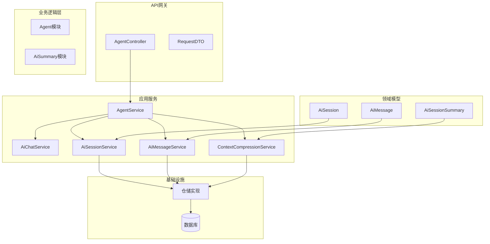
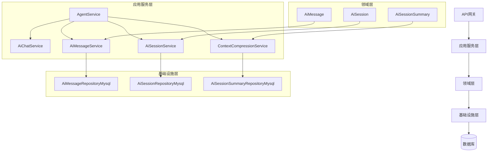
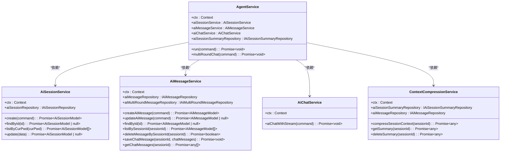
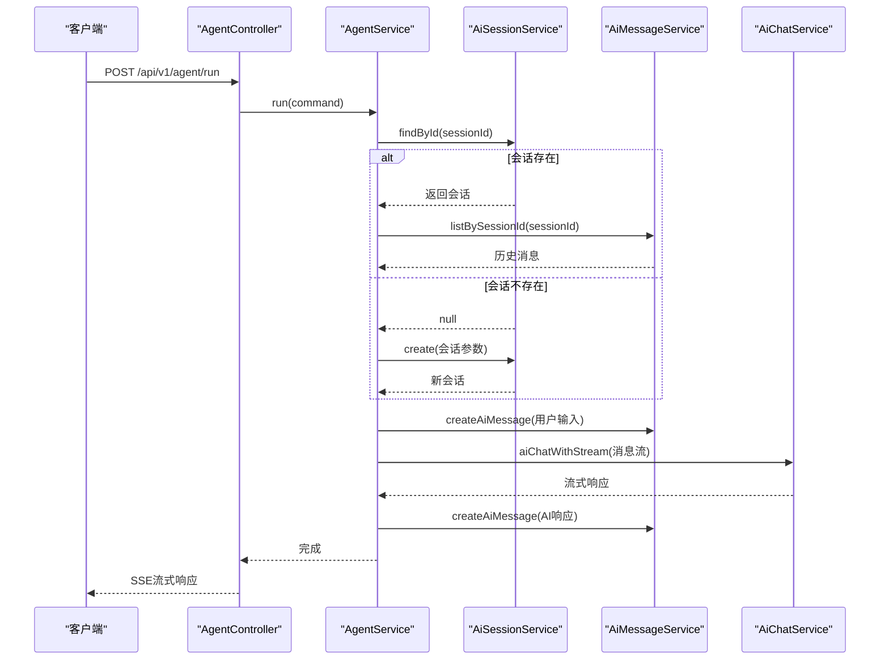
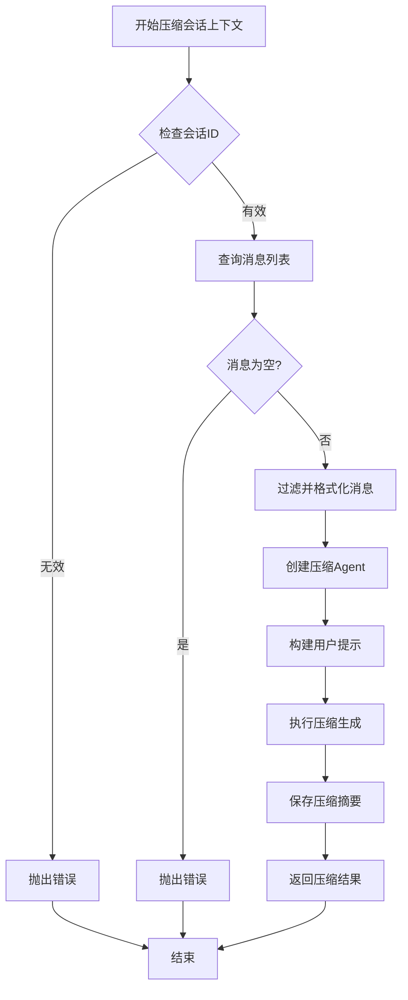
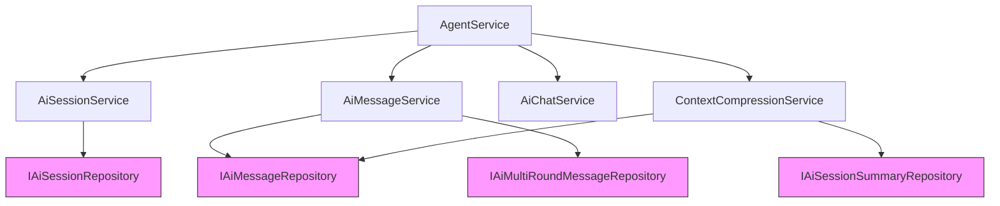

# 业务逻辑层

<cite>
**本文档中引用的文件**  
- [AgentService.ts](file://src/BussinessLayer/Agent/Application/Service/AgentService.ts)
- [AiChatService.ts](file://src/BussinessLayer/Agent/Application/Service/AiChatService.ts)
- [AiSessionService.ts](file://src/BussinessLayer/Agent/Application/Service/AiSessionService.ts)
- [AiMessageService.ts](file://src/BussinessLayer/Agent/Application/Service/AiMessageService.ts)
- [contextCompressionService.ts](file://src/BussinessLayer/AiSummary/Application/service/contextCompressionService.ts)
- [AiSession.ts](file://src/BussinessLayer/Agent/Domain/Agent/AiSession.ts)
- [AiMessage.ts](file://src/BussinessLayer/Agent/Domain/Agent/AiMessage.ts)
- [AiSessionSummary.ts](file://src/BussinessLayer/Agent/Domain/Agent/AiSessionSummary.ts)
- [AgentController.ts](file://src/ApiGateway/aiController/AgentController.ts)
- [AgentRunRequestDTO.ts](file://src/ApiGateway/aiController/RequestDTO/AgentRunRequestDTO.ts)
</cite>

## 目录
1. [简介](#简介)
2. [项目结构](#项目结构)
3. [核心组件](#核心组件)
4. [架构概述](#架构概述)
5. [详细组件分析](#详细组件分析)
6. [依赖分析](#依赖分析)
7. [性能考虑](#性能考虑)
8. [故障排除指南](#故障排除指南)
9. [结论](#结论)

## 简介
本文档详细阐述了schooberAi项目的业务逻辑层架构。该系统采用分层架构设计，核心是应用服务层，负责协调领域模型与基础设施之间的交互。文档重点分析了AgentService作为核心协调者，如何调用AiChatService、AiSessionService、AiMessageService和ContextCompressionService来完成复杂的AI对话和上下文压缩业务流程。系统基于MidwayJS框架，使用TypeORM进行数据持久化，实现了清晰的职责分离和依赖注入模式。

## 项目结构
schooberAi项目采用模块化分层架构，主要分为API网关、业务逻辑层、共享基础组件和辅助工具等部分。业务逻辑层进一步划分为领域驱动设计的各个模块，包括Agent、AiSummary等，每个模块包含应用服务、领域模型和仓储实现。

**图示来源**
- [AgentController.ts](file://src/ApiGateway/aiController/AgentController.ts)
- [AgentService.ts](file://src/BussinessLayer/Agent/Application/Service/AgentService.ts)
- [AiSession.ts](file://src/BussinessLayer/Agent/Domain/Agent/AiSession.ts)

## 核心组件
业务逻辑层的核心组件包括AgentService、AiChatService、AiSessionService、AiMessageService和ContextCompressionService。这些服务通过依赖注入进行通信，实现了高内聚低耦合的设计。AgentService作为主要协调者，负责启动和管理整个AI对话流程，而其他服务则专注于各自的业务领域，如会话管理、消息存储和上下文压缩等。

**组件来源**
- [AgentService.ts](file://src/BussinessLayer/Agent/Application/Service/AgentService.ts#L1-L294)
- [AiChatService.ts](file://src/BussinessLayer/Agent/Application/Service/AiChatService.ts#L1-L196)

## 架构概述
schooberAi项目采用典型的分层架构，包括表现层（API网关）、应用服务层、领域层和基础设施层。应用服务层是业务逻辑的核心，负责协调领域对象和基础设施服务。领域层包含实体和聚合根，封装了核心业务规则。基础设施层提供数据持久化和其他外部服务集成。

**图示来源**
- [AgentService.ts](file://src/BussinessLayer/Agent/Application/Service/AgentService.ts)
- [AiSession.ts](file://src/BussinessLayer/Agent/Domain/Agent/AiSession.ts)
- [AiSessionRepositoryMysql.ts](file://src/BussinessLayer/Agent/Repository/AiSessionRepositoryMysql.ts)

## 详细组件分析

### AgentService分析
AgentService是整个系统的核心协调者，负责管理AI对话的完整生命周期。它接收来自API控制器的请求，协调会话创建、消息记录和AI交互等操作。该服务通过依赖注入获取其他服务实例，实现了松耦合的设计。

**图示来源**
- [AgentService.ts](file://src/BussinessLayer/Agent/Application/Service/AgentService.ts#L1-L294)
- [AiSessionService.ts](file://src/BussinessLayer/Agent/Application/Service/AiSessionService.ts#L1-L133)

### AI对话工作流
AI对话工作流展示了从用户请求到AI响应的完整处理流程。AgentService首先检查会话状态，然后协调消息服务和AI聊天服务完成对话交互。

**图示来源**
- [AgentService.ts](file://src/BussinessLayer/Agent/Application/Service/AgentService.ts#L34-L294)
- [AgentController.ts](file://src/ApiGateway/aiController/AgentController.ts#L39-L55)

### 上下文压缩工作流
上下文压缩工作流展示了如何将长对话历史压缩为摘要，以提高后续对话的效率和性能。

**图示来源**
- [contextCompressionService.ts](file://src/BussinessLayer/AiSummary/Application/service/contextCompressionService.ts#L25-L75)

## 依赖分析
系统采用依赖注入模式管理组件间的依赖关系。AgentService依赖于AiSessionService、AiMessageService、AiChatService和ContextCompressionService，这些依赖通过@Midwayjs/core的@Inject装饰器注入。领域模型与仓储接口的依赖通过类型注入实现，具体的仓储实现由基础设施层提供。

**图示来源**
- [AgentService.ts](file://src/BussinessLayer/Agent/Application/Service/AgentService.ts#L18-L27)
- [AiSessionService.ts](file://src/BussinessLayer/Agent/Application/Service/AiSessionService.ts#L12-L12)

## 性能考虑
系统在性能方面进行了多项优化。首先，采用SSE（Server-Sent Events）技术实现流式响应，使AI的回复能够实时传输给客户端，提升用户体验。其次，通过上下文压缩服务减少长对话的历史记录长度，降低后续请求的处理开销。此外，系统使用TypeORM进行数据库操作，支持连接池和查询优化。日志记录采用异步方式，避免阻塞主业务流程。

## 故障排除指南
当系统出现故障时，可按照以下步骤进行排查：
1. 检查API网关日志，确认请求是否正确到达
2. 查看AgentService日志，分析业务流程中的错误
3. 验证AI服务配置（AK、API URL等）是否正确
4. 检查数据库连接状态和表结构
5. 确认依赖服务（如AI模型服务）是否正常运行

常见错误包括会话不存在、消息查询失败、AI服务调用超时等，系统已实现相应的错误处理和日志记录机制。

**组件来源**
- [AgentService.ts](file://src/BussinessLayer/Agent/Application/Service/AgentService.ts#L89-L92)
- [AiSessionService.ts](file://src/BussinessLayer/Agent/Application/Service/AiSessionService.ts#L68-L72)

## 结论
schooberAi项目的业务逻辑层采用了清晰的分层架构和领域驱动设计，通过AgentService作为核心协调者，有效整合了各个应用服务。系统实现了AI对话、会话管理、消息存储和上下文压缩等核心功能，具有良好的可维护性和扩展性。依赖注入模式的使用使得组件间耦合度低，便于单元测试和替换实现。未来可进一步优化上下文压缩算法，提升长对话的处理效率。