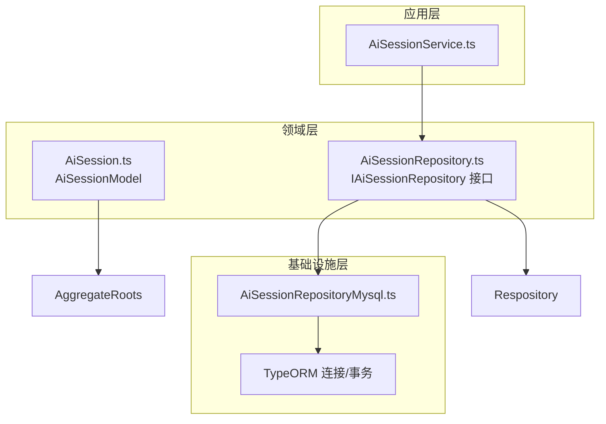
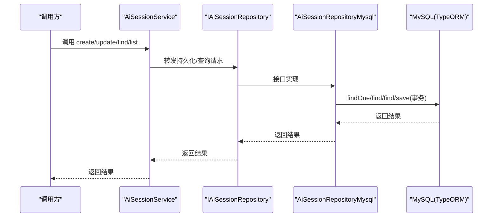
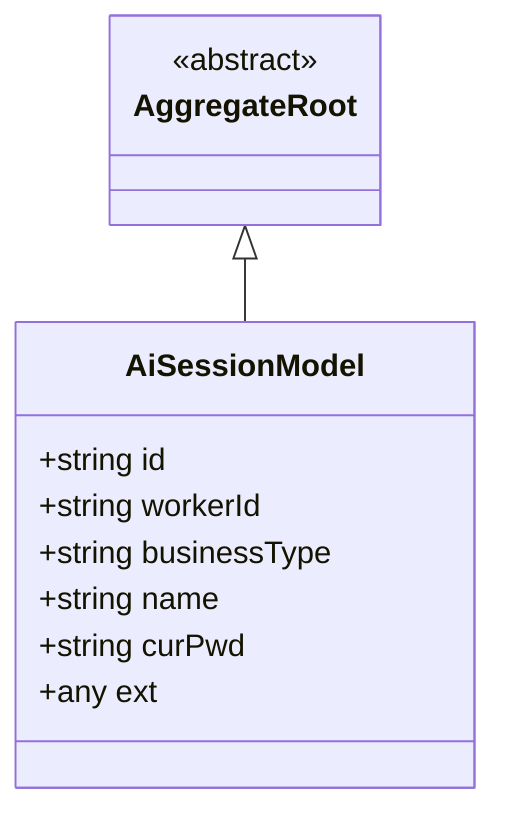
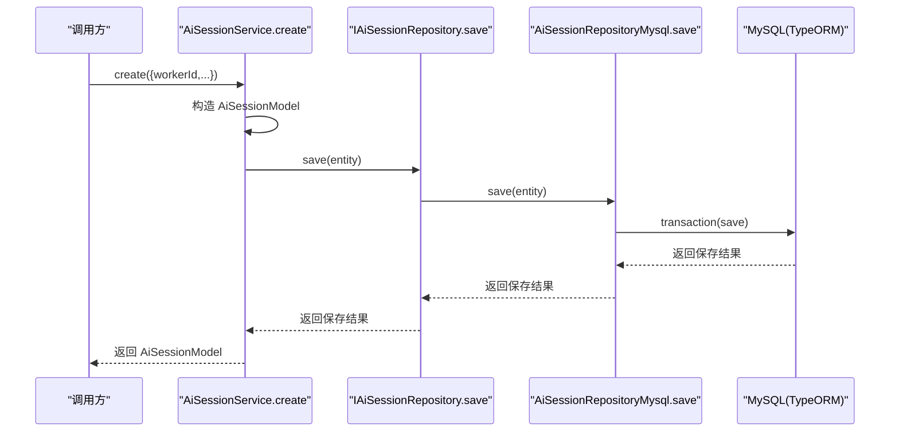
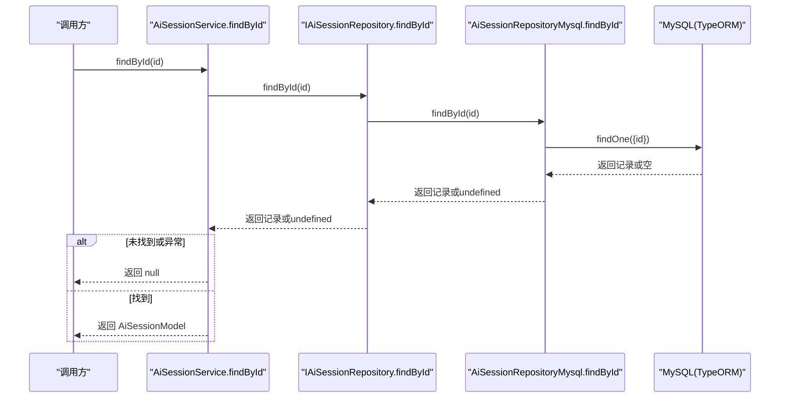
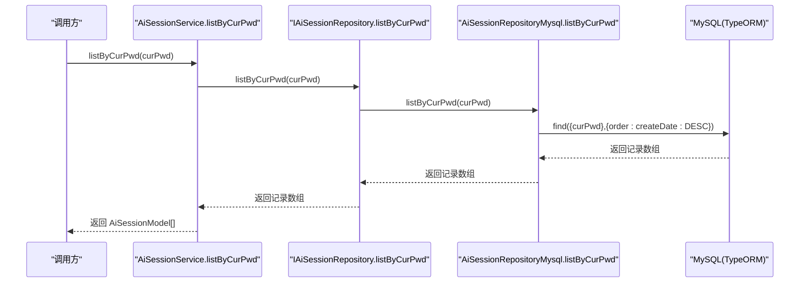
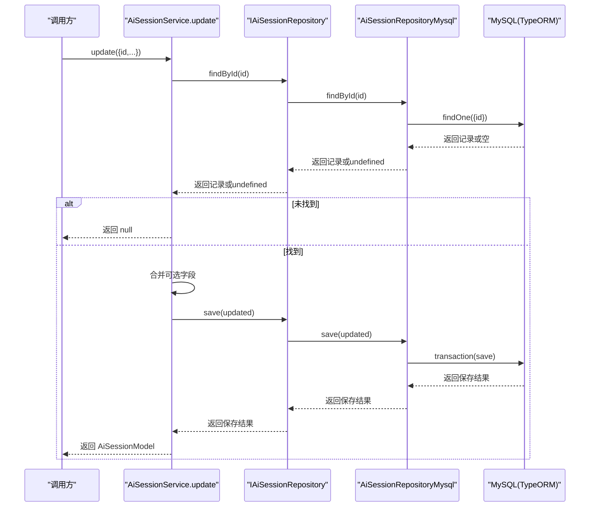
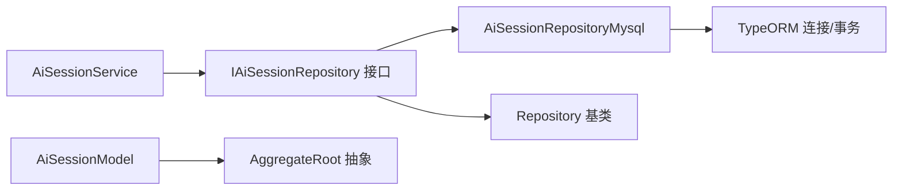

# 会话管理服务

<cite>
**本文引用的文件**
- [AiSessionService.ts](file://src/BussinessLayer/Agent/Application/Service/AiSessionService.ts)
- [AiSession.ts](file://src/BussinessLayer/Agent/Domain/Agent/AiSession.ts)
- [AiSessionRepository.ts](file://src/BussinessLayer/Agent/Domain/Agent/AiSessionRepository.ts)
- [AiSessionRepositoryMysql.ts](file://src/BussinessLayer/Agent/Repository/AiSessionRepositoryMysql.ts)
- [AggregateRoots.ts](file://src/Shared/SeedWork/AggregateRoots.ts)
- [Respository.ts](file://src/Shared/SeedWork/Respository.ts)
</cite>

## 目录
1. [简介](#简介)
2. [项目结构](#项目结构)
3. [核心组件](#核心组件)
4. [架构总览](#架构总览)
5. [详细组件分析](#详细组件分析)
6. [依赖关系分析](#依赖关系分析)
7. [性能与索引建议](#性能与索引建议)
8. [故障排查指南](#故障排查指南)
9. [结论](#结论)

## 简介
本文件围绕会话管理服务 AiSessionService 提供的四大核心方法进行系统化说明：create、findById、listByCurPwd 和 update。文档重点解释：
- 每个方法的业务逻辑与调用流程
- 参数校验与默认值处理策略
- 数据库交互细节与事务保障
- 会话实体 AiSessionModel 的关键字段及其用途
- 容错设计（尤其是 findById 在数据库异常时返回 null 的策略）
- 会话生命周期管理最佳实践与 curPwd 索引使用建议

## 项目结构
会话管理相关代码采用“应用层服务 + 领域模型 + 仓储层”的分层架构组织，职责清晰、耦合度低，便于维护与扩展。

图表来源
- [AiSessionService.ts](file://src/BussinessLayer/Agent/Application/Service/AiSessionService.ts#L1-L133)
- [AiSession.ts](file://src/BussinessLayer/Agent/Domain/Agent/AiSession.ts#L1-L72)
- [AiSessionRepository.ts](file://src/BussinessLayer/Agent/Domain/Agent/AiSessionRepository.ts#L1-L13)
- [AiSessionRepositoryMysql.ts](file://src/BussinessLayer/Agent/Repository/AiSessionRepositoryMysql.ts#L1-L56)
- [AggregateRoots.ts](file://src/Shared/SeedWork/AggregateRoots.ts#L1-L18)
- [Respository.ts](file://src/Shared/SeedWork/Respository.ts#L1-L6)

章节来源
- [AiSessionService.ts](file://src/BussinessLayer/Agent/Application/Service/AiSessionService.ts#L1-L133)
- [AiSession.ts](file://src/BussinessLayer/Agent/Domain/Agent/AiSession.ts#L1-L72)
- [AiSessionRepository.ts](file://src/BussinessLayer/Agent/Domain/Agent/AiSessionRepository.ts#L1-L13)
- [AiSessionRepositoryMysql.ts](file://src/BussinessLayer/Agent/Repository/AiSessionRepositoryMysql.ts#L1-L56)
- [AggregateRoots.ts](file://src/Shared/SeedWork/AggregateRoots.ts#L1-L18)
- [Respository.ts](file://src/Shared/SeedWork/Respository.ts#L1-L6)

## 核心组件
- AiSessionService：会话管理的应用服务，封装创建、查询、列表与更新等业务操作。
- AiSessionModel：会话实体，映射数据库表 ai_session，包含 workerId、businessType、name、curPwd、ext 等字段。
- IAiSessionRepository：仓储接口，定义统一的查询与持久化契约。
- AiSessionRepositoryMysql：基于 TypeORM 的 MySQL 实现，提供 findById、findByCurPwd、listByCurPwd、save 等能力，并通过事务保证一致性。

章节来源
- [AiSessionService.ts](file://src/BussinessLayer/Agent/Application/Service/AiSessionService.ts#L1-L133)
- [AiSession.ts](file://src/BussinessLayer/Agent/Domain/Agent/AiSession.ts#L1-L72)
- [AiSessionRepository.ts](file://src/BussinessLayer/Agent/Domain/Agent/AiSessionRepository.ts#L1-L13)
- [AiSessionRepositoryMysql.ts](file://src/BussinessLayer/Agent/Repository/AiSessionRepositoryMysql.ts#L1-L56)

## 架构总览
下图展示 AiSessionService 与仓储层之间的交互关系及数据流向：

图表来源
- [AiSessionService.ts](file://src/BussinessLayer/Agent/Application/Service/AiSessionService.ts#L1-L133)
- [AiSessionRepository.ts](file://src/BussinessLayer/Agent/Domain/Agent/AiSessionRepository.ts#L1-L13)
- [AiSessionRepositoryMysql.ts](file://src/BussinessLayer/Agent/Repository/AiSessionRepositoryMysql.ts#L1-L56)

## 详细组件分析

### 会话实体 AiSessionModel
- 字段说明
  - id：会话主键（由构造函数将 sessionId 映射为 id；若未传入则由数据库生成）
  - workerId：工作者标识，必填
  - businessType：业务类型，可选
  - name：会话名称，可选
  - curPwd：当前工作目录（用于按路径检索），可选
  - ext：扩展字段，JSON 类型，可选
- 继承关系
  - AiSessionModel 继承自 AggregateRoot，具备聚合根的基础能力
- 关系映射
  - 实体注解映射到数据库表 ai_session

图表来源
- [AiSession.ts](file://src/BussinessLayer/Agent/Domain/Agent/AiSession.ts#L1-L72)
- [AggregateRoots.ts](file://src/Shared/SeedWork/AggregateRoots.ts#L1-L18)

章节来源
- [AiSession.ts](file://src/BussinessLayer/Agent/Domain/Agent/AiSession.ts#L1-L72)
- [AggregateRoots.ts](file://src/Shared/SeedWork/AggregateRoots.ts#L1-L18)

### 方法一：create（创建会话）
- 业务逻辑
  - 接收命令对象，构造 AiSessionModel 实例并调用仓储保存
  - 使用数据库事务确保保存的一致性
- 参数与默认值
  - 必填：workerId
  - 可选：sessionId、businessType、name、curPwd、ext
  - 若未提供 sessionId，则 id 将由数据库生成
- 数据库交互
  - 通过 AiSessionRepositoryMysql.save 执行事务保存
- 错误处理
  - 捕获异常并记录错误日志后抛出统一错误

图表来源
- [AiSessionService.ts](file://src/BussinessLayer/Agent/Application/Service/AiSessionService.ts#L19-L49)
- [AiSessionRepositoryMysql.ts](file://src/BussinessLayer/Agent/Repository/AiSessionRepositoryMysql.ts#L47-L53)

章节来源
- [AiSessionService.ts](file://src/BussinessLayer/Agent/Application/Service/AiSessionService.ts#L19-L49)
- [AiSessionRepositoryMysql.ts](file://src/BussinessLayer/Agent/Repository/AiSessionRepositoryMysql.ts#L47-L53)

### 方法二：findById（按 ID 查询）
- 业务逻辑
  - 通过仓储按 id 查询单条会话
  - 若未找到或数据库异常，返回 null，不抛出异常
- 容错设计
  - 数据库连接错误（如 ECONNRESET）时记录错误日志并返回 null，允许上层优雅降级（例如重新创建会话）
- 日志与返回
  - 成功：记录成功日志并返回实体
  - 异常：记录错误日志并返回 null

图表来源
- [AiSessionService.ts](file://src/BussinessLayer/Agent/Application/Service/AiSessionService.ts#L56-L73)
- [AiSessionRepositoryMysql.ts](file://src/BussinessLayer/Agent/Repository/AiSessionRepositoryMysql.ts#L14-L22)

章节来源
- [AiSessionService.ts](file://src/BussinessLayer/Agent/Application/Service/AiSessionService.ts#L56-L73)
- [AiSessionRepositoryMysql.ts](file://src/BussinessLayer/Agent/Repository/AiSessionRepositoryMysql.ts#L14-L22)

### 方法三：listByCurPwd（按 curPwd 列表查询）
- 业务逻辑
  - 通过仓储按 curPwd 查询所有匹配的会话，并按创建时间倒序排列
- 数据库交互
  - 使用 find 查询并设置排序
- 错误处理
  - 捕获异常并记录错误日志后抛出统一错误

图表来源
- [AiSessionService.ts](file://src/BussinessLayer/Agent/Application/Service/AiSessionService.ts#L80-L89)
- [AiSessionRepositoryMysql.ts](file://src/BussinessLayer/Agent/Repository/AiSessionRepositoryMysql.ts#L34-L44)

章节来源
- [AiSessionService.ts](file://src/BussinessLayer/Agent/Application/Service/AiSessionService.ts#L80-L89)
- [AiSessionRepositoryMysql.ts](file://src/BussinessLayer/Agent/Repository/AiSessionRepositoryMysql.ts#L34-L44)

### 方法四：update（更新会话）
- 业务逻辑
  - 先根据 id 查询是否存在该会话；不存在则返回 null
  - 存在时仅更新传入的可选字段（sessionId、workerId、businessType、name、ext）
  - 最终保存并返回更新后的实体
- 数据库交互
  - 通过事务保存更新后的实体
- 错误处理
  - 捕获异常并记录错误日志后抛出统一错误

图表来源
- [AiSessionService.ts](file://src/BussinessLayer/Agent/Application/Service/AiSessionService.ts#L96-L131)
- [AiSessionRepositoryMysql.ts](file://src/BussinessLayer/Agent/Repository/AiSessionRepositoryMysql.ts#L47-L53)

章节来源
- [AiSessionService.ts](file://src/BussinessLayer/Agent/Application/Service/AiSessionService.ts#L96-L131)
- [AiSessionRepositoryMysql.ts](file://src/BussinessLayer/Agent/Repository/AiSessionRepositoryMysql.ts#L47-L53)

## 依赖关系分析
- 应用服务对仓储接口编程，避免直接依赖具体实现，提升可测试性与可替换性
- 仓储实现基于 TypeORM，统一使用 getConnection().transaction 包裹保存操作，确保一致性
- 实体继承自 AggregateRoot，遵循聚合根抽象

图表来源
- [AiSessionService.ts](file://src/BussinessLayer/Agent/Application/Service/AiSessionService.ts#L1-L133)
- [AiSessionRepository.ts](file://src/BussinessLayer/Agent/Domain/Agent/AiSessionRepository.ts#L1-L13)
- [AiSessionRepositoryMysql.ts](file://src/BussinessLayer/Agent/Repository/AiSessionRepositoryMysql.ts#L1-L56)
- [AiSession.ts](file://src/BussinessLayer/Agent/Domain/Agent/AiSession.ts#L1-L72)
- [AggregateRoots.ts](file://src/Shared/SeedWork/AggregateRoots.ts#L1-L18)
- [Respository.ts](file://src/Shared/SeedWork/Respository.ts#L1-L6)

章节来源
- [AiSessionService.ts](file://src/BussinessLayer/Agent/Application/Service/AiSessionService.ts#L1-L133)
- [AiSessionRepository.ts](file://src/BussinessLayer/Agent/Domain/Agent/AiSessionRepository.ts#L1-L13)
- [AiSessionRepositoryMysql.ts](file://src/BussinessLayer/Agent/Repository/AiSessionRepositoryMysql.ts#L1-L56)
- [AiSession.ts](file://src/BussinessLayer/Agent/Domain/Agent/AiSession.ts#L1-L72)
- [AggregateRoots.ts](file://src/Shared/SeedWork/AggregateRoots.ts#L1-L18)
- [Respository.ts](file://src/Shared/SeedWork/Respository.ts#L1-L6)

## 性能与索引建议
- curPwd 查询优化
  - 当前实现通过 listByCurPwd 对 curPwd 进行等值查询并按创建时间倒序排序。若数据量较大，建议在数据库表 ai_session 上为 curPwd 建立索引，以减少全表扫描成本
  - 如需进一步加速，可在 curPwd + createDate 上建立复合索引，满足“按路径筛选 + 时间倒序”的典型查询模式
- 事务与并发
  - 保存操作均在事务中执行，可有效避免部分写入导致的数据不一致
- 缓存与降级
  - findById 在数据库异常时返回 null，有利于前端或上层逻辑进行优雅降级（例如自动重建会话），降低对数据库的强依赖

[本节为通用性能建议，无需特定文件来源]

## 故障排查指南
- 创建失败
  - 现象：create 抛出统一错误
  - 排查要点：检查 workerId 是否缺失、数据库连接状态、事务是否正常提交
- 查询为空
  - findById 返回 null：可能是会话不存在或数据库异常触发了容错降级
  - listByCurPwd 返回空数组：确认 curPwd 是否正确、索引是否生效
- 更新失败
  - 现象：update 返回 null 或抛出错误
  - 排查要点：确认 id 是否存在；检查传入字段是否合法；查看事务日志

章节来源
- [AiSessionService.ts](file://src/BussinessLayer/Agent/Application/Service/AiSessionService.ts#L56-L73)
- [AiSessionService.ts](file://src/BussinessLayer/Agent/Application/Service/AiSessionService.ts#L80-L89)
- [AiSessionService.ts](file://src/BussinessLayer/Agent/Application/Service/AiSessionService.ts#L96-L131)

## 结论
AiSessionService 通过清晰的分层设计与仓储接口，提供了稳定可靠的会话管理能力。其核心特性包括：
- create：事务化保存，支持可选字段与默认 id 生成
- findById：容错设计，数据库异常时优雅降级
- listByCurPwd：按路径检索并按时间倒序，适合快速定位最新会话
- update：幂等更新指定字段，避免覆盖未变更内容

配合合理的数据库索引（尤其是 curPwd）与缓存策略，可显著提升查询性能与系统可用性。