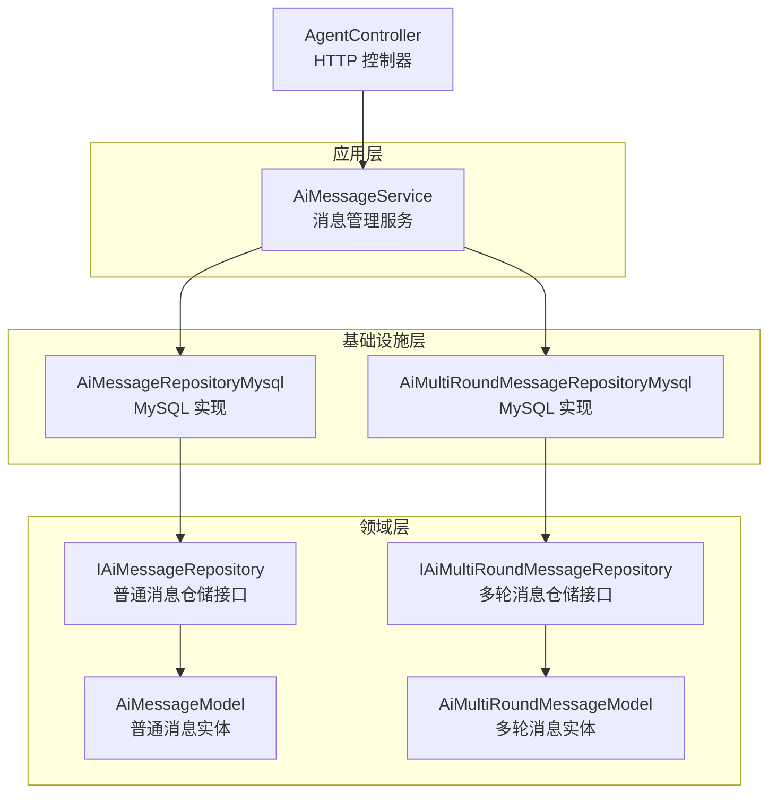
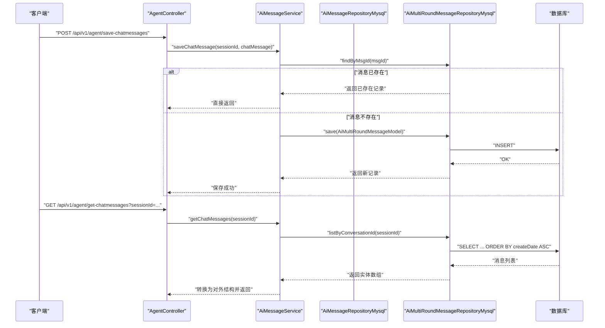
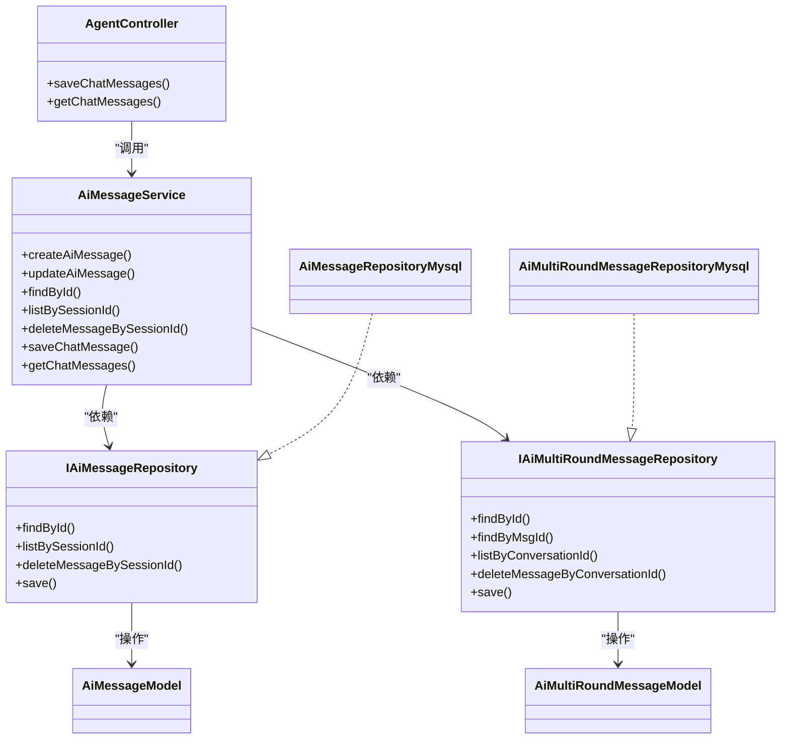

# 消息管理服务

<cite>
**本文引用的文件**
- [AiMessageService.ts](file://src/BussinessLayer/Agent/Application/Service/AiMessageService.ts)
- [AiMessage.ts](file://src/BussinessLayer/Agent/Domain/Agent/AiMessage.ts)
- [AiMessageRepository.ts](file://src/BussinessLayer/Agent/Domain/Agent/AiMessageRepository.ts)
- [AiMessageRepositoryMysql.ts](file://src/BussinessLayer/Agent/Repository/AiMessageRepositoryMysql.ts)
- [AiMultiRoundMessage.ts](file://src/BussinessLayer/Agent/Domain/Agent/AiMultiRoundMessage.ts)
- [AiMultiRoundMessageRepository.ts](file://src/BussinessLayer/Agent/Domain/Agent/AiMultiRoundMessageRepository.ts)
- [AiMultiRoundMessageRepositoryMysql.ts](file://src/BussinessLayer/Agent/Repository/AiMultiRoundMessageRepositoryMysql.ts)
- [AgentController.ts](file://src/ApiGateway/aiController/AgentController.ts)
- [SaveChatMessagesRequestDTO.ts](file://src/ApiGateway/aiController/RequestDTO/SaveChatMessagesRequestDTO.ts)
- [GetChatMessagesRequestDTO.ts](file://src/ApiGateway/aiController/RequestDTO/GetChatMessagesRequestDTO.ts)
</cite>

## 目录
1. [简介](#简介)
2. [项目结构](#项目结构)
3. [核心组件](#核心组件)
4. [架构总览](#架构总览)
5. [详细组件分析](#详细组件分析)
6. [依赖关系分析](#依赖关系分析)
7. [性能考量](#性能考量)
8. [故障排查指南](#故障排查指南)
9. [结论](#结论)

## 简介
本文件围绕消息管理服务进行系统化文档化，重点覆盖以下方面：
- AiMessageService 的关键方法：createAiMessage、updateAiMessage、listBySessionId，以及 saveChatMessage 和 getChatMessages 的多轮对话消息处理流程。
- 消息实体 AiMessageModel 的结构与字段语义，包括 fromType、messageContent、llmConfig 等。
- 多轮对话消息 AiMultiRoundMessage 与普通消息的区别，以及通过 msgId 去重避免重复保存的机制。
- 消息持久化策略与查询性能优化，特别是按会话 ID 的索引优化建议。
- 完整的消息数据流图，展示从用户输入到 AI 响应的存储路径。

## 项目结构
消息管理相关代码主要分布在三层：
- 应用层服务：AiMessageService 提供业务操作入口。
- 领域层模型与仓储接口：AiMessageModel、AiMultiRoundMessageModel 及其仓储接口定义。
- 基础设施层实现：AiMessageRepositoryMysql、AiMultiRoundMessageRepositoryMysql 实现数据库访问。

图表来源
- [AiMessageService.ts](file://src/BussinessLayer/Agent/Application/Service/AiMessageService.ts#L1-L191)
- [AiMessage.ts](file://src/BussinessLayer/Agent/Domain/Agent/AiMessage.ts#L1-L79)
- [AiMessageRepository.ts](file://src/BussinessLayer/Agent/Domain/Agent/AiMessageRepository.ts#L1-L12)
- [AiMessageRepositoryMysql.ts](file://src/BussinessLayer/Agent/Repository/AiMessageRepositoryMysql.ts#L1-L47)
- [AiMultiRoundMessage.ts](file://src/BussinessLayer/Agent/Domain/Agent/AiMultiRoundMessage.ts#L1-L100)
- [AiMultiRoundMessageRepository.ts](file://src/BussinessLayer/Agent/Domain/Agent/AiMultiRoundMessageRepository.ts#L1-L12)
- [AiMultiRoundMessageRepositoryMysql.ts](file://src/BussinessLayer/Agent/Repository/AiMultiRoundMessageRepositoryMysql.ts#L1-L56)
- [AgentController.ts](file://src/ApiGateway/aiController/AgentController.ts#L1-L170)

章节来源
- [AiMessageService.ts](file://src/BussinessLayer/Agent/Application/Service/AiMessageService.ts#L1-L191)
- [AiMessage.ts](file://src/BussinessLayer/Agent/Domain/Agent/AiMessage.ts#L1-L79)
- [AiMultiRoundMessage.ts](file://src/BussinessLayer/Agent/Domain/Agent/AiMultiRoundMessage.ts#L1-L100)
- [AiMessageRepositoryMysql.ts](file://src/BussinessLayer/Agent/Repository/AiMessageRepositoryMysql.ts#L1-L47)
- [AiMultiRoundMessageRepositoryMysql.ts](file://src/BussinessLayer/Agent/Repository/AiMultiRoundMessageRepositoryMysql.ts#L1-L56)
- [AgentController.ts](file://src/ApiGateway/aiController/AgentController.ts#L1-L170)

## 核心组件
- AiMessageService：封装消息创建、更新、查询、删除及多轮对话消息的保存与读取。
- AiMessageModel：普通消息实体，承载会话标识、来源类型、消息内容、工作者标识、扩展字段与 LLM 配置。
- AiMultiRoundMessageModel：多轮对话消息实体，包含会话标识、消息唯一标识、消息类型、内容、发送者、状态、工作者与扩展信息。
- 仓储接口与实现：IAiMessageRepository/IAiMultiRoundMessageRepository 及其 MySQL 实现，负责数据持久化与查询。

章节来源
- [AiMessageService.ts](file://src/BussinessLayer/Agent/Application/Service/AiMessageService.ts#L1-L191)
- [AiMessage.ts](file://src/BussinessLayer/Agent/Domain/Agent/AiMessage.ts#L1-L79)
- [AiMultiRoundMessage.ts](file://src/BussinessLayer/Agent/Domain/Agent/AiMultiRoundMessage.ts#L1-L100)
- [AiMessageRepository.ts](file://src/BussinessLayer/Agent/Domain/Agent/AiMessageRepository.ts#L1-L12)
- [AiMultiRoundMessageRepository.ts](file://src/BussinessLayer/Agent/Domain/Agent/AiMultiRoundMessageRepository.ts#L1-L12)

## 架构总览
消息管理服务采用分层架构，控制器负责接收请求并调用服务层；服务层协调仓储实现完成数据持久化与查询；仓储实现基于 TypeORM 进行数据库操作，并在保存时使用事务确保一致性。

图表来源
- [AgentController.ts](file://src/ApiGateway/aiController/AgentController.ts#L94-L143)
- [AiMessageService.ts](file://src/BussinessLayer/Agent/Application/Service/AiMessageService.ts#L136-L191)
- [AiMultiRoundMessageRepositoryMysql.ts](file://src/BussinessLayer/Agent/Repository/AiMultiRoundMessageRepositoryMysql.ts#L1-L56)

## 详细组件分析

### AiMessageService 方法详解
- createAiMessage
  - 功能：创建一条普通消息，支持传入 sessionId、fromType、messageContent、workerId、ext、llmConfig 等参数。
  - 流程要点：构造 AiMessageModel 后交由 IAiMessageRepository 保存；内部使用事务保存，保证一致性；日志记录成功或失败。
  - 返回值：保存后的 AiMessageModel。
  - 异常处理：捕获错误并抛出统一错误信息。
- updateAiMessage
  - 功能：根据 id 更新消息的部分字段，若未找到对应记录则返回空。
  - 流程要点：先按 id 查找，不存在则告警并返回空；存在则逐项赋值并保存。
  - 异常处理：捕获错误并抛出统一错误信息。
- listBySessionId
  - 功能：按会话 ID 查询消息列表，并按创建时间升序排列。
  - 流程要点：调用 IAiMessageRepository.listBySessionId 并返回结果。
  - 性能提示：查询按 sessionId 过滤，建议在数据库层对 sessionId 建立索引以提升查询效率。
- saveChatMessage（多轮对话）
  - 功能：保存多轮对话消息，基于 msgId 去重，避免重复保存。
  - 流程要点：先检查 msgId 是否已存在；存在则跳过；不存在则构造 AiMultiRoundMessageModel 并保存。
  - 异常处理：捕获错误并抛出统一错误信息。
- getChatMessages（多轮对话）
  - 功能：按会话 ID 获取多轮对话消息列表，并将实体转换为对外结构（含时间戳、内容类型处理等）。
  - 流程要点：调用 IAiMultiRoundMessageRepository.listByConversationId，再做字段映射与类型转换。
  - 异常处理：捕获错误并抛出统一错误信息。

章节来源
- [AiMessageService.ts](file://src/BussinessLayer/Agent/Application/Service/AiMessageService.ts#L20-L191)

### 消息实体结构与字段语义
- AiMessageModel（普通消息）
  - 字段
    - sessionId：关联的会话 ID。
    - fromType：消息来源类型（如用户、AI 等）。
    - messageContent：消息内容，类型为 AiPrompt 数组。
    - workerId：工作者 ID。
    - ext：扩展字段，JSON 类型。
    - llmConfig：大模型配置，JSON 类型。
  - 用途：记录单轮或多轮对话中的消息条目，便于按会话检索与管理。
- AiMultiRoundMessageModel（多轮对话消息）
  - 字段
    - conversationId：所属会话 ID。
    - msgId：消息唯一标识，用于去重。
    - type：消息类型（默认 Text）。
    - content：消息内容，JSON 类型。
    - sender：发送者信息，JSON 类型。
    - msgStatus：消息状态（默认 complete）。
    - workerId：创建者 ID。
    - ext：额外信息，JSON 类型。
  - 用途：记录多轮对话中的每条消息，支持按会话 ID 排序与去重。

章节来源
- [AiMessage.ts](file://src/BussinessLayer/Agent/Domain/Agent/AiMessage.ts#L1-L79)
- [AiMultiRoundMessage.ts](file://src/BussinessLayer/Agent/Domain/Agent/AiMultiRoundMessage.ts#L1-L100)

### 多轮对话消息与普通消息的区别
- 存储维度不同
  - 普通消息：以 AiMessageModel 为主，适合单条消息或简单会话场景。
  - 多轮消息：以 AiMultiRoundMessageModel 为主，面向多轮对话，强调消息唯一性与排序。
- 去重策略
  - 多轮消息通过 msgId 去重，避免重复保存同一消息。
- 查询方式
  - 普通消息按 sessionId 查询并排序。
  - 多轮消息按 conversationId 查询并排序。
- 内容结构
  - 普通消息内容为 AiPrompt 数组。
  - 多轮消息内容为 JSON，可包含多种类型（如 Text、多媒体等），并在对外返回时按 type 做差异化处理。

章节来源
- [AiMessageService.ts](file://src/BussinessLayer/Agent/Application/Service/AiMessageService.ts#L136-L191)
- [AiMultiRoundMessage.ts](file://src/BussinessLayer/Agent/Domain/Agent/AiMultiRoundMessage.ts#L1-L100)

### HTTP 接口与 DTO
- 保存多轮对话消息
  - 路径：POST /api/v1/agent/save-chatmessages
  - 请求体：SaveChatMessagesRequestDTO，包含 sessionId 与 chatMessage。
  - 逻辑：调用 AiMessageService.saveChatMessage。
- 获取多轮对话消息列表
  - 路径：GET /api/v1/agent/get-chatmessages
  - 查询参数：GetChatMessagesRequestDTO，包含 sessionId。
  - 逻辑：调用 AiMessageService.getChatMessages。

章节来源
- [AgentController.ts](file://src/ApiGateway/aiController/AgentController.ts#L94-L143)
- [SaveChatMessagesRequestDTO.ts](file://src/ApiGateway/aiController/RequestDTO/SaveChatMessagesRequestDTO.ts#L1-L10)
- [GetChatMessagesRequestDTO.ts](file://src/ApiGateway/aiController/RequestDTO/GetChatMessagesRequestDTO.ts#L1-L7)

## 依赖关系分析
- 组件耦合
  - AgentController 仅依赖 AiMessageService，降低控制器复杂度。
  - AiMessageService 依赖 IAiMessageRepository 与 IAiMultiRoundMessageRepository，通过接口解耦具体实现。
  - 仓储实现依赖 TypeORM 进行数据库操作，并在保存时使用事务。
- 关键依赖链
  - 控制器 -> 服务 -> 仓储接口 -> 仓储实现 -> 数据库。
- 循环依赖
  - 代码结构清晰，未发现循环依赖迹象。

图表来源
- [AgentController.ts](file://src/ApiGateway/aiController/AgentController.ts#L1-L170)
- [AiMessageService.ts](file://src/BussinessLayer/Agent/Application/Service/AiMessageService.ts#L1-L191)
- [AiMessageRepository.ts](file://src/BussinessLayer/Agent/Domain/Agent/AiMessageRepository.ts#L1-L12)
- [AiMultiRoundMessageRepository.ts](file://src/BussinessLayer/Agent/Domain/Agent/AiMultiRoundMessageRepository.ts#L1-L12)
- [AiMessageRepositoryMysql.ts](file://src/BussinessLayer/Agent/Repository/AiMessageRepositoryMysql.ts#L1-L47)
- [AiMultiRoundMessageRepositoryMysql.ts](file://src/BussinessLayer/Agent/Repository/AiMultiRoundMessageRepositoryMysql.ts#L1-L56)
- [AiMessage.ts](file://src/BussinessLayer/Agent/Domain/Agent/AiMessage.ts#L1-L79)
- [AiMultiRoundMessage.ts](file://src/BussinessLayer/Agent/Domain/Agent/AiMultiRoundMessage.ts#L1-L100)

## 性能考量
- 查询优化
  - 普通消息：listBySessionId 已按创建时间升序排序，建议在数据库层为 sessionId 建立索引，以减少全表扫描。
  - 多轮消息：listByConversationId 同样按创建时间升序排序，建议为 conversationId 建立索引。
- 去重策略
  - 多轮消息通过 findByMsgId 去重，避免重复写入，减少冗余数据与索引维护成本。
- 事务与一致性
  - 保存均使用事务，确保插入或更新的一致性，但事务范围内的写入可能带来锁竞争，建议在高并发场景下评估批量写入策略。
- 分页与大数据量
  - 当前实现未包含分页，若历史消息量巨大，建议在 listBySessionId 与 listByConversationId 上增加分页参数，限制每次返回的数据量。

章节来源
- [AiMessageRepositoryMysql.ts](file://src/BussinessLayer/Agent/Repository/AiMessageRepositoryMysql.ts#L22-L31)
- [AiMultiRoundMessageRepositoryMysql.ts](file://src/BussinessLayer/Agent/Repository/AiMultiRoundMessageRepositoryMysql.ts#L32-L41)
- [AiMessageService.ts](file://src/BussinessLayer/Agent/Application/Service/AiMessageService.ts#L136-L191)

## 故障排查指南
- 常见问题
  - 未提供必要参数：updateAiMessage 必须提供 id，否则会抛出错误。
  - 未找到记录：当 findById 或 updateAiMessage 查不到对应记录时，会返回空或告警。
  - 保存失败：创建与保存过程均捕获异常并抛出统一错误信息，可通过日志定位具体原因。
- 日志与可观测性
  - 服务层在成功与失败时均有日志输出，便于快速定位问题。
- 建议排查步骤
  - 确认请求参数是否完整（如 sessionId、msgId、chatMessage）。
  - 检查数据库连接与事务是否正常提交。
  - 对于高频写入场景，关注索引与锁竞争情况。

章节来源
- [AiMessageService.ts](file://src/BussinessLayer/Agent/Application/Service/AiMessageService.ts#L53-L88)
- [AiMessageRepositoryMysql.ts](file://src/BussinessLayer/Agent/Repository/AiMessageRepositoryMysql.ts#L40-L47)
- [AiMultiRoundMessageRepositoryMysql.ts](file://src/BussinessLayer/Agent/Repository/AiMultiRoundMessageRepositoryMysql.ts#L50-L56)

## 结论
消息管理服务通过清晰的分层设计与接口抽象，实现了普通消息与多轮对话消息的统一管理。普通消息适用于会话级记录，多轮消息则聚焦于消息去重与有序存储。结合事务与索引优化，可在保证一致性的前提下提升查询性能。后续可在查询接口引入分页与缓存策略，进一步优化大规模数据场景下的性能表现。