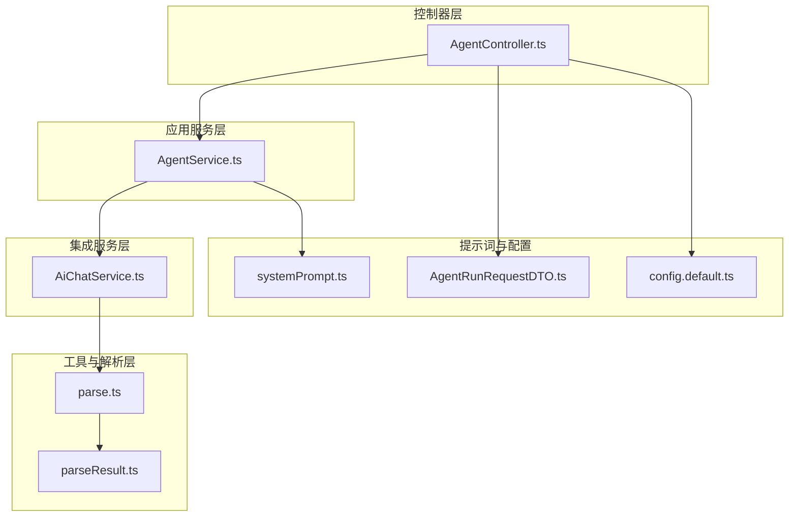
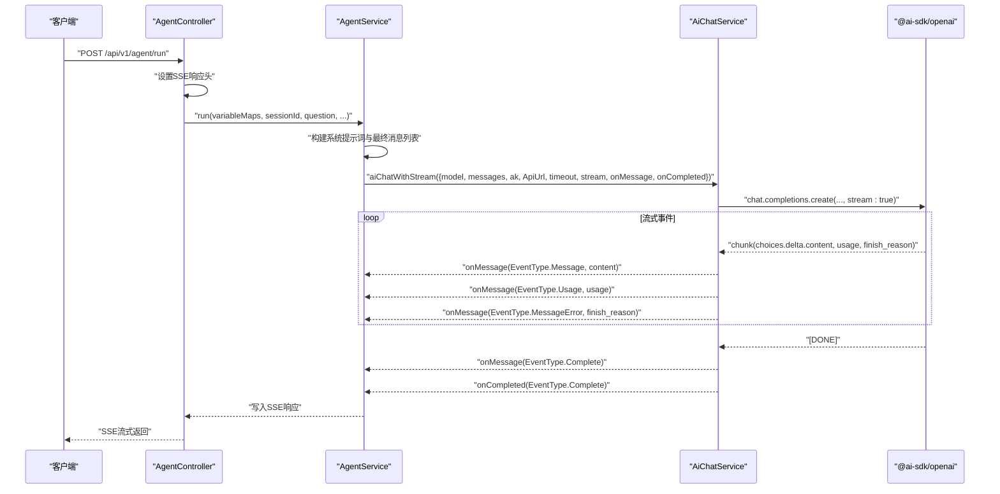
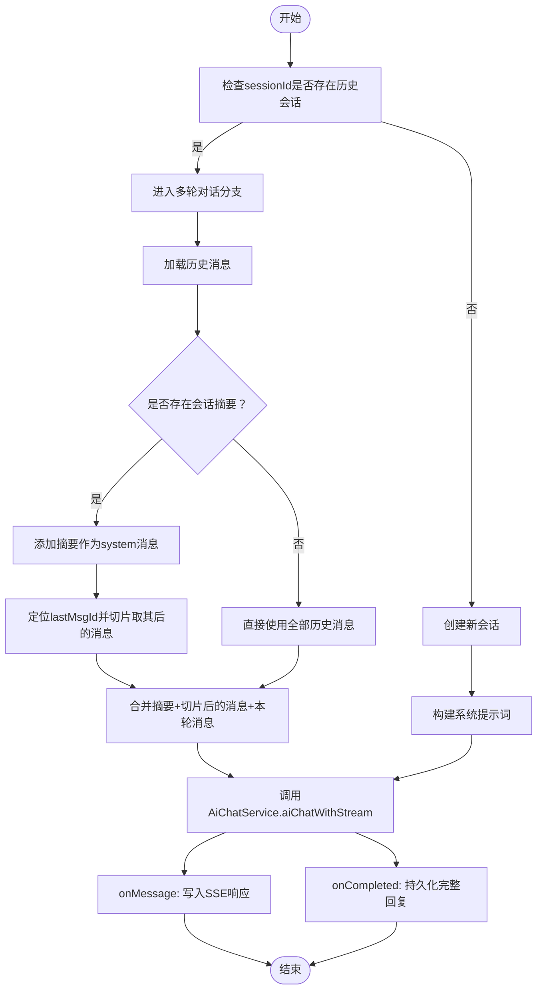
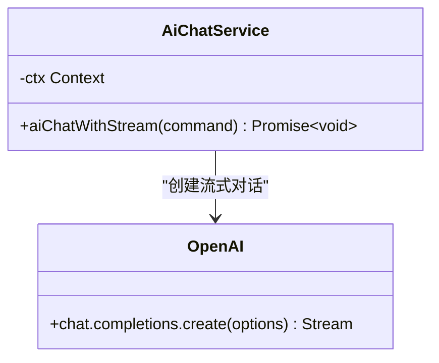
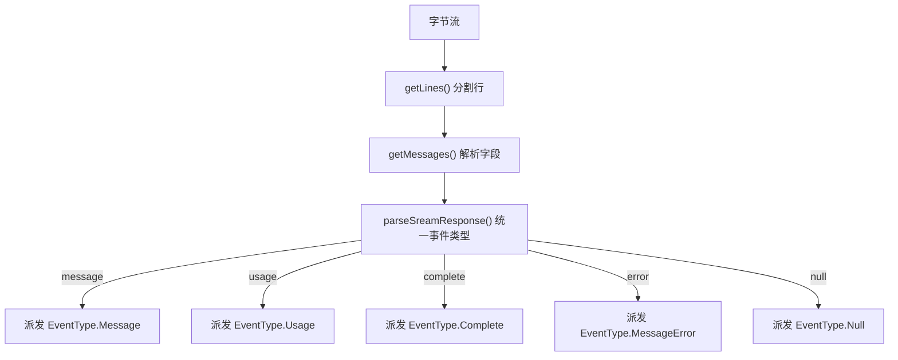
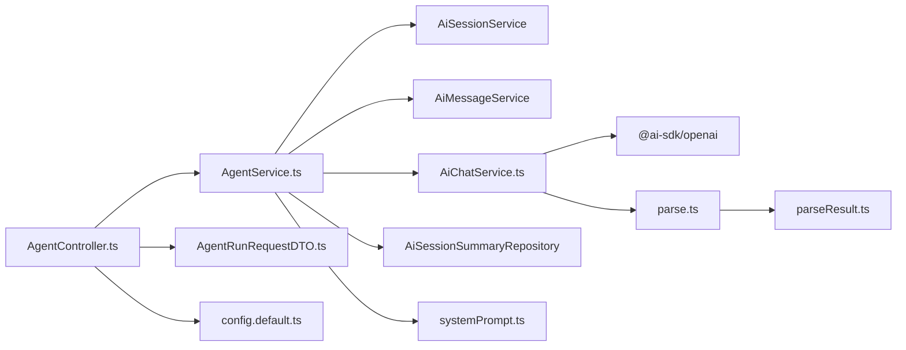

# AI模型集成

<cite>
**本文引用的文件**
- [AgentService.ts](file://src/BussinessLayer/Agent/Application/Service/AgentService.ts)
- [AiChatService.ts](file://src/BussinessLayer/Agent/Application/Service/AiChatService.ts)
- [AiChatServicebase.ts](file://src/BussinessLayer/Agent/Application/Service/AiChatServicebase.ts)
- [AgentController.ts](file://src/ApiGateway/aiController/AgentController.ts)
- [agent.ts](file://src/Helper/Types/agent.ts)
- [chat.ts](file://src/Helper/Types/chat.ts)
- [parse.ts](file://src/Helper/ParseSSE/parse.ts)
- [parseResult.ts](file://src/Helper/ParseSSE/parseResult.ts)
- [systemPrompt.ts](file://src/Helper/prompt/basePrompt/systemPrompt/systemPrompt.ts)
- [AgentRunRequestDTO.ts](file://src/ApiGateway/aiController/RequestDTO/AgentRunRequestDTO.ts)
- [config.default.ts](file://src/config/config.default.ts)
</cite>

## 目录
1. [简介](#简介)
2. [项目结构](#项目结构)
3. [核心组件](#核心组件)
4. [架构总览](#架构总览)
5. [详细组件分析](#详细组件分析)
6. [依赖关系分析](#依赖关系分析)
7. [性能考量](#性能考量)
8. [故障排查指南](#故障排查指南)
9. [结论](#结论)
10. [附录](#附录)

## 简介
本文件聚焦于schooberAi项目中的AI模型集成方案，围绕AgentService如何通过@ai-sdk/openai与外部AI模型（如Claude Sonnet 4.5）进行交互，实现流式对话响应展开。文档详细解释aiChatWithStream方法的实现机制，包括onMessage和onCompleted回调如何处理SSE流式数据并写入HTTP响应；系统提示词（systemPrompt）的构建过程及其在多轮对话中的作用；大模型配置参数（API密钥、模型名称、超时设置）的传递方式与运行时动态加载机制；以及在记忆模式下如何结合历史消息和会话摘要优化上下文管理。最后提供替换AI服务提供商的扩展指南，包括接口适配与错误处理策略。

## 项目结构
AI模型集成涉及以下关键层次：
- 控制器层：AgentController负责接收请求、设置SSE响应头并触发业务流程。
- 应用服务层：AgentService协调会话、消息与AI聊天服务，构建系统提示词与上下文，驱动流式对话。
- 集成服务层：AiChatService基于@ai-sdk/openai与外部模型交互，封装流式事件分发。
- 工具与解析层：SSE解析工具将流式片段解析为事件，统一事件类型便于上层消费。
- 提示词与配置：系统提示词模板与请求DTO定义参数结构。

图表来源
- [AgentController.ts](file://src/ApiGateway/aiController/AgentController.ts#L33-L55)
- [AgentService.ts](file://src/BussinessLayer/Agent/Application/Service/AgentService.ts#L94-L163)
- [AiChatService.ts](file://src/BussinessLayer/Agent/Application/Service/AiChatService.ts#L125-L196)
- [parse.ts](file://src/Helper/ParseSSE/parse.ts#L1-L184)
- [parseResult.ts](file://src/Helper/ParseSSE/parseResult.ts#L1-L60)
- [systemPrompt.ts](file://src/Helper/prompt/basePrompt/systemPrompt/systemPrompt.ts#L1-L269)
- [AgentRunRequestDTO.ts](file://src/ApiGateway/aiController/RequestDTO/AgentRunRequestDTO.ts#L1-L75)
- [config.default.ts](file://src/config/config.default.ts#L1-L40)

章节来源
- [AgentController.ts](file://src/ApiGateway/aiController/AgentController.ts#L33-L55)
- [AgentService.ts](file://src/BussinessLayer/Agent/Application/Service/AgentService.ts#L94-L163)
- [AiChatService.ts](file://src/BussinessLayer/Agent/Application/Service/AiChatService.ts#L125-L196)
- [parse.ts](file://src/Helper/ParseSSE/parse.ts#L1-L184)
- [parseResult.ts](file://src/Helper/ParseSSE/parseResult.ts#L1-L60)
- [systemPrompt.ts](file://src/Helper/prompt/basePrompt/systemPrompt/systemPrompt.ts#L1-L269)
- [AgentRunRequestDTO.ts](file://src/ApiGateway/aiController/RequestDTO/AgentRunRequestDTO.ts#L1-L75)
- [config.default.ts](file://src/config/config.default.ts#L1-L40)

## 核心组件
- AgentController：设置SSE响应头，接收请求体，调用AgentService.run执行业务流程。
- AgentService：负责会话管理、系统提示词构建、历史消息与摘要整合、多轮对话与单轮对话分支、流式回调写入HTTP响应与最终消息落库。
- AiChatService：基于@ai-sdk/openai创建流式对话，逐块解析delta内容，分发事件给上层回调。
- SSE解析工具：将字节流按SSE格式解析为消息，再由parseResult统一转换为事件类型。
- 系统提示词：根据工作目录、MCP Hub开关与数据信息动态拼装，指导模型行为与工具使用。
- 请求DTO与配置：定义llmConfig参数结构，支持模型名、API密钥、基础URL与超时等。

章节来源
- [AgentController.ts](file://src/ApiGateway/aiController/AgentController.ts#L33-L55)
- [AgentService.ts](file://src/BussinessLayer/Agent/Application/Service/AgentService.ts#L94-L163)
- [AiChatService.ts](file://src/BussinessLayer/Agent/Application/Service/AiChatService.ts#L125-L196)
- [parse.ts](file://src/Helper/ParseSSE/parse.ts#L1-L184)
- [parseResult.ts](file://src/Helper/ParseSSE/parseResult.ts#L1-L60)
- [systemPrompt.ts](file://src/Helper/prompt/basePrompt/systemPrompt/systemPrompt.ts#L1-L269)
- [AgentRunRequestDTO.ts](file://src/ApiGateway/aiController/RequestDTO/AgentRunRequestDTO.ts#L1-L75)

## 架构总览
整体交互链路如下：
- 客户端通过POST /api/v1/agent/run发起请求，AgentController设置SSE响应头并调用AgentService.run。
- AgentService根据是否存在sessionId判断是否进入多轮对话分支，并构建系统提示词与最终消息列表。
- AgentService调用AiChatService.aiChatWithStream，传入模型参数与回调。
- AiChatService通过@ai-sdk/openai创建流式对话，逐块读取choices.delta.content，派发EventType.Message事件；当出现usage或finish_reason时派发对应事件；流结束派发EventType.Complete。
- AgentService在onMessage中将事件序列化为SSE格式写入HTTP响应，在onCompleted中持久化完整回复。

图表来源
- [AgentController.ts](file://src/ApiGateway/aiController/AgentController.ts#L33-L55)
- [AgentService.ts](file://src/BussinessLayer/Agent/Application/Service/AgentService.ts#L133-L163)
- [AiChatService.ts](file://src/BussinessLayer/Agent/Application/Service/AiChatService.ts#L125-L196)
- [parseResult.ts](file://src/Helper/ParseSSE/parseResult.ts#L1-L60)

## 详细组件分析

### AgentController：SSE响应与入口
- 设置SSE响应头（Content-Type: text/event-stream、Cache-Control: no-cache、Connection: keep-alive），确保客户端能实时接收事件。
- 接收AgentRunRequestDTO，调用AgentService.run执行业务流程。

章节来源
- [AgentController.ts](file://src/ApiGateway/aiController/AgentController.ts#L33-L55)
- [AgentRunRequestDTO.ts](file://src/ApiGateway/aiController/RequestDTO/AgentRunRequestDTO.ts#L1-L75)

### AgentService：系统提示词、上下文与流式回调
- 会话管理：若传入sessionId且存在历史会话，则进入多轮对话分支；否则创建新会话。
- 系统提示词构建：basicSystemPrompt根据工作目录、MCP Hub开关与数据信息动态生成，作为第一条system消息加入最终消息列表。
- 单轮对话：记录用户输入，调用AiChatService.aiChatWithStream，onMessage将事件序列化写入HTTP响应，onCompleted在完成后持久化完整回复。
- 多轮对话：从AiMessageService获取历史消息，尝试从AiSessionSummaryRepository获取摘要；若存在摘要，将摘要内容作为system消息插入，并仅追加lastMsgId之后的历史消息；最后将本轮用户消息追加到最终消息列表，再调用AiChatService.aiChatWithStream。

图表来源
- [AgentService.ts](file://src/BussinessLayer/Agent/Application/Service/AgentService.ts#L94-L163)
- [AgentService.ts](file://src/BussinessLayer/Agent/Application/Service/AgentService.ts#L165-L294)

章节来源
- [AgentService.ts](file://src/BussinessLayer/Agent/Application/Service/AgentService.ts#L94-L163)
- [AgentService.ts](file://src/BussinessLayer/Agent/Application/Service/AgentService.ts#L165-L294)
- [systemPrompt.ts](file://src/Helper/prompt/basePrompt/systemPrompt/systemPrompt.ts#L1-L269)

### AiChatService：@ai-sdk/openai流式集成
- 初始化OpenAI客户端：apiKey来自请求参数ak，baseURL来自ApiUrl，timeout来自请求参数timeout，允许浏览器环境。
- 创建流式对话：传入model、messages、temperature、max_tokens、stream=true、stream_options={include_usage:true}。
- 事件分发：
  - 当chunk.choices[0].delta.content存在时，派发EventType.Message事件；
  - 当chunk.usage存在时，派发EventType.Usage事件；
  - 当finish_reason为length时，派发EventType.MessageError事件；
  - 流结束时派发EventType.Complete事件，并触发onCompleted。

图表来源
- [AiChatService.ts](file://src/BussinessLayer/Agent/Application/Service/AiChatService.ts#L125-L196)

章节来源
- [AiChatService.ts](file://src/BussinessLayer/Agent/Application/Service/AiChatService.ts#L125-L196)

### SSE解析与事件分发
- parse.ts：将ReadableStream按SSE格式解析为EventSourceMessage（data、event、id、retry），按空行分隔消息。
- parseResult.ts：将SSE data解析为统一事件类型：
  - 当data为[DONE]时，标记EventType.Complete；
  - 当data包含usage时，标记EventType.Usage；
  - 当choices[0].delta.content存在时，标记EventType.Message；
  - 当finish_reason为max_tokens时，标记EventType.MessageError；
  - 其他情况标记EventType.Null。

图表来源
- [parse.ts](file://src/Helper/ParseSSE/parse.ts#L1-L184)
- [parseResult.ts](file://src/Helper/ParseSSE/parseResult.ts#L1-L60)

章节来源
- [parse.ts](file://src/Helper/ParseSSE/parse.ts#L1-L184)
- [parseResult.ts](file://src/Helper/ParseSSE/parseResult.ts#L1-L60)

### 系统提示词构建与多轮上下文优化
- 系统提示词：basicSystemPrompt根据工作目录、MCP Hub开关与数据信息动态拼装，包含工具使用规范、文件编辑指南、能力说明与规则约束，确保模型在受控环境中执行任务。
- 多轮上下文优化：
  - 若存在会话摘要，将摘要作为system消息插入，随后仅追加lastMsgId之后的历史消息，避免重复上下文；
  - 若无摘要，使用全部历史消息；
  - 最终将本轮用户消息追加至列表，形成最终消息数组。

章节来源
- [systemPrompt.ts](file://src/Helper/prompt/basePrompt/systemPrompt/systemPrompt.ts#L1-L269)
- [AgentService.ts](file://src/BussinessLayer/Agent/Application/Service/AgentService.ts#L201-L247)

### 大模型配置参数与运行时加载
- 请求参数结构：AgentRunRequestDTO定义variableMaps.llmConfig，包含cwdFormatted、model、ak、ApiUrl等字段。
- 运行时加载：
  - AgentService.run与multiRoundChat均从variableMaps.llmConfig读取ak、ApiUrl、cwdFormatted、model、timeout等；
  - AiChatService初始化OpenAI客户端时使用ak与ApiUrl；
  - AiChatService在创建流式对话时使用model、temperature、max_tokens、timeout等参数。

章节来源
- [AgentRunRequestDTO.ts](file://src/ApiGateway/aiController/RequestDTO/AgentRunRequestDTO.ts#L1-L75)
- [AgentService.ts](file://src/BussinessLayer/Agent/Application/Service/AgentService.ts#L133-L163)
- [AgentService.ts](file://src/BussinessLayer/Agent/Application/Service/AgentService.ts#L266-L292)
- [AiChatService.ts](file://src/BussinessLayer/Agent/Application/Service/AiChatService.ts#L130-L150)

### 替换AI服务提供商的扩展指南
- 接口适配：
  - 保持AiChatService.aiChatWithStream签名一致（model、messages、ak、ApiUrl、timeout、stream、onMessage、onCompleted等）。
  - 在AiChatService内部切换到目标SDK或HTTP客户端，实现相同的事件分发逻辑（message、usage、complete、error）。
- 错误处理策略：
  - 对finish_reason为length的情况，统一派发EventType.MessageError，便于上层感知长度限制；
  - 对流式调用异常，捕获并抛出可识别的错误，便于上层统一处理。
- 配置迁移：
  - 将原OpenAI的apiKey/baseURL迁移到新SDK对应的认证与baseURL配置；
  - 保持temperature、max_tokens、stream_options等参数映射一致。

章节来源
- [AiChatService.ts](file://src/BussinessLayer/Agent/Application/Service/AiChatService.ts#L125-L196)
- [parseResult.ts](file://src/Helper/ParseSSE/parseResult.ts#L1-L60)

## 依赖关系分析
- AgentController依赖AgentService与各类DTO，负责请求接入与SSE响应头设置。
- AgentService依赖AiSessionService、AiMessageService、AiChatService与AiSessionSummaryRepository，负责会话、消息与摘要管理。
- AiChatService依赖@ai-sdk/openai，负责与外部模型交互。
- SSE解析工具与事件类型定义位于Helper目录，为流式事件提供统一抽象。

图表来源
- [AgentController.ts](file://src/ApiGateway/aiController/AgentController.ts#L33-L55)
- [AgentService.ts](file://src/BussinessLayer/Agent/Application/Service/AgentService.ts#L94-L163)
- [AiChatService.ts](file://src/BussinessLayer/Agent/Application/Service/AiChatService.ts#L125-L196)
- [parse.ts](file://src/Helper/ParseSSE/parse.ts#L1-L184)
- [parseResult.ts](file://src/Helper/ParseSSE/parseResult.ts#L1-L60)
- [systemPrompt.ts](file://src/Helper/prompt/basePrompt/systemPrompt/systemPrompt.ts#L1-L269)
- [AgentRunRequestDTO.ts](file://src/ApiGateway/aiController/RequestDTO/AgentRunRequestDTO.ts#L1-L75)
- [config.default.ts](file://src/config/config.default.ts#L1-L40)

章节来源
- [AgentController.ts](file://src/ApiGateway/aiController/AgentController.ts#L33-L55)
- [AgentService.ts](file://src/BussinessLayer/Agent/Application/Service/AgentService.ts#L94-L163)
- [AiChatService.ts](file://src/BussinessLayer/Agent/Application/Service/AiChatService.ts#L125-L196)
- [parse.ts](file://src/Helper/ParseSSE/parse.ts#L1-L184)
- [parseResult.ts](file://src/Helper/ParseSSE/parseResult.ts#L1-L60)
- [systemPrompt.ts](file://src/Helper/prompt/basePrompt/systemPrompt/systemPrompt.ts#L1-L269)
- [AgentRunRequestDTO.ts](file://src/ApiGateway/aiController/RequestDTO/AgentRunRequestDTO.ts#L1-L75)
- [config.default.ts](file://src/config/config.default.ts#L1-L40)

## 性能考量
- 流式传输：采用SSE与逐块事件派发，降低首字节延迟，提升用户体验。
- 上下文裁剪：多轮对话中优先使用摘要与lastMsgId之后的历史消息，减少上下文长度，提高响应速度与成本控制。
- 超时控制：支持timeout参数透传，避免长尾请求占用资源。
- 事件粒度：仅在delta.content存在时派发message事件，避免冗余事件导致的网络与CPU开销。

## 故障排查指南
- 无法接收SSE事件：
  - 检查AgentController是否正确设置SSE响应头（Content-Type、Cache-Control、Connection）。
  - 确认客户端是否以text/event-stream方式接收。
- 流式调用失败：
  - 检查AiChatService初始化时ak与ApiUrl是否为空。
  - 关注finish_reason为length的错误事件，可能需要调整max_tokens或优化上下文。
- 上下文过长：
  - 触发会话摘要压缩流程，重新生成摘要并更新lastMsgId。
- 配置不生效：
  - 确认AgentRunRequestDTO中variableMaps.llmConfig字段包含正确的model、ak、ApiUrl、timeout等。

章节来源
- [AgentController.ts](file://src/ApiGateway/aiController/AgentController.ts#L33-L55)
- [AiChatService.ts](file://src/BussinessLayer/Agent/Application/Service/AiChatService.ts#L130-L150)
- [parseResult.ts](file://src/Helper/ParseSSE/parseResult.ts#L1-L60)
- [AgentRunRequestDTO.ts](file://src/ApiGateway/aiController/RequestDTO/AgentRunRequestDTO.ts#L1-L75)

## 结论
本集成方案通过AgentController设置SSE响应头，AgentService统一管理会话与上下文，AiChatService基于@ai-sdk/openai实现流式对话，并以SSE解析工具与事件类型抽象实现稳定的事件分发。系统提示词与摘要机制有效提升了多轮对话的稳定性与效率。通过统一的接口与事件模型，可平滑替换不同AI服务提供商，满足多样化部署需求。

## 附录
- 类型定义参考：
  - AiPrompt与AimessageType：定义消息角色与消息类型枚举。
  - AiChatInputCommand与AiStreamChatInputCommand：定义聊天请求命令与流式回调签名。
- 配置参考：
  - config.default.ts：包含跨域、安全与HTTP代理配置，可作为集成外部模型时的参考。

章节来源
- [agent.ts](file://src/Helper/Types/agent.ts#L1-L9)
- [chat.ts](file://src/Helper/Types/chat.ts#L1-L25)
- [config.default.ts](file://src/config/config.default.ts#L1-L40)