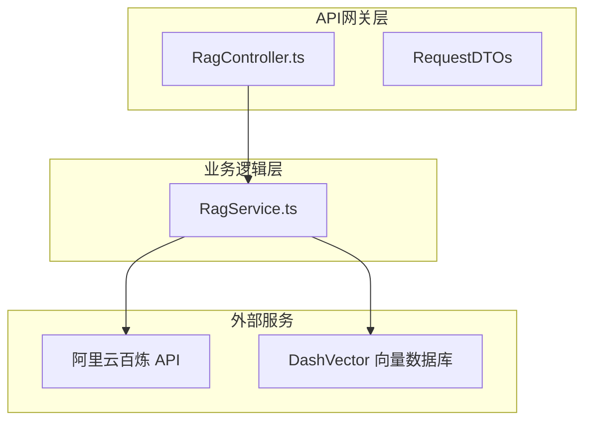
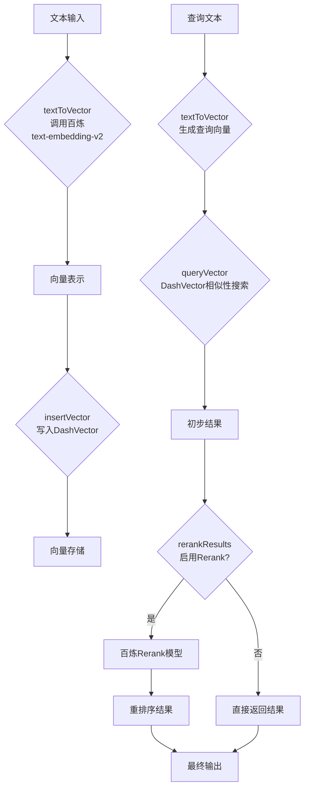
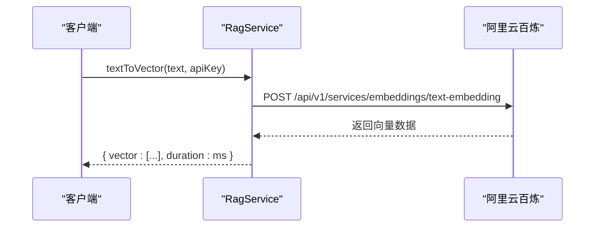
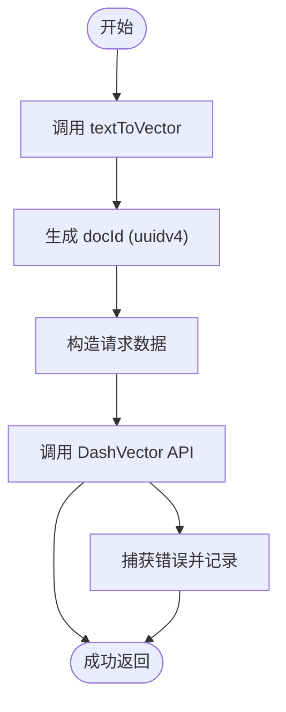
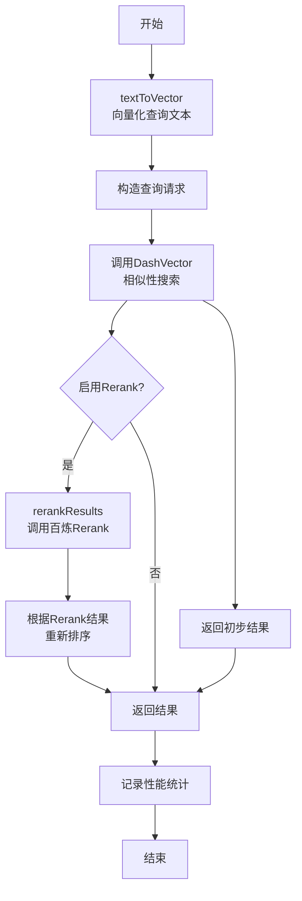
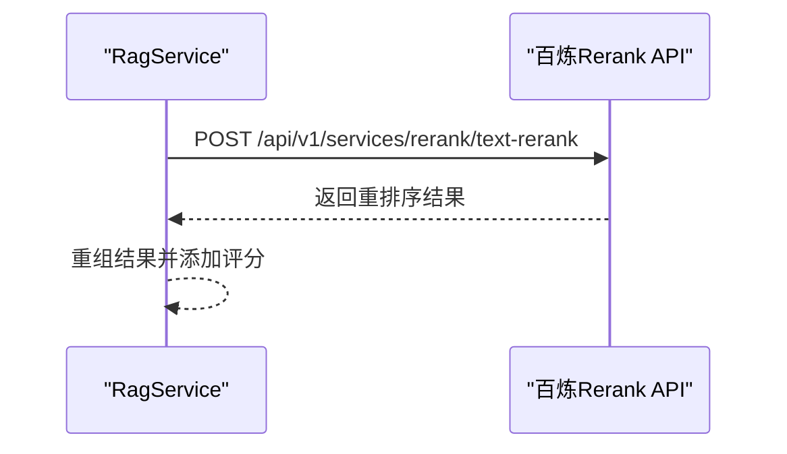
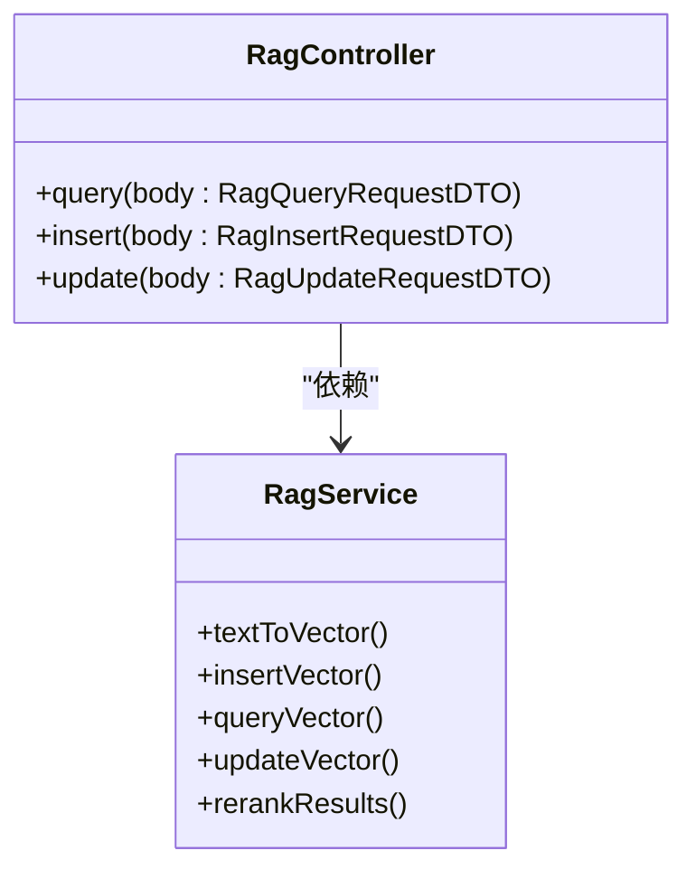

# RAG向量集成

<cite>
**本文档引用文件**  
- [RagService.ts](file://src/BussinessLayer/Rag/Application/service/RagService.ts)
- [RagController.ts](file://src/ApiGateway/controller/RagController.ts)
- [RagInsertRequestDTO.ts](file://src/ApiGateway/controller/RequestDTO/RagInsertRequestDTO.ts)
- [RagQueryRequestDTO.ts](file://src/ApiGateway/controller/RequestDTO/RagQueryRequestDTO.ts)
- [RagUpdateRequestDTO.ts](file://src/ApiGateway/controller/RequestDTO/RagUpdateRequestDTO.ts)
- [config.default.ts](file://src/config/config.default.ts)
- [AiChatServicebase.ts](file://src/BussinessLayer/Agent/Application/Service/AiChatServicebase.ts)
</cite>

## 目录
1. [简介](#简介)
2. [项目结构](#项目结构)
3. [核心组件](#核心组件)
4. [架构概览](#架构概览)
5. [详细组件分析](#详细组件分析)
6. [依赖分析](#依赖分析)
7. [性能考量](#性能考量)
8. [故障排查指南](#故障排查指南)
9. [结论](#结论)

## 简介
本文档详细描述了schooberAi项目中检索增强生成（RAG）向量集成的实现机制。重点阐述了`RagService`如何协同阿里云百炼API与DashVector向量数据库，实现从文本输入到向量存储、检索及结果重排序的完整流程。文档涵盖`textToVector`、`insertVector`、`queryVector`、`updateVector`和`rerankResults`等核心方法的实现逻辑，并提供生产级实践建议，包括API密钥管理、请求头配置和错误处理。

## 项目结构
schooberAi项目采用分层架构，RAG相关功能主要分布在`ApiGateway`和`BussinessLayer`两个模块中。`ApiGateway`负责提供RESTful API接口，而`BussinessLayer`则封装了核心业务逻辑。



**图示来源**
- [RagController.ts](file://src/ApiGateway/controller/RagController.ts)
- [RagService.ts](file://src/BussinessLayer/Rag/Application/service/RagService.ts)

**本节来源**
- [RagController.ts](file://src/ApiGateway/controller/RagController.ts)
- [RagService.ts](file://src/BussinessLayer/Rag/Application/service/RagService.ts)

## 核心组件
RAG向量集成的核心组件是`RagService`类，它提供了向量化、存储、查询和重排序等关键功能。该服务通过调用阿里云百炼的嵌入和重排序模型，并与DashVector向量数据库交互，实现了高效的检索增强生成能力。

**本节来源**
- [RagService.ts](file://src/BussinessLayer/Rag/Application/service/RagService.ts)

## 架构概览
整个RAG流程遵循一个清晰的数据流：用户输入文本 → 调用百炼API生成向量 → 存储到DashVector → 执行相似性搜索 → （可选）使用百炼Rerank模型对结果进行重排序 → 返回最终结果。



**图示来源**
- [RagService.ts](file://src/BussinessLayer/Rag/Application/service/RagService.ts)

## 详细组件分析

### RagService 分析
`RagService`是实现RAG功能的核心服务，提供了多个关键方法。

#### textToVector 方法
该方法负责将文本转换为向量表示。它调用阿里云百炼的`text-embedding-v2`模型，通过HTTP POST请求发送文本内容，并接收返回的向量数据。



**图示来源**
- [RagService.ts](file://src/BussinessLayer/Rag/Application/service/RagService.ts#L75-L113)

#### insertVector 方法
该方法将文本向量化后插入到DashVector数据库中。流程包括：1) 调用`textToVector`生成向量；2) 生成或使用提供的文档ID；3) 构造请求数据；4) 调用DashVector API进行插入。



**图示来源**
- [RagService.ts](file://src/BussinessLayer/Rag/Application/service/RagService.ts#L119-L182)

#### queryVector 方法
该方法执行完整的RAG查询流程，支持可选的Rerank重排序功能。



**图示来源**
- [RagService.ts](file://src/BussinessLayer/Rag/Application/service/RagService.ts#L188-L307)

#### rerankResults 方法
该方法利用阿里云百炼的Rerank模型对初步检索结果进行相关性重排序，以提高结果的准确性。



**图示来源**
- [RagService.ts](file://src/BussinessLayer/Rag/Application/service/RagService.ts#L14-L69)

**本节来源**
- [RagService.ts](file://src/BussinessLayer/Rag/Application/service/RagService.ts)

### API 控制器分析
`RagController`提供了RESTful API接口，作为外部系统与`RagService`交互的桥梁。

#### RagController 功能
该控制器暴露了三个主要端点：`/insert`、`/query`和`/update`，分别对应向量的插入、查询和更新操作。



**图示来源**
- [RagController.ts](file://src/ApiGateway/controller/RagController.ts)
- [RagService.ts](file://src/BussinessLayer/Rag/Application/service/RagService.ts)

**本节来源**
- [RagController.ts](file://src/ApiGateway/controller/RagController.ts)

## 依赖分析
RAG服务依赖于多个外部服务和内部模块。

```mermaid
graph TD
RagService --> Axios[axios]
RagService --> UUID[uuid]
RagService --> DashScope[阿里云百炼 API]
RagService --> DashVector[DashVector DB]
RagController --> RagService
RagController --> MidwayJS[@midwayjs/core]
RagController --> Swagger[@midwayjs/swagger]
```

**图示来源**
- [RagService.ts](file://src/BussinessLayer/Rag/Application/service/RagService.ts)
- [RagController.ts](file://src/ApiGateway/controller/RagController.ts)
- [package.json](file://package.json)

**本节来源**
- [RagService.ts](file://src/BussinessLayer/Rag/Application/service/RagService.ts)
- [RagController.ts](file://src/ApiGateway/controller/RagController.ts)

## 性能考量
`queryVector`方法内置了详细的性能监控，可以分别统计向量化、向量查询和Rerank三个阶段的耗时。启用Rerank会增加额外的处理时间，但能显著提高结果的相关性。建议在对结果质量要求高的场景下启用Rerank，在对响应速度要求高的场景下关闭。

**本节来源**
- [RagService.ts](file://src/BussinessLayer/Rag/Application/service/RagService.ts#L200-L307)
- [RagController.ts](file://src/ApiGateway/controller/RagController.ts#L25-L87)

## 故障排查指南
系统实现了全面的错误处理和日志记录机制。

**常见错误及解决方案：**
- **向量化失败**：检查`dashscopeApiKey`是否正确，确认阿里云百炼服务是否正常。
- **向量插入/查询失败**：检查`dashvectorApiKey`和`dashvectorEndpoint`配置，确认DashVector服务状态。
- **网络超时**：检查网络连接，考虑增加请求超时时间。
- **认证失败**：验证API密钥的有效性，确保没有过期或被撤销。

所有错误都会被记录到日志中，包括详细的错误信息和响应数据，便于快速定位问题。

**本节来源**
- [RagService.ts](file://src/BussinessLayer/Rag/Application/service/RagService.ts)
- [RagController.ts](file://src/ApiGateway/controller/RagController.ts)

## 结论
schooberAi项目的RAG向量集成通过`RagService`与阿里云百炼API及DashVector向量数据库的紧密协作，实现了高效、准确的检索增强生成能力。系统设计合理，功能完整，具备良好的可扩展性和生产级的健壮性。通过合理配置API密钥和优化查询参数，可以在性能和准确性之间取得良好平衡。