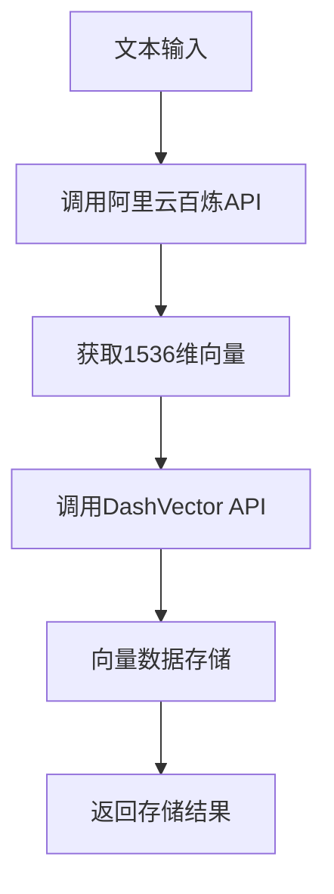
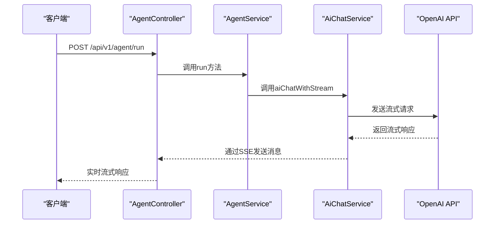
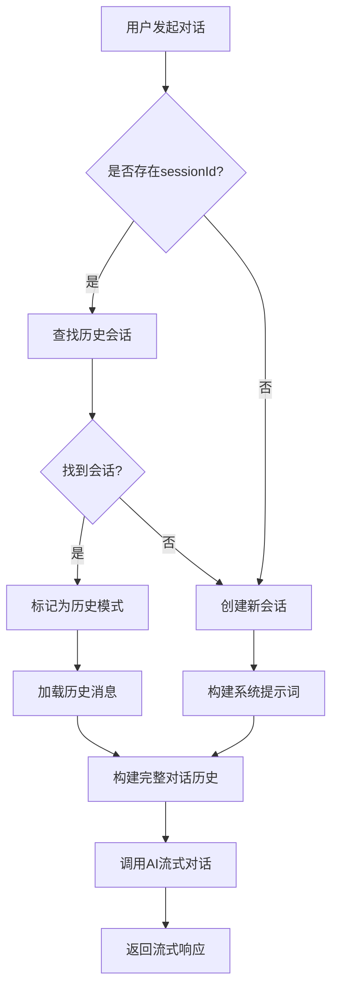
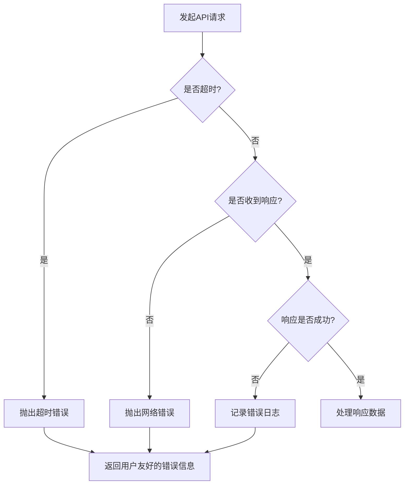

# 外部集成

<cite>
**本文档引用的文件**
- [RagService.ts](file://src/BussinessLayer/Rag/Application/service/RagService.ts)
- [AgentService.ts](file://src/BussinessLayer/Agent/Application/Service/AgentService.ts)
- [AiChatService.ts](file://src/BussinessLayer/Agent/Application/Service/AiChatService.ts)
- [RagController.ts](file://src/ApiGateway/controller/RagController.ts)
- [AgentController.ts](file://src/ApiGateway/aiController/AgentController.ts)
- [config.default.ts](file://src/config/config.default.ts)
- [README.md](file://dist/BussinessLayer/Rag/README.md)
</cite>

## 目录
1. [简介](#简介)
2. [RAG服务集成](#rag服务集成)
3. [AI对话服务集成](#ai对话服务集成)
4. [配置管理](#配置管理)
5. [错误处理策略](#错误处理策略)
6. [扩展集成指导](#扩展集成指导)

## 简介
schooberAi项目通过集成外部AI服务和向量数据库，实现了强大的检索增强生成（RAG）和智能对话功能。本项目主要集成了OpenAI API、阿里云百炼API和DashVector向量数据库，通过这些集成，系统能够将文本内容向量化存储，并基于向量相似性进行高效检索，同时支持与AI模型的流式对话交互。

## RAG服务集成

### 文本向量化与存储
RAG服务的核心功能是使用阿里云百炼的`text-embedding-v2`模型将文本转换为向量，并将结果存储到DashVector向量数据库中进行相似性搜索。`RagService`类实现了这一完整流程，包括文本向量化、向量插入、查询和更新等操作。



**图示来源**
- [RagService.ts](file://src/BussinessLayer/Rag/Application/service/RagService.ts#L75-L104)

### 向量数据库操作
系统通过`RagService`类提供的方法与DashVector向量数据库进行交互。`insertVector`方法负责将文本向量插入数据库，`queryVector`方法用于查询相似向量，`updateVector`方法则实现向量数据的更新或插入（Upsert）操作。这些方法都通过环境变量获取必要的API密钥和端点URL，确保了配置的安全性和灵活性。

```mermaid
classDiagram
class RagService {
+queryVector(command) : Promise<any>
+insertVector(command) : Promise<any>
+updateVector(command) : Promise<any>
+textToVector(text, apiKey) : Promise<{vector, duration}>
+rerankResults(command) : Promise<{rankings, duration}>
}
RagService --> "1" "阿里云百炼API"
RagService --> "1" "DashVector API"
```

**图示来源**
- [RagService.ts](file://src/BussinessLayer/Rag/Application/service/RagService.ts#L119-L383)

**本节来源**
- [RagService.ts](file://src/BussinessLayer/Rag/Application/service/RagService.ts#L72-L383)
- [README.md](file://dist/BussinessLayer/Rag/README.md#L9-L12)

## AI对话服务集成

### 流式对话实现
Agent服务通过`@ai-sdk/openai`与AI模型进行流式对话。`AgentService`类负责管理对话会话，处理用户输入，并调用`AiChatService`进行实际的AI交互。系统支持记忆模式，能够根据会话ID查找历史记录，实现多轮对话的上下文管理。



**图示来源**
- [AgentService.ts](file://src/BussinessLayer/Agent/Application/Service/AgentService.ts#L34-L163)
- [AiChatService.ts](file://src/BussinessLayer/Agent/Application/Service/AiChatService.ts#L125-L195)

### 对话流程管理
系统实现了完整的对话流程管理，包括会话创建、历史消息处理和上下文压缩。当用户发起对话时，系统首先检查是否存在历史会话，如果存在则加载历史消息；如果不存在则创建新会话。对于多轮对话，系统会构建完整的对话历史，包括系统提示词、会话摘要和历史消息，然后与用户的新消息一起发送给AI模型。



**图示来源**
- [AgentService.ts](file://src/BussinessLayer/Agent/Application/Service/AgentService.ts#L45-L163)

**本节来源**
- [AgentService.ts](file://src/BussinessLayer/Agent/Application/Service/AgentService.ts#L34-L294)
- [AgentController.ts](file://src/ApiGateway/aiController/AgentController.ts#L38-L55)
- [AiChatService.ts](file://src/BussinessLayer/Agent/Application/Service/AiChatService.ts#L125-L195)

## 配置管理

### 环境变量配置
系统通过环境变量管理所有外部服务的配置信息，包括API密钥和端点URL。这种配置方式既保证了敏感信息的安全性，又提供了良好的配置灵活性。主要的环境变量包括：

| 环境变量 | 说明 | 示例值 |
|---------|------|-------|
| `DASHVECTOR_API_KEY` | DashVector向量数据库的API密钥 | `sk-xxxxxxxxxxxxxxxx` |
| `DASHSCOPE_API_KEY` | 阿里云百炼API的API密钥 | `sk-xxxxxxxxxxxxxxxx` |
| `DASHVECTOR_ENDPOINT` | DashVector API的端点URL | `https://vrs-cn-.../v1/collections/...` |
| `DASHSCOPE_EMBEDDING_URL` | 阿里云百炼嵌入接口URL | `https://dashscope.aliyuncs.com/api/v1/services/embeddings/text-embedding/text-embedding` |

```bash
# 在项目根目录创建 .env 文件
DASHVECTOR_API_KEY=your_dashvector_api_key_here
DASHSCOPE_API_KEY=your_dashscope_api_key_here
DASHVECTOR_ENDPOINT=https://vrs-cn-1wy4kbz6a00011.dashvector.cn-hangzhou.aliyuncs.com/v1/collections/Schoober_Doc_Collection/docs
DASHSCOPE_EMBEDDING_URL=https://dashscope.aliyuncs.com/api/v1/services/embeddings/text-embedding/text-embedding
```

**本节来源**
- [RagController.ts](file://src/ApiGateway/controller/RagController.ts#L30-L33)
- [README.md](file://dist/BussinessLayer/Rag/README.md#L18-L24)

## 错误处理策略

### 网络超时处理
系统在与外部API交互时实现了完善的错误处理机制。在`AiChatService`中，通过设置`timeout`参数来处理网络超时问题，确保在指定时间内未收到响应时能够及时终止请求并返回错误信息。同时，系统使用axios库的`responseType: 'stream'`配置来处理流式响应，避免长时间等待导致的连接超时。



### API限流处理
系统通过详细的日志记录和错误信息反馈来处理API限流问题。在`RagService`中，每个API调用都包含详细的日志输出，包括请求开始、完成和错误信息。当遇到API限流时，系统会捕获具体的错误代码（如`invalid_api_key`），并在日志中记录完整的错误响应，便于开发者排查问题。

```mermaid
flowchart TD
A[调用外部API] --> B{API响应成功?}
B --> |是| C[返回正常结果]
B --> |否| D[检查错误类型]
D --> E{是否为限流错误?}
E --> |是| F[返回"API调用频率过高"提示]
E --> |否| G{是否为认证错误?}
G --> |是| H[返回"API密钥无效"提示]
G --> |否| I[返回通用错误信息]
F --> J[建议用户稍后重试]
H --> K[提示检查API密钥配置]
```

**本节来源**
- [RagService.ts](file://src/BussinessLayer/Rag/Application/service/RagService.ts#L108-L113)
- [AiChatService.ts](file://src/BussinessLayer/Agent/Application/Service/AiChatService.ts#L191-L193)
- [logs/my-midway-project/common-error.log.2025-12-13](file://logs/my-midway-project/common-error.log.2025-12-13#L260-L262)

## 扩展集成指导

### 添加新的AI服务
要添加对其他AI服务的支持，开发者可以创建新的服务类，实现与特定AI模型的交互。建议遵循现有的`AiChatService`模式，使用依赖注入的方式将新服务集成到系统中。关键步骤包括：

1. 创建新的服务类，实现流式对话接口
2. 在`AgentService`中注入新服务
3. 根据配置参数选择使用哪个AI服务
4. 统一错误处理和日志记录格式

### 支持其他向量数据库
要支持其他向量数据库，可以创建新的向量服务类，实现与目标数据库的交互。建议保持与`RagService`相同的接口定义，以便于在不同向量数据库之间切换。主要工作包括：

1. 实现向量插入、查询和更新方法
2. 处理目标数据库的认证和端点配置
3. 保持与现有RAG流程的兼容性
4. 提供详细的错误处理和性能监控

**本节来源**
- [RagService.ts](file://src/BussinessLayer/Rag/Application/service/RagService.ts)
- [AiChatService.ts](file://src/BussinessLayer/Agent/Application/Service/AiChatService.ts)