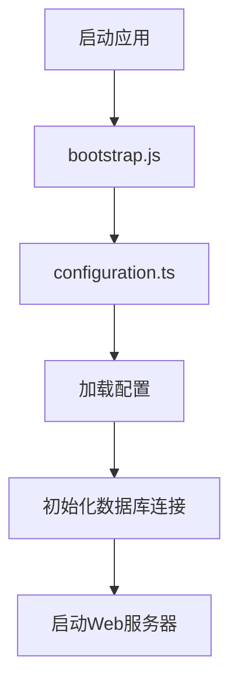
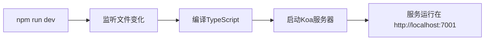
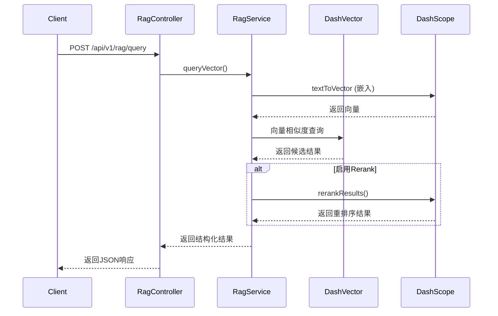

# 快速入门

<cite>
**本文档中引用的文件**  
- [package.json](file://package.json)
- [README.md](file://README.md)
- [configuration.ts](file://src/configuration.ts)
- [config.default.ts](file://src/config/config.default.ts)
- [RagController.ts](file://src/ApiGateway/controller/RagController.ts)
- [RagService.ts](file://src/BussinessLayer/Rag/Application/service/RagService.ts)
- [CodeReviewcontroller.ts](file://src/ApiGateway/controller/CodeReviewcontroller.ts)
- [codeReviewAgentService.ts](file://src/BussinessLayer/AiSummary/Application/service/codeReviewAgentService.ts)
- [bootstrap.js](file://bootstrap.js)
</cite>

## 目录
1. [简介](#简介)
2. [项目结构概览](#项目结构概览)
3. [环境准备与依赖安装](#环境准备与依赖安装)
4. [启动开发服务器](#启动开发服务器)
5. [package.json 脚本详解](#packagejson-脚本详解)
6. [环境变量配置](#环境变量配置)
7. [API 接口调用示例](#api-接口调用示例)
8. [常见问题排查](#常见问题排查)
9. [总结](#总结)

## 简介

本指南旨在帮助开发者快速搭建并运行 `schooberAi` 项目。通过逐步说明，您将学会如何克隆仓库、安装依赖、配置环境变量、启动服务，并通过 API 调用验证系统功能。项目基于 Midway 框架构建，集成了 AI 代码审查与 RAG（检索增强生成）功能，适用于智能代码分析场景。

**Section sources**
- [README.md](file://README.md#L1-L37)

## 项目结构概览

项目采用分层架构设计，主要分为以下几个核心目录：

- `src/ApiGateway`：API 控制器层，处理 HTTP 请求与响应。
- `src/BussinessLayer`：业务逻辑层，包含 AI 审查、RAG 服务等核心功能。
- `src/Helper`：工具类与辅助函数。
- `src/config`：环境配置文件。
- `test/`：单元测试用例。

关键入口文件包括 `bootstrap.js` 和 `configuration.ts`，负责应用初始化与数据库连接。



**Diagram sources**
- [bootstrap.js](file://bootstrap.js#L1-L3)
- [configuration.ts](file://src/configuration.ts#L1-L65)

## 环境准备与依赖安装

在开始之前，请确保您的开发环境已安装以下工具：

- Node.js（版本 >=12.0.0）
- npm 或 yarn
- MySQL 数据库（用于持久化存储）

### 步骤一：克隆项目仓库

```bash
git clone <repository-url>
cd schooberAi
```

### 步骤二：安装项目依赖

执行以下命令安装所有必要的依赖包：

```bash
npm i
```

该命令将根据 `package.json` 中的依赖列表自动下载并安装所有模块。

**Section sources**
- [package.json](file://package.json#L1-L103)

## 启动开发服务器

安装完成后，使用以下命令启动开发模式下的服务：

```bash
npm run dev
```

此命令会启动 Midway 的热重载开发服务器。启动成功后，您可以在浏览器中访问：

```
http://localhost:7001/
```

默认端口由 `src/config/config.default.ts` 中的 `egg.port` 配置项指定。

**Section sources**
- [package.json](file://package.json#L8)
- [config.default.ts](file://src/config/config.default.ts#L7)

## package.json 脚本详解

`package.json` 文件中定义了多个 npm 脚本，用于不同场景下的操作：

| 脚本命令 | 用途说明 |
|--------|--------|
| `dev` | 启动开发服务器，启用热重载功能 |
| `start` | 生产环境启动应用 |
| `test` | 运行单元测试 |
| `lint` | 检查代码风格是否符合规范 |
| `lint:fix` | 自动修复可修复的代码格式问题 |
| `build` | 编译 TypeScript 代码 |

**示例说明：**

- 开发阶段推荐使用 `npm run dev`
- 发布前应运行 `npm run lint` 和 `npm test` 确保代码质量



**Diagram sources**
- [package.json](file://package.json#L6-L14)

## 环境变量配置

项目依赖多个环境变量来连接外部服务，需在根目录下创建 `.env` 文件并填写以下内容：

```env
# 数据库配置
DB_HOST=localhost
DB_PORT=3306
DB_USER=root
DB_PASSWORD=woshiGY3011
DB_DATABASE=ai_mutil_message

# 阿里云百炼 API 密钥
DASHSCOPE_API_KEY=your_dashscope_api_key_here
DASHVECTOR_API_KEY=your_dashvector_api_key_here

# 可选：自定义嵌入模型URL
DASHSCOPE_EMBEDDING_URL=https://dashscope.aliyuncs.com/api/v1/services/embeddings/text-embedding/text-embedding
DASHVECTOR_QUERY_ENDPOINT=https://vrs-cn-1wy4kbz6a00011.dashvector.cn-hangzhou.aliyuncs.com/v1/collections/Schoober_Doc_Collection/query
```

> **注意**：数据库连接信息已在 `configuration.ts` 中硬编码，建议后续改为从环境变量读取以提升安全性。

**Section sources**
- [configuration.ts](file://src/configuration.ts#L29-L34)
- [RagController.ts](file://src/ApiGateway/controller/RagController.ts#L30-L33)

## API 接口调用示例

为验证安装是否成功，可通过调用 RAG 查询接口进行测试。

### 示例：执行 RAG 查询

**请求地址：**
```
POST http://localhost:7001/api/v1/rag/query
```

**请求体（JSON）：**
```json
{
  "text": "如何优化前端性能？",
  "topk": 5,
  "useRerank": true,
  "rerankTopN": 3
}
```

**预期响应：**
```json
{
  "success": true,
  "data": {
    "query": "如何优化前端性能？",
    "results": [...],
    "total": 5,
    "timing": {
      "vectorization": 120,
      "query": 80,
      "rerank": 60,
      "total": 260
    }
  },
  "message": "RAG查询成功"
}
```

该接口将文本向量化后在 DashVector 中检索相似内容，并可选地使用百炼 Rerank 模型进行结果重排序。



**Diagram sources**
- [RagController.ts](file://src/ApiGateway/controller/RagController.ts#L18-L86)
- [RagService.ts](file://src/BussinessLayer/Rag/Application/service/RagService.ts#L188-L307)

## 常见问题排查

### 1. 服务无法启动

**可能原因：**
- 端口 7001 被占用
- 数据库未运行或连接信息错误

**解决方案：**
- 检查 `config.default.ts` 中的端口设置
- 确认 MySQL 服务已启动且凭据正确

### 2. RAG 查询返回空结果

**可能原因：**
- 知识库中无数据
- 向量数据库连接失败

**解决方案：**
- 先调用 `/api/v1/rag/insert` 插入测试数据
- 检查 `DASHVECTOR_API_KEY` 是否正确

### 3. 代码审查接口无响应

**可能原因：**
- `codeReviewAgentFactory` 初始化失败
- 流式响应未正确处理

**解决方案：**
- 查看日志确认 `codeReviewAgent` 是否成功创建
- 确保客户端支持 SSE（Server-Sent Events）

**Section sources**
- [RagController.ts](file://src/ApiGateway/controller/RagController.ts#L87-L94)
- [codeReviewAgentService.ts](file://src/BussinessLayer/AiSummary/Application/service/codeReviewAgentService.ts#L9-L43)

## 总结

本指南详细介绍了 `schooberAi` 项目的快速入门流程，涵盖从环境搭建到 API 验证的全过程。项目结构清晰，基于 Midway 框架实现模块化开发，支持 AI 驱动的代码审查与 RAG 检索功能。通过合理配置环境变量与外部服务密钥，开发者可快速投入功能开发与集成测试。

如需进一步了解各模块实现细节，建议查阅对应的服务类与控制器源码。

**Section sources**
- [README.md](file://README.md#L1-L37)
- [package.json](file://package.json#L1-L103)