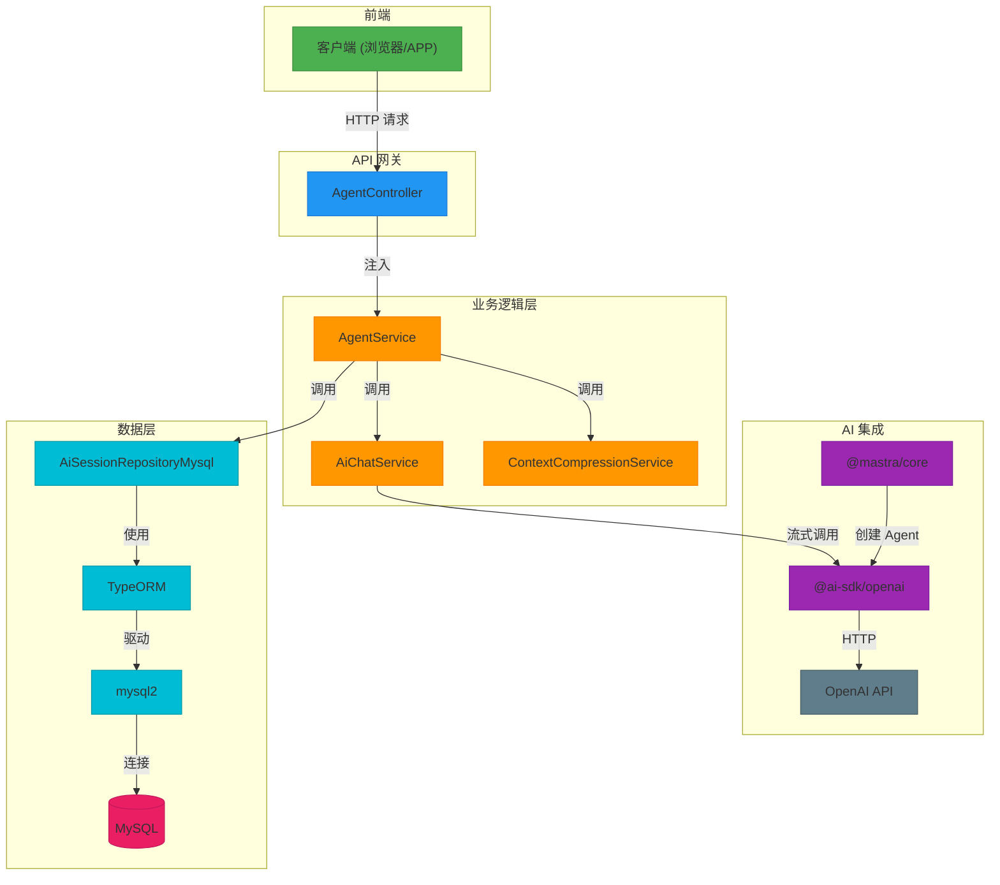

# 技术栈与依赖

<cite>
**本文档中引用的文件**  
- [package.json](file://package.json)
- [tsconfig.json](file://tsconfig.json)
- [configuration.ts](file://src/configuration.ts)
- [config.default.ts](file://src/config/config.default.ts)
- [AgentService.ts](file://src/BussinessLayer/Agent/Application/Service/AgentService.ts)
- [AiChatService.ts](file://src/BussinessLayer/Agent/Application/Service/AiChatService.ts)
- [codeReviewAgents.ts](file://src/BussinessLayer/AiSummary/Mastra/agents/codeReviewAgents.ts)
- [AiSessionRepositoryMysql.ts](file://src/BussinessLayer/Agent/Repository/AiSessionRepositoryMysql.ts)
- [AgentController.ts](file://src/ApiGateway/aiController/AgentController.ts)
</cite>

## 目录
1. [简介](#简介)
2. [核心外部依赖](#核心外部依赖)
3. [TypeScript 与编译配置](#typescript-与编译配置)
4. [Midway 框架特性集成](#midway-框架特性集成)
5. [技术栈替换与扩展指南](#技术栈替换与扩展指南)
6. [架构与依赖关系图](#架构与依赖关系图)
7. [结论](#结论)

## 简介
schooberAi 是一个基于 Node.js 的 AI 代理与会话管理系统，采用现代化的技术栈构建，支持流式对话、上下文压缩、多轮会话记忆等功能。本项目以 Midway 框架为核心，结合 TypeORM 实现数据持久化，并通过 @ai-sdk/openai 和 @mastra/core 集成 AI 模型调用与智能代理管理。本文档详细阐述项目的技术栈组成、关键依赖的作用、TypeScript 配置、框架特性应用，并为开发者提供组件替换的指导。

## 核心外部依赖

### @midwayjs/core（框架核心）
@midwayjs/core 是项目的底层框架，提供依赖注入、模块化设计、配置管理、生命周期钩子等企业级应用开发所需的核心能力。项目通过 `@Configuration` 装饰器在 `configuration.ts` 中定义应用入口，导入 `@midwayjs/web`、`@midwayjs/cross-domain` 和 `@midwayjs/swagger` 等模块，实现 Web 服务、跨域支持和 API 文档自动生成。

**作用**：
- 提供基于装饰器的依赖注入（`@Inject`, `@Provide`），实现松耦合的组件管理。
- 支持模块化架构，通过 `imports` 配置集成不同功能模块。
- 管理应用生命周期，如 `onReady` 钩子用于初始化数据库连接。

**集成方式**：
在 `configuration.ts` 中通过 `@Configuration` 装饰器导入所需模块，并在服务类（如 `AgentService`）中使用 `@Inject` 注入依赖。

**Section sources**
- [configuration.ts](file://src/configuration.ts#L1-L65)
- [AgentService.ts](file://src/BussinessLayer/Agent/Application/Service/AgentService.ts#L1-L294)

### typeorm（ORM）
TypeORM 是项目的数据访问层 ORM 框架，用于将数据库表映射为 TypeScript 类（实体），并提供类型安全的数据库操作。项目通过 `createConnection` 在 `configuration.ts` 中建立与 MySQL 数据库的连接，并配置实体扫描路径。

**作用**：
- 管理数据库连接池，配置连接超时、最大连接数等参数。
- 自动同步实体（`synchronize: false` 生产环境禁用）。
- 提供 `getRepository` 和 `getConnection` API 进行 CRUD 操作。

**集成方式**：
- 在 `configuration.ts` 中配置 `type: 'mysql'` 和 `driver: require('mysql2')`。
- 实体类（如 `AiSessionModel`）位于 `src/BussinessLayer/Agent/Domain/Agent/` 目录下。
- 仓库实现类（如 `AiSessionRepositoryMysql`）使用 `getRepository` 操作数据库。

**Section sources**
- [configuration.ts](file://src/configuration.ts#L7-L64)
- [AiSessionRepositoryMysql.ts](file://src/BussinessLayer/Agent/Repository/AiSessionRepositoryMysql.ts#L1-L56)

### @ai-sdk/openai（AI 模型调用）
@ai-sdk/openai 是一个现代化的 AI SDK，用于调用 OpenAI 兼容的 API。项目在 `codeReviewAgents.ts` 中使用 `createOpenAI` 创建客户端，用于代码审查代理。

**作用**：
- 提供简洁的 API 调用 OpenAI 或兼容服务（如阿里云百炼）。
- 支持流式响应（streaming），实现低延迟的实时对话。
- 与 `@mastra/core` 集成，构建 AI Agent。

**集成方式**：
在 `codeReviewAgents.ts` 中创建 `openai` 客户端实例，并作为 `model` 参数传递给 `Agent` 构造函数。

**Section sources**
- [codeReviewAgents.ts](file://src/BussinessLayer/AiSummary/Mastra/agents/codeReviewAgents.ts#L1-L22)

### @mastra/core（AI 代理管理）
@mastra/core 是一个 AI Agent 框架，用于构建和管理智能代理。项目利用它创建 `codeReviewAgent`，定义代理的行为和指令。

**作用**：
- 提供 `Agent` 类，封装代理的逻辑、模型和工具。
- 支持指令（`instructions`）定义，指导 AI 的行为。
- 与 AI SDK 集成，实现模型调用。

**集成方式**：
在 `codeReviewAgents.ts` 中使用 `new Agent()` 创建代理实例，配置 `name`、`instructions` 和 `model`。

**Section sources**
- [codeReviewAgents.ts](file://src/BussinessLayer/AiSummary/Mastra/agents/codeReviewAgents.ts#L1-L22)

### mysql2（数据库驱动）
mysql2 是 Node.js 的高性能 MySQL 驱动，作为 TypeORM 的底层驱动，提供异步、流式和连接池支持。

**作用**：
- 作为 TypeORM 与 MySQL 数据库之间的桥梁。
- 提供比原生 `mysql` 包更好的性能和 Promise 支持。
- 支持连接池配置，优化数据库资源使用。

**集成方式**：
在 `configuration.ts` 中通过 `driver: require('mysql2')` 显式指定使用 mysql2 驱动。

**Section sources**
- [configuration.ts](file://src/configuration.ts#L36)

## TypeScript 与编译配置

### TypeScript 优势
项目采用 TypeScript 作为主要编程语言，其优势包括：
- **类型安全**：在编译期捕获类型错误，减少运行时异常。
- **代码可维护性**：清晰的接口和类型定义，提升代码可读性和团队协作效率。
- **IDE 支持**：提供智能提示、自动补全和重构支持。
- **面向对象**：支持类、接口、装饰器等特性，适合构建大型应用。

### 编译配置（tsconfig.json）
`tsconfig.json` 定义了 TypeScript 编译器的配置，确保代码正确编译和类型检查。

**关键配置项**：
- `"target": "es2018"`：编译目标为 ES2018，支持现代 JavaScript 特性。
- `"module": "commonjs"`：使用 CommonJS 模块系统，兼容 Node.js。
- `"experimentalDecorators": true` 和 `"emitDecoratorMetadata": true`：启用装饰器，支持 Midway 框架的依赖注入。
- `"outDir": "dist"`：编译输出目录。
- `"rootDir": "src"`：源码目录。
- `"paths": { "@/*": ["./src/*"] }`：配置路径别名，简化模块导入。

**Section sources**
- [tsconfig.json](file://tsconfig.json#L1-L36)

## Midway 框架特性集成

### 依赖注入（Dependency Injection）
Midway 通过装饰器实现依赖注入，降低组件间的耦合度。

**实现方式**：
- 使用 `@Provide()` 标记可注入的服务类（如 `AgentService`）。
- 使用 `@Inject()` 在需要的地方注入实例（如 `AgentController` 中注入 `agentService`）。
- 支持按名称注入（如 `@Inject(AI_SESSION)`）。

**优势**：
- 便于单元测试，可轻松替换依赖。
- 实现控制反转（IoC），由框架管理对象生命周期。

**Section sources**
- [AgentService.ts](file://src/BussinessLayer/Agent/Application/Service/AgentService.ts#L1-L294)
- [AgentController.ts](file://src/ApiGateway/aiController/AgentController.ts#L1-L170)

### 模块化设计
项目采用清晰的模块化分层架构：
- **ApiGateway**：API 网关层，处理 HTTP 请求，使用 `@Controller` 和 `@Post` 定义路由。
- **BussinessLayer**：业务逻辑层，包含 `Agent`、`AiSummary` 等子模块。
- **Domain**：领域模型层，定义实体和仓库接口。
- **Repository**：数据访问层，实现具体的数据库操作。
- **Shared/SeedWork**：共享基类，如 `EntityBase` 和 `Respository`。

**优势**：
- 职责分离，代码结构清晰。
- 便于维护和扩展。

**Section sources**
- [AgentController.ts](file://src/ApiGateway/aiController/AgentController.ts#L1-L170)
- [AgentService.ts](file://src/BussinessLayer/Agent/Application/Service/AgentService.ts#L1-L294)

## 技术栈替换与扩展指南

### 替换数据库
项目当前使用 MySQL，可通过以下步骤替换为其他数据库（如 PostgreSQL）：
1. 修改 `package.json`，添加 `pg` 驱动。
2. 更新 `configuration.ts` 中的 `type` 为 `'postgres'`，并调整连接参数。
3. 确保 `entities` 路径正确，TypeORM 会自动适配。

```json
// package.json
"dependencies": {
  "pg": "^8.11.3"
}
```

```ts
// configuration.ts
createConnection({
  type: 'postgres',
  host: 'localhost',
  port: 5432,
  username: 'user',
  password: 'password',
  database: 'mydb',
  driver: require('pg'),
  // ... 其他配置
});
```

### 集成不同的 AI 服务提供商
项目通过 `ApiUrl` 配置支持不同的 AI 服务，如阿里云百炼。

**集成步骤**：
1. 在 `config.default.ts` 中配置 `httpProxy`，将请求代理到目标服务。
2. 在客户端调用时，传入正确的 `ApiUrl` 和 `ak`（API Key）。

```ts
// config.default.ts
export default {
  httpProxy: {
    enable: true,
    default: {
      target: 'https://dashscope.aliyuncs.com/compatible-mode/v1/chat/completions/v1/$1',
      ingoreHeaders: { origin: true, Origin: true }
    }
  }
}
```

3. 在 `AiChatService` 中，`ApiUrl` 将被用于 `openai` 客户端的 `baseURL`。

### 替换 ORM 框架
若需替换 TypeORM，可考虑 Prisma：
1. 移除 `typeorm` 和 `mysql2` 依赖。
2. 添加 `prisma` 依赖。
3. 重新设计数据模型和访问逻辑。
4. 修改 `configuration.ts` 中的数据库初始化逻辑。

## 架构与依赖关系图



**Diagram sources**
- [AgentController.ts](file://src/ApiGateway/aiController/AgentController.ts#L1-L170)
- [AgentService.ts](file://src/BussinessLayer/Agent/Application/Service/AgentService.ts#L1-L294)
- [AiChatService.ts](file://src/BussinessLayer/Agent/Application/Service/AiChatService.ts#L111-L196)
- [AiSessionRepositoryMysql.ts](file://src/BussinessLayer/Agent/Repository/AiSessionRepositoryMysql.ts#L1-L56)
- [codeReviewAgents.ts](file://src/BussinessLayer/AiSummary/Mastra/agents/codeReviewAgents.ts#L1-L22)

## 结论
schooberAi 项目构建了一个现代化、可扩展的 AI 代理系统。通过 Midway 框架实现了依赖注入和模块化设计，利用 TypeORM 和 mysql2 实现了高效的数据持久化，并通过 @ai-sdk/openai 和 @mastra/core 集成了强大的 AI 能力。TypeScript 的使用确保了代码的健壮性和可维护性。项目架构清晰，组件职责明确，为未来的技术栈替换和功能扩展提供了良好的基础。开发者可根据需求灵活替换数据库或集成不同的 AI 服务提供商，以适应多样化的部署场景。