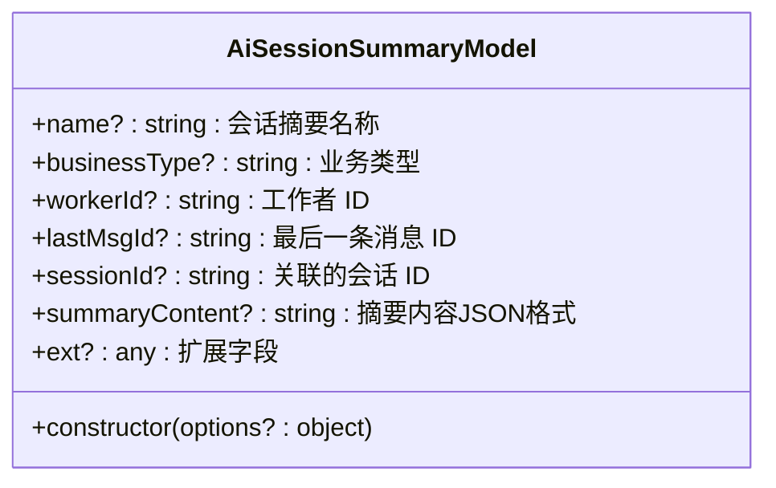
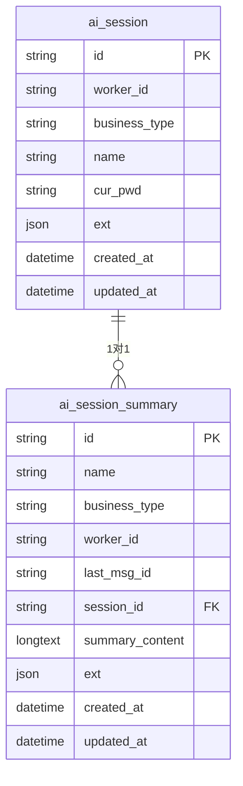
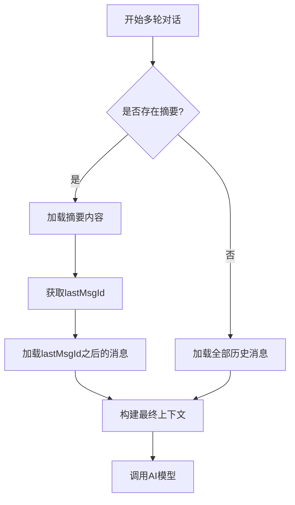
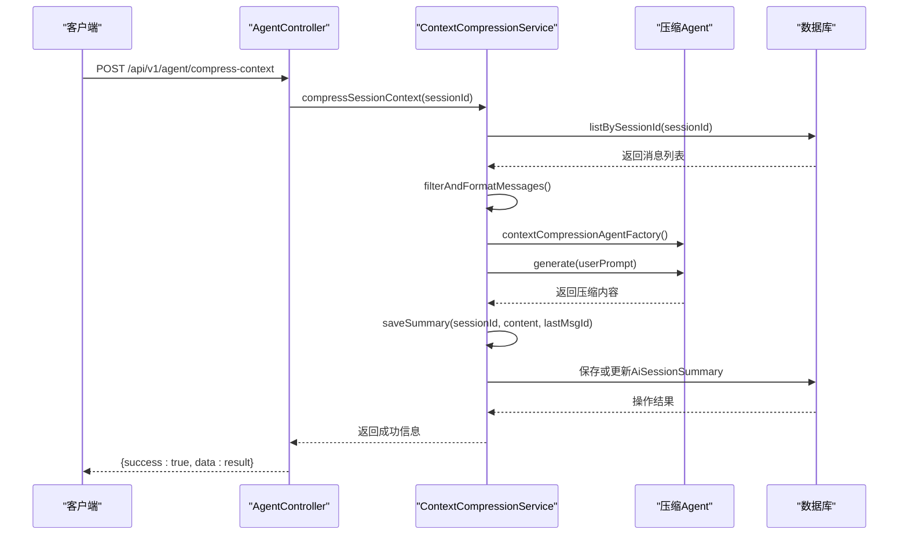

# 会话摘要模型 (AiSessionSummary)

<cite>
**本文档引用的文件**
- [AiSessionSummary.ts](file://src/BussinessLayer/Agent/Domain/Agent/AiSessionSummary.ts)
- [AiSession.ts](file://src/BussinessLayer/Agent/Domain/Agent/AiSession.ts)
- [contextCompressionService.ts](file://src/BussinessLayer/AiSummary/Application/service/contextCompressionService.ts)
- [AgentService.ts](file://src/BussinessLayer/Agent/Application/Service/AgentService.ts)
- [AiSessionSummaryRepository.ts](file://src/BussinessLayer/Agent/Domain/Agent/AiSessionSummaryRepository.ts)
- [AiSessionSummaryRepositoryMysql.ts](file://src/BussinessLayer/Agent/Repository/AiSessionSummaryRepositoryMysql.ts)
- [contextCompressionAgent.ts](file://src/BussinessLayer/AiSummary/Mastra/agents/contextCompressionAgent.ts)
- [contextCompressionPrompt.ts](file://src/BussinessLayer/AiSummary/Mastra/prompts/contextCompressionPrompt.ts)
- [AgentController.ts](file://src/ApiGateway/aiController/AgentController.ts)
</cite>

## 目录
1. [简介](#简介)
2. [实体结构与字段说明](#实体结构与字段说明)
3. [数据库映射](#数据库映射)
4. [与AiSession的关系](#与aisession的关系)
5. [上下文压缩服务调用流程](#上下文压缩服务调用流程)
6. [在AgentService中的使用示例](#在agentservice中的使用示例)
7. [摘要更新策略与版本控制](#摘要更新策略与版本控制)
8. [总结](#总结)

## 简介

`AiSessionSummary` 实体是 schooberAi 项目中用于解决大语言模型上下文窗口限制的核心组件。当AI会话消息数量增长到一定程度时，完整的对话历史可能超出模型的上下文处理能力。为了解决这一问题，系统引入了会话摘要机制。

该实体专门用于存储长会话的压缩摘要。通过将历史对话的关键信息提炼成简洁的摘要，系统能够在后续对话中仅加载摘要而非全部历史，从而显著减少上下文长度，提升AI对话的效率和响应速度。此机制使得系统能够支持无限长度的会话，同时保持上下文的相关性和连贯性。

**Section sources**
- [AiSessionSummary.ts](file://src/BussinessLayer/Agent/Domain/Agent/AiSessionSummary.ts)

## 实体结构与字段说明

`AiSessionSummaryModel` 类定义了会话摘要的核心数据结构，其字段设计旨在全面描述摘要内容及其上下文关系。

**Diagram sources**
- [AiSessionSummary.ts](file://src/BussinessLayer/Agent/Domain/Agent/AiSessionSummary.ts)

以下是各字段的详细说明：

- **name**: 摘要的名称，通常由系统根据摘要内容自动生成，便于识别和管理。
- **businessType**: 标识该摘要所属的业务类型，用于对不同业务场景的会话进行分类。
- **workerId**: 记录创建或关联此摘要的工作单元或用户ID，用于权限和归属管理。
- **lastMsgId**: 存储摘要所涵盖的最后一条消息的ID。这是实现增量上下文构建的关键，AgentService通过此ID确定从哪条消息之后开始加载完整历史。
- **sessionId**: 外键，关联到 `AiSession` 实体的会话ID，建立与原始会话的一对一关系。
- **summaryContent**: 摘要的核心内容，以JSON格式存储经过压缩的对话历史。内容遵循特定的压缩规则，保留用户提问、工具调用、关键决策等核心信息。
- **ext**: 扩展字段，以JSON格式存储额外的元数据，如压缩时间戳、版本信息等，为未来功能扩展提供灵活性。

**Section sources**
- [AiSessionSummary.ts](file://src/BussinessLayer/Agent/Domain/Agent/AiSessionSummary.ts)

## 数据库映射

`AiSessionSummary` 实体通过TypeORM框架映射到数据库中的 `ai_session_summary` 表。该映射确保了对象模型与数据库表结构之间的一致性。

**Diagram sources**
- [AiSessionSummary.ts](file://src/BussinessLayer/Agent/Domain/Agent/AiSessionSummary.ts)
- [AiSession.ts](file://src/BussinessLayer/Agent/Domain/Agent/AiSession.ts)

表 `ai_session_summary` 的主要字段与实体属性一一对应：
- `session_id` 字段作为外键，指向 `ai_session` 表的主键，确保每个会话最多只有一个摘要。
- `summary_content` 使用 `longtext` 类型，以支持存储较长的文本摘要。
- `ext` 字段使用 `json` 类型，直接存储JavaScript对象，便于序列化和反序列化。
- 系统通过 `createdAt` 和 `updatedAt` 字段（继承自 `AggregateRoot`）自动管理记录的创建和更新时间。

**Section sources**
- [AiSessionSummary.ts](file://src/BussinessLayer/Agent/Domain/Agent/AiSessionSummary.ts)
- [AiSessionSummaryRepositoryMysql.ts](file://src/BussinessLayer/Agent/Repository/AiSessionSummaryRepositoryMysql.ts)

## 与AiSession的关系

`AiSessionSummary` 与 `AiSession` 实体之间存在明确的一对一关系。这种设计模式确保了每个会话（`AiSession`）最多只能关联一个摘要（`AiSessionSummary`）。

这种关系由 `AiSessionSummary` 实体中的 `sessionId` 字段实现，该字段作为外键引用 `AiSession` 的主键。在业务逻辑层面，这种关系由 `ContextCompressionService` 和 `AgentService` 共同维护。

当需要为某个会话生成摘要时，`ContextCompressionService` 会通过 `sessionId` 查找或创建对应的 `AiSessionSummary` 记录。而在后续的对话中，`AgentService` 会通过相同的 `sessionId` 查询摘要，以构建精简的上下文。

**Diagram sources**
- [AgentService.ts](file://src/BussinessLayer/Agent/Application/Service/AgentService.ts)
- [contextCompressionService.ts](file://src/BussinessLayer/AiSummary/Application/service/contextCompressionService.ts)

**Section sources**
- [AiSessionSummary.ts](file://src/BussinessLayer/Agent/Domain/Agent/AiSessionSummary.ts)
- [AiSession.ts](file://src/BussinessLayer/Agent/Domain/Agent/AiSession.ts)

## 上下文压缩服务调用流程

会话摘要的生成由 `ContextCompressionService` 服务驱动，其调用流程是一个完整的自动化过程。

**Diagram sources**
- [contextCompressionService.ts](file://src/BussinessLayer/AiSummary/Application/service/contextCompressionService.ts)
- [AgentController.ts](file://src/ApiGateway/aiController/AgentController.ts)

具体流程如下：
1.  **触发**: 客户端通过调用 `/api/v1/agent/compress-context` API 发起压缩请求。
2.  **查询**: `ContextCompressionService` 从数据库中查询指定 `sessionId` 的所有消息。
3.  **预处理**: 过滤掉 `system` 角色的消息，并将消息格式化为适合压缩的结构。
4.  **执行压缩**: 创建一个专用的AI Agent（`contextCompressionAgent`），该Agent根据预设的提示词（`CONTEXT_COMPRESSION_SYSTEM_PROMPT`）对对话历史进行压缩。
5.  **持久化**: 将压缩后的内容、最后一条消息的ID等信息保存到 `ai_session_summary` 表中。如果摘要已存在，则进行更新。

**Section sources**
- [contextCompressionService.ts](file://src/BussinessLayer/AiSummary/Application/service/contextCompressionService.ts)
- [contextCompressionAgent.ts](file://src/BussinessLayer/AiSummary/Mastra/agents/contextCompressionAgent.ts)
- [contextCompressionPrompt.ts](file://src/BussinessLayer/AiSummary/Mastra/prompts/contextCompressionPrompt.ts)

## 在AgentService中的使用示例

`AgentService` 在处理多轮对话时，会主动利用 `AiSessionSummary` 来优化上下文构建。

当 `AgentService` 检测到当前会话有历史记录时，它会执行以下逻辑：
1.  调用 `aiSessionSummaryRepository.findBySessionId(sessionId)` 查询是否存在摘要。
2.  如果摘要存在且有效（`summaryContent` 和 `lastMsgId` 不为空），则：
    -   将 `summaryContent` 作为系统消息添加到上下文。
    -   根据 `lastMsgId` 在历史消息列表中找到对应位置。
    -   仅加载 `lastMsgId` 之后的所有消息，以保证上下文的连续性。
3.  如果摘要不存在，则加载全部历史消息。

这种方式实现了“摘要+增量历史”的上下文构建策略，极大地减少了发送给AI模型的token数量，从而提高了效率并降低了成本。

**Section sources**
- [AgentService.ts](file://src/BussinessLayer/Agent/Application/Service/AgentService.ts)

## 摘要更新策略与版本控制

`AiSessionSummary` 的更新策略是“存在即更新，否则创建”。`ContextCompressionService` 中的 `saveSummary` 方法实现了这一逻辑。

当为一个已有摘要的会话再次执行压缩时，系统会找到旧的摘要记录，并用新的压缩内容、新的 `lastMsgId` 和更新的时间戳覆盖其字段。`ext` 字段会进行合并，保留旧的扩展信息并添加新的元数据（如新的 `compressedAt` 时间戳）。

虽然当前实现中没有显式的版本号字段，但 `ext` 字段为实现版本控制提供了基础。未来可以通过在 `ext` 中添加 `version` 或 `revision` 字段来追踪摘要的迭代历史。此外，`updatedAt` 字段也可以作为判断摘要新旧的依据。

**Section sources**
- [contextCompressionService.ts](file://src/BussinessLayer/AiSummary/Application/service/contextCompressionService.ts)

## 总结

`AiSessionSummary` 实体是schooberAi项目中实现长会话管理的关键。它通过将冗长的对话历史压缩为精炼的摘要，有效解决了大模型上下文窗口的限制。该实体与 `AiSession` 通过 `sessionId` 建立一对一关系，并由 `ContextCompressionService` 负责生成和更新。在 `AgentService` 的驱动下，系统能够智能地利用摘要构建高效、连贯的上下文，从而在保证对话质量的同时，显著提升了AI服务的性能和可扩展性。