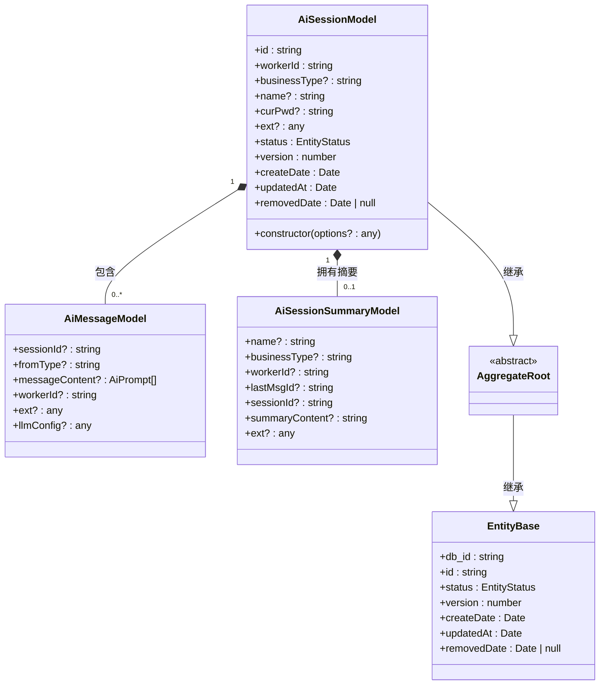
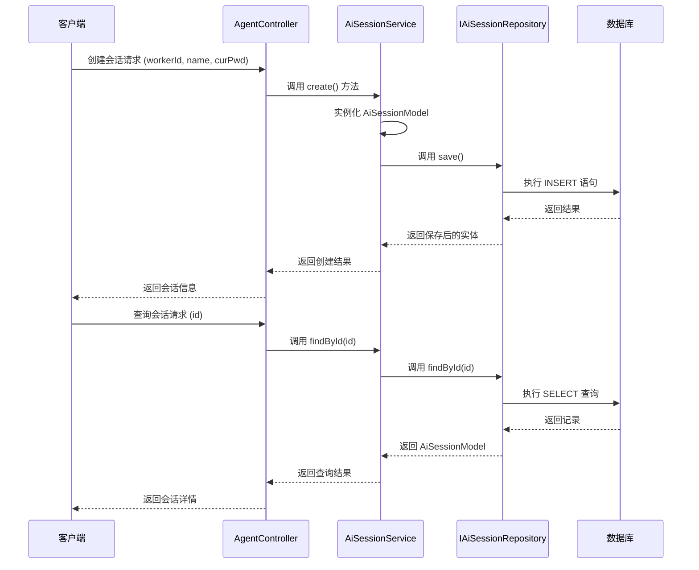

# 会话模型 (AiSession)

<cite>
**本文档中引用的文件**  
- [AiSession.ts](file://src/BussinessLayer/Agent/Domain/Agent/AiSession.ts)
- [EntityBase.ts](file://src/Shared/SeedWork/EntityBase.ts)
- [AiSessionRepository.ts](file://src/BussinessLayer/Agent/Domain/Agent/AiSessionRepository.ts)
- [AiSessionRepositoryMysql.ts](file://src/BussinessLayer/Agent/Repository/AiSessionRepositoryMysql.ts)
- [AiSessionService.ts](file://src/BussinessLayer/Agent/Application/Service/AiSessionService.ts)
- [AiMessage.ts](file://src/BussinessLayer/Agent/Domain/Agent/AiMessage.ts)
- [AiSessionSummary.ts](file://src/BussinessLayer/Agent/Domain/Agent/AiSessionSummary.ts)
</cite>

## 目录
1. [简介](#简介)
2. [实体结构与字段说明](#实体结构与字段说明)
3. [数据库映射关系](#数据库映射关系)
4. [业务流程中的使用场景](#业务流程中的使用场景)
5. [与其他实体的关联关系](#与其他实体的关联关系)
6. [数据验证与持久化策略](#数据验证与持久化策略)
7. [高并发下的乐观锁机制](#高并发下的乐观锁机制)
8. [类图：AiSession 及其关联实体](#类图：aisession-及其关联实体)
9. [序列图：会话创建与查询流程](#序列图：会话创建与查询流程)

## 简介

`AiSession` 实体是 schooberAi 项目中用户 AI 会话的聚合根（Aggregate Root），负责管理整个会话生命周期的核心状态。作为领域驱动设计（DDD）中的聚合根，它封装了会话相关的所有业务规则和状态变更逻辑，确保数据一致性与事务边界清晰。

该实体通过 TypeORM 框架映射到数据库表 `ai_session`，并继承自通用基类 `EntityBase`，具备标准的主键、时间戳、版本控制等能力。其主要职责包括会话的创建、更新、查询以及与消息记录（`AiMessage`）和摘要信息（`AiSessionSummary`）的关联管理。

**Section sources**
- [AiSession.ts](file://src/BussinessLayer/Agent/Domain/Agent/AiSession.ts#L1-L72)
- [EntityBase.ts](file://src/Shared/SeedWork/EntityBase.ts#L1-L91)

## 实体结构与字段说明

`AiSessionModel` 类定义了会话的核心属性，所有字段均通过 TypeORM 的 `@Column` 装饰器进行数据库映射配置。以下是各字段的详细说明：

| 字段名 | 类型 | 是否可为空 | 长度限制 | 数据库列名 | 描述 |
|--------|------|------------|----------|------------|------|
| `id` | `string` | 否 | 36 字符 | `id` | 会话唯一标识符，使用 Ruid 生成，作为业务主键 |
| `db_id` | `string` | 否 | - | `db_id` | 数据库自增主键，用于内部引用 |
| `workerId` | `string` | 否 | 255 字符 | `worker_id` | 工作者 ID，标识会话所属的执行者 |
| `businessType` | `string` | 是 | 100 字符 | `business_type` | 业务类型，区分不同场景的会话（如代码审查、上下文压缩等） |
| `name` | `string` | 是 | 255 字符 | `name` | 会话名称，用户可读的标识 |
| `curPwd` | `string` | 是 | 255 字符 | `cur_pwd` | 当前工作路径，用于定位上下文环境 |
| `ext` | `any` | 是 | - | `ext` | 扩展字段，JSON 格式，用于存储动态附加信息 |
| `status` | `EntityStatus` | 否 | 36 字符 | `status` | 实体状态（Active/Removed），软删除标记 |
| `version` | `number` | 否 | - | `version` | 版本号，用于乐观锁控制 |
| `createDate` | `Date` | 否 | - | `create_date` | 创建时间 |
| `updatedAt` | `Date` | 否 | - | `update_date` | 最后更新时间 |
| `removedDate` | `Date` \| `null` | 是 | - | `removed_date` | 删除时间（软删除时记录） |

其中，`id` 字段由 `Ruid` 库生成全局唯一字符串，避免 UUID 的性能开销；`createDate` 和 `updatedAt` 分别由构造函数和 `@UpdateDateColumn` 自动填充。

**Section sources**
- [AiSession.ts](file://src/BussinessLayer/Agent/Domain/Agent/AiSession.ts#L7-L72)
- [EntityBase.ts](file://src/Shared/SeedWork/EntityBase.ts#L48-L89)

## 数据库映射关系

`AiSession` 实体通过 TypeORM 的装饰器系统与数据库表 `ai_session` 建立映射关系：

- 使用 `@Entity('ai_session')` 显式指定表名
- 主键为 `id` 字段（业务主键），对应数据库列 `id`
- `db_id` 为数据库自增主键，使用 `@PrimaryGeneratedColumn("increment")`
- 所有字段通过 `@Column` 明确配置列名、类型、长度、空值约束及注释
- `create_date` 和 `update_date` 分别对应 `createDate` 和 `updatedAt` 字段，由 TypeORM 自动管理
- `version` 字段使用 `@VersionColumn` 实现乐观锁机制

该映射策略确保了代码与数据库结构的一致性，并支持未来通过 TypeORM 迁移工具进行模式演进。

**Section sources**
- [AiSession.ts](file://src/BussinessLayer/Agent/Domain/Agent/AiSession.ts#L4-L72)
- [EntityBase.ts](file://src/Shared/SeedWork/EntityBase.ts#L31-L81)

## 业务流程中的使用场景

`AiSession` 在系统中广泛应用于以下核心业务流程：

### 会话创建
通过 `AiSessionService.create()` 方法创建新会话。传入 `workerId` 等必要参数后，服务层实例化 `AiSessionModel` 并调用仓储层保存至数据库。此过程确保会话元数据完整记录。

### 会话查询
支持多种查询方式：
- `findById(id)`：根据会话 ID 精确查找
- `findByCurPwd(curPwd)`：根据当前路径查找关联会话
- `listByCurPwd(curPwd)`：列出指定路径下的所有会话，按创建时间倒序排列

### 会话更新
调用 `AiSessionService.update()` 方法可修改会话名称、扩展字段等内容。更新前会先检查会话是否存在，防止无效操作。

### 会话删除
虽未直接展示删除方法，但基于 `EntityBase` 的软删除机制，可通过设置 `status = EntityStatus.Removed` 并更新 `removedDate` 来实现逻辑删除。

所有操作均通过日志记录关键事件，便于问题追踪与审计。

**Section sources**
- [AiSessionService.ts](file://src/BussinessLayer/Agent/Application/Service/AiSessionService.ts#L19-L133)
- [AiSessionRepositoryMysql.ts](file://src/BussinessLayer/Agent/Repository/AiSessionRepositoryMysql.ts#L14-L45)

## 与其他实体的关联关系

`AiSession` 作为聚合根，与多个子实体存在一对多关联关系：

### 与 AiMessage 的关系
一个 `AiSession` 可包含多个 `AiMessage` 实例，表示该会话中的消息历史。关联通过 `AiMessage.sessionId` 字段实现，外键指向 `ai_session.id`。这种设计支持完整对话上下文的重建与回溯。

### 与 AiSessionSummary 的关系
每个 `AiSession` 可对应一个 `AiSessionSummary` 摘要记录，用于快速展示会话概要（如最后一条消息、摘要内容等）。关联通过 `AiSessionSummary.sessionId` 字段建立，支持高效列表渲染与搜索。

这些关系未在代码中显式使用 TypeORM 的 `@OneToMany` 装饰器声明，而是通过业务逻辑手动维护，保持了聚合边界的清晰性与性能可控性。

**Diagram sources**
- [AiSession.ts](file://src/BussinessLayer/Agent/Domain/Agent/AiSession.ts#L5-L72)
- [AiMessage.ts](file://src/BussinessLayer/Agent/Domain/Agent/AiMessage.ts#L5-L79)
- [AiSessionSummary.ts](file://src/BussinessLayer/Agent/Domain/Agent/AiSessionSummary.ts#L4-L89)
- [EntityBase.ts](file://src/Shared/SeedWork/EntityBase.ts#L10-L91)

## 数据验证与持久化策略

### 数据验证
- 构造函数接受可选参数对象，仅在值存在时赋值，避免 `undefined` 写入
- 必填字段（如 `workerId`）在调用 `create()` 时由上层服务校验
- `id` 自动生成，确保全局唯一性
- `status` 默认为 `EntityStatus.ACTIVE`，防止非法状态插入

### 持久化策略
- 使用 `AiSessionRepositoryMysql` 实现仓储接口，封装数据库操作
- 所有写操作（`save`）在事务中执行，保证数据一致性
- 查询操作使用 `findOne` 和 `find` 方法，支持条件过滤与排序
- 通过 `getConnection().transaction()` 确保事务边界清晰，避免脏写

该策略兼顾了数据完整性与系统可靠性，同时通过接口抽象支持未来更换存储实现。

**Section sources**
- [AiSessionRepositoryMysql.ts](file://src/BussinessLayer/Agent/Repository/AiSessionRepositoryMysql.ts#L47-L52)
- [AiSessionService.ts](file://src/BussinessLayer/Agent/Application/Service/AiSessionService.ts#L40-L41)

## 高并发下的乐观锁机制

为应对高并发场景下的数据竞争问题，`AiSession` 实体采用乐观锁机制：

- 在 `EntityBase` 基类中使用 `@VersionColumn` 装饰 `version` 字段
- 每次更新时，TypeORM 自动递增 `version` 值
- 若两个事务同时读取同一记录并尝试更新，后提交的事务将因版本号不匹配而抛出异常
- 应用层可捕获此异常并重试操作，或提示用户刷新状态

此机制避免了悲观锁带来的性能瓶颈，适用于读多写少的会话管理场景，有效防止了并发更新导致的数据覆盖问题。

**Section sources**
- [EntityBase.ts](file://src/Shared/SeedWork/EntityBase.ts#L60-L66)
- [AiSessionRepositoryMysql.ts](file://src/BussinessLayer/Agent/Repository/AiSessionRepositoryMysql.ts#L47-L52)

## 类图：AiSession 及其关联实体

**Diagram sources**
- [AiSession.ts](file://src/BussinessLayer/Agent/Domain/Agent/AiSession.ts#L5-L72)
- [AiMessage.ts](file://src/BussinessLayer/Agent/Domain/Agent/AiMessage.ts#L5-L79)
- [AiSessionSummary.ts](file://src/BussinessLayer/Agent/Domain/Agent/AiSessionSummary.ts#L4-L89)
- [EntityBase.ts](file://src/Shared/SeedWork/EntityBase.ts#L10-L91)

## 序列图：会话创建与查询流程

**Diagram sources**
- [AiSessionService.ts](file://src/BussinessLayer/Agent/Application/Service/AiSessionService.ts#L19-L48)
- [AiSessionRepositoryMysql.ts](file://src/BussinessLayer/Agent/Repository/AiSessionRepositoryMysql.ts#L14-L22)
- [AiSession.ts](file://src/BussinessLayer/Agent/Domain/Agent/AiSession.ts#L5-L72)