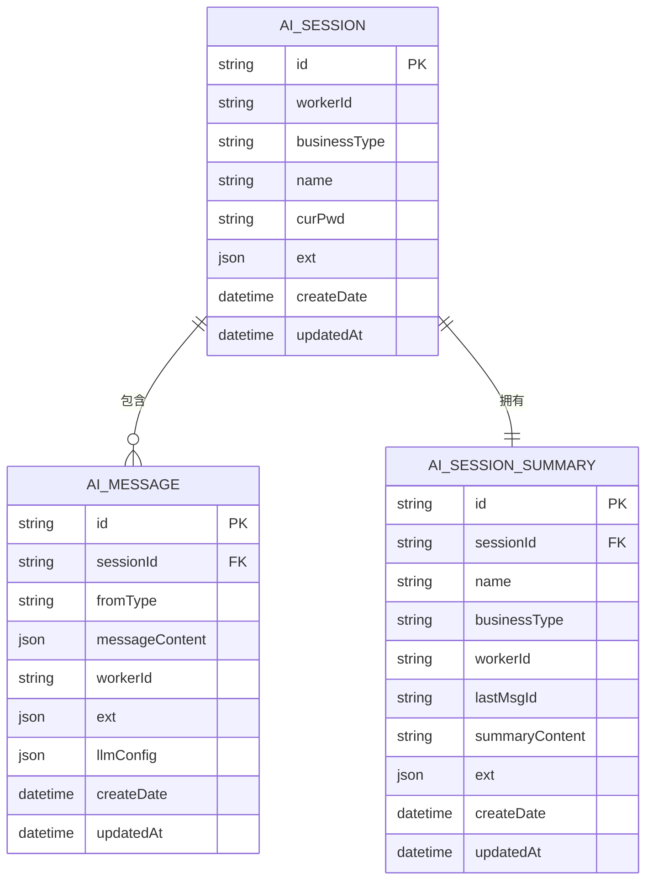

# 数据模型

<cite>
**本文档引用的文件**  
- [AiSession.ts](file://src/BussinessLayer/Agent/Domain/Agent/AiSession.ts)
- [AiMessage.ts](file://src/BussinessLayer/Agent/Domain/Agent/AiMessage.ts)
- [AiSessionSummary.ts](file://src/BussinessLayer/Agent/Domain/Agent/AiSessionSummary.ts)
- [AiSessionRepository.ts](file://src/BussinessLayer/Agent/Domain/Agent/AiSessionRepository.ts)
- [AiMessageRepository.ts](file://src/BussinessLayer/Agent/Domain/Agent/AiMessageRepository.ts)
- [AiSessionSummaryRepository.ts](file://src/BussinessLayer/Agent/Domain/Agent/AiSessionSummaryRepository.ts)
- [EntityBase.ts](file://src/Shared/SeedWork/EntityBase.ts)
- [AggregateRoots.ts](file://src/Shared/SeedWork/AggregateRoots.ts)
</cite>

## 目录
1. [引言](#引言)
2. [核心实体定义](#核心实体定义)
3. [实体关系与数据库映射](#实体关系与数据库映射)
4. [数据生命周期与持久化策略](#数据生命周期与持久化策略)
5. [查询优化建议](#查询优化建议)
6. [总结](#总结)

## 引言

本项目`schooberAi`的数据模型围绕AI会话管理构建，核心实体包括`AiSession`（AI会话）、`AiMessage`（AI消息）和`AiSessionSummary`（AI会话摘要）。这些实体共同支撑了用户与AI的交互历史记录、上下文管理及会话状态维护。本文档详细描述这三个核心实体的结构、字段、主键、外键关系及其在业务逻辑中的作用，并阐述其数据库映射方式、数据生命周期以及优化建议。

## 核心实体定义

### AiSession（AI会话）

`AiSession`实体用于管理用户的AI会话生命周期，每个会话代表一次独立的交互过程。

**字段定义：**
- `id`：主键，字符串类型，唯一标识一个会话（对应数据库字段 `id`）。
- `workerId`：必填字段，字符串类型，表示处理该会话的工作节点ID（`worker_id`）。
- `businessType`：可选字段，字符串类型，标识会话所属的业务类型（`business_type`）。
- `name`：可选字段，字符串类型，会话名称（`name`）。
- `curPwd`：可选字段，字符串类型，表示当前工作路径（`cur_pwd`）。
- `ext`：可选字段，JSON类型，用于存储扩展属性（`ext`）。

该实体继承自`AggregateRoot`，具备通用的元数据字段，如`db_id`（数据库自增主键）、`status`（状态）、`createDate`（创建时间）、`updatedAt`（更新时间）等。

**Section sources**  
- [AiSession.ts](file://src/BussinessLayer/Agent/Domain/Agent/AiSession.ts#L4-L71)
- [EntityBase.ts](file://src/Shared/SeedWork/EntityBase.ts#L10-L91)

### AiMessage（AI消息）

`AiMessage`实体用于存储用户与AI之间的对话历史，每条消息属于某个会话。

**字段定义：**
- `id`：主键，字符串类型，唯一标识一条消息。
- `sessionId`：可选字段，字符串类型，外键关联到`AiSession`的`id`（`session_id`）。
- `fromType`：可选字段，字符串类型，表示消息来源（如用户或AI）（`from_type`）。
- `messageContent`：可选字段，JSON数组类型，存储实际的消息内容（`message_content`）。
- `workerId`：可选字段，字符串类型，表示处理该消息的工作节点ID（`worker_id`）。
- `ext`：可选字段，JSON类型，扩展字段（`ext`）。
- `llmConfig`：可选字段，JSON类型，存储大模型配置信息（`llm_config`）。

**Section sources**  
- [AiMessage.ts](file://src/BussinessLayer/Agent/Domain/Agent/AiMessage.ts#L5-L78)
- [EntityBase.ts](file://src/Shared/SeedWork/EntityBase.ts#L10-L91)

### AiSessionSummary（AI会话摘要）

`AiSessionSummary`实体用于存储压缩后的会话摘要，便于快速恢复上下文或展示会话概览。

**字段定义：**
- `id`：主键，字符串类型，唯一标识一个摘要。
- `name`：可选字段，字符串类型，摘要名称（`name`）。
- `businessType`：可选字段，字符串类型，业务类型（`business_type`）。
- `workerId`：可选字段，字符串类型，工作节点ID（`worker_id`）。
- `lastMsgId`：可选字段，字符串类型，最后一条消息的ID（`last_msg_id`）。
- `sessionId`：可选字段，字符串类型，外键关联到`AiSession`的`id`（`session_id`）。
- `summaryContent`：可选字段，`longtext`类型，以JSON格式存储摘要内容（`summary_content`）。
- `ext`：可选字段，JSON类型，扩展字段（`ext`）。

**Section sources**  
- [AiSessionSummary.ts](file://src/BussinessLayer/Agent/Domain/Agent/AiSessionSummary.ts#L4-L88)
- [EntityBase.ts](file://src/Shared/SeedWork/EntityBase.ts#L10-L91)

## 实体关系与数据库映射

### 实体关系图

**Diagram sources**  
- [AiSession.ts](file://src/BussinessLayer/Agent/Domain/Agent/AiSession.ts#L4-L71)
- [AiMessage.ts](file://src/BussinessLayer/Agent/Domain/Agent/AiMessage.ts#L5-L78)
- [AiSessionSummary.ts](file://src/BussinessLayer/Agent/Domain/Agent/AiSessionSummary.ts#L4-L88)

### 数据库映射说明

- 所有实体均使用TypeORM进行ORM映射，通过`@Entity`装饰器指定表名（如`ai_session`、`ai_message`、`ai_session_summary`）。
- 主键`id`为业务主键，由`Ruid`生成，确保全局唯一；`db_id`为数据库自增主键，用于优化索引性能。
- 外键关系通过`sessionId`字段建立：
  - `AiMessage.sessionId` → `AiSession.id`
  - `AiSessionSummary.sessionId` → `AiSession.id`
- 所有实体继承`EntityBase`，自动包含`createDate`、`updatedAt`、`status`等审计字段。
- JSON字段（如`ext`、`messageContent`、`llmConfig`）在MySQL中映射为`JSON`类型，`summaryContent`使用`longtext`以支持大文本存储。

**Section sources**  
- [AiSession.ts](file://src/BussinessLayer/Agent/Domain/Agent/AiSession.ts#L4-L71)
- [AiMessage.ts](file://src/BussinessLayer/Agent/Domain/Agent/AiMessage.ts#L5-L78)
- [AiSessionSummary.ts](file://src/BussinessLayer/Agent/Domain/Agent/AiSessionSummary.ts#L4-L88)
- [EntityBase.ts](file://src/Shared/SeedWork/EntityBase.ts#L10-L91)

## 数据生命周期与持久化策略

### 数据生命周期

- **AiSession**：会话创建时生成，随用户交互更新，可被软删除（`status = Removed`）。长期未使用的会话可能被归档或清理。
- **AiMessage**：每轮对话生成一条消息，按时间顺序存储。消息随所属会话的删除而被级联删除（通过`deleteMessageBySessionId`实现）。
- **AiSessionSummary**：在会话达到一定长度或用户请求时生成，用于替代完整消息列表加载上下文。摘要随会话更新而刷新，旧版本可保留或覆盖。

### 持久化策略

- 使用MySQL作为持久化存储，通过TypeORM进行数据访问。
- 所有写操作（如`save`）均在数据库事务中执行，确保数据一致性。
- 读取操作根据场景优化排序：
  - 消息按`createDate ASC`排序，保证对话顺序。
  - 会话和摘要按`updatedAt DESC`排序，优先展示最新记录。
- 软删除机制通过`status`字段实现，避免数据物理删除，支持恢复。

**Section sources**  
- [AiSessionRepositoryMysql.ts](file://src/BussinessLayer/Agent/Repository/AiSessionRepositoryMysql.ts#L1-L55)
- [AiMessageRepositoryMysql.ts](file://src/BussinessLayer/Agent/Repository/AiMessageRepositoryMysql.ts#L1-L46)
- [AiSessionSummaryRepositoryMysql.ts](file://src/BussinessLayer/Agent/Repository/AiSessionSummaryRepositoryMysql.ts#L1-L70)

## 查询优化建议

为提升查询性能，建议在以下字段上创建索引：

| 表名 | 字段 | 索引类型 | 说明 |
|------|------|----------|------|
| `ai_session` | `workerId` | 普通索引 | 按工作节点查询会话 |
| `ai_session` | `curPwd` | 普通索引 | 按当前路径查找会话 |
| `ai_message` | `sessionId` | 普通索引 | 快速获取某会话的所有消息 |
| `ai_message` | `workerId` | 普通索引 | 按工作节点筛选消息 |
| `ai_session_summary` | `sessionId` | 唯一索引（可选） | 确保每个会话最多一个有效摘要 |
| `ai_session_summary` | `workerId` | 普通索引 | 按工作节点获取摘要列表 |
| `ai_session_summary` | `businessType` | 普通索引 | 按业务类型分类摘要 |

此外，`id`字段已由框架自动建立主键索引，`createDate`和`updatedAt`在部分查询中可利用排序优化。

**Section sources**  
- [AiSessionRepository.ts](file://src/BussinessLayer/Agent/Domain/Agent/AiSessionRepository.ts#L6-L12)
- [AiMessageRepository.ts](file://src/BussinessLayer/Agent/Domain/Agent/AiMessageRepository.ts#L6-L11)
- [AiSessionSummaryRepository.ts](file://src/BussinessLayer/Agent/Domain/Agent/AiSessionSummaryRepository.ts#L6-L12)

## 总结

`schooberAi`项目的数据模型设计清晰，围绕`AiSession`为核心，通过`AiMessage`和`AiSessionSummary`分别管理对话细节与上下文摘要。实体间关系明确，支持高效的会话恢复与历史查询。基于TypeORM的ORM映射和软删除机制保障了数据一致性与可维护性。通过合理的索引策略，可进一步优化高并发场景下的查询性能。