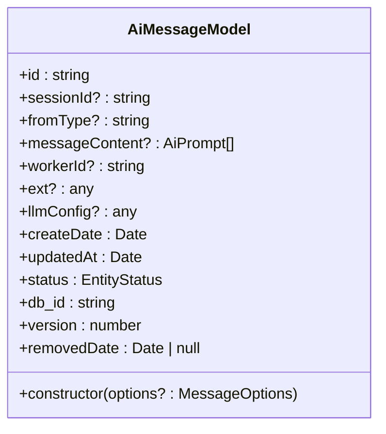
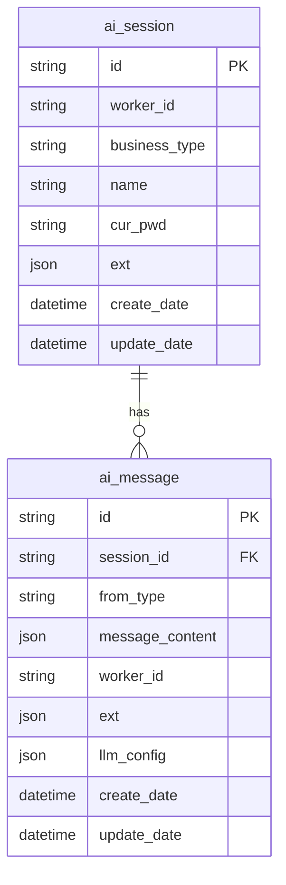
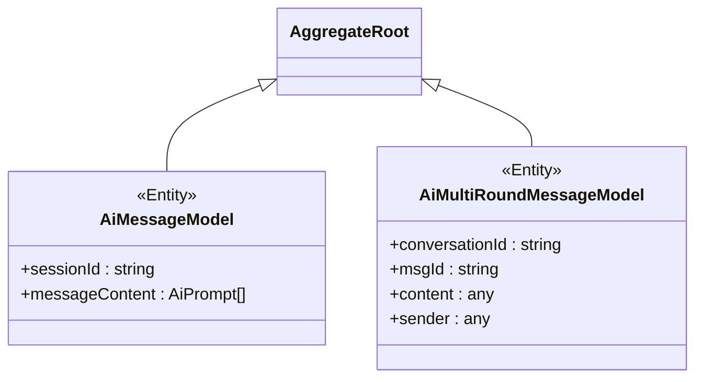
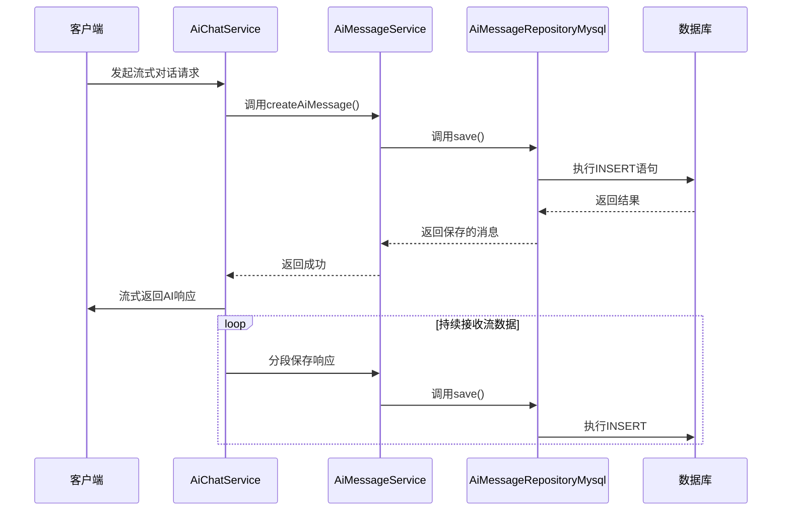

# 消息模型 (AiMessage)

<cite>
**本文档中引用的文件**   
- [AiMessage.ts](file://src/BussinessLayer/Agent/Domain/Agent/AiMessage.ts)
- [AiMultiRoundMessage.ts](file://src/BussinessLayer/Agent/Domain/Agent/AiMultiRoundMessage.ts)
- [AiSession.ts](file://src/BussinessLayer/Agent/Domain/Agent/AiSession.ts)
- [AiMessageRepositoryMysql.ts](file://src/BussinessLayer/Agent/Repository/AiMessageRepositoryMysql.ts)
- [AiMessageService.ts](file://src/BussinessLayer/Agent/Application/Service/AiMessageService.ts)
- [EntityBase.ts](file://src/Shared/SeedWork/EntityBase.ts)
- [AggregateRoots.ts](file://src/Shared/SeedWork/AggregateRoots.ts)
</cite>

## 目录
1. [介绍](#介绍)
2. [实体结构与字段定义](#实体结构与字段定义)
3. [数据库映射与关系](#数据库映射与关系)
4. [继承关系与多轮对话支持](#继承关系与多轮对话支持)
5. [在流式响应与历史检索中的作用](#在流式响应与历史检索中的作用)
6. [查询性能优化与索引设计](#查询性能优化与索引设计)
7. [总结](#总结)

## 介绍

`AiMessage` 实体是 schooberAi 项目中用于持久化用户与 AI 之间对话历史的核心数据模型。作为实现多轮对话记忆的关键组件，该实体负责存储每次交互的消息内容，并通过会话 ID（`sessionId`）组织对话上下文。它不仅支持基本的聊天记录功能，还为后续的上下文压缩、会话摘要生成和智能代理行为分析提供了数据基础。

该实体基于 TypeORM 构建，继承自领域驱动设计（DDD）中的聚合根（`AggregateRoot`），确保了数据的一致性和业务规则的封装。通过与 `AiSession` 的外键关联，实现了按会话维度管理对话历史的能力。

**Section sources**
- [AiMessage.ts](file://src/BussinessLayer/Agent/Domain/Agent/AiMessage.ts#L1-L79)
- [EntityBase.ts](file://src/Shared/SeedWork/EntityBase.ts#L1-L91)

## 实体结构与字段定义

`AiMessageModel` 类定义了以下核心字段，每个字段均通过 TypeORM 的 `@Column` 装饰器映射到数据库表 `ai_message` 的对应列：

| 字段名 | 映射列名 | 数据类型 | 可空性 | 说明 |
|--------|----------|----------|--------|------|
| `id` | `id` | `string` (VARCHAR 36) | 否 | 实体唯一标识符，由 Ruid 生成 |
| `sessionId` | `session_id` | `string` (VARCHAR 255) | 是 | 关联的会话 ID，用于组织对话上下文 |
| `fromType` | `from_type` | `string` (VARCHAR 255) | 是 | 消息来源类型（如 user、assistant） |
| `messageContent` | `message_content` | `AiPrompt[]` (JSON) | 是 | 消息内容，以 JSON 格式存储提示数组 |
| `workerId` | `worker_id` | `string` (VARCHAR 255) | 是 | 创建消息的工作者 ID |
| `ext` | `ext` | `any` (JSON) | 是 | 扩展字段，用于存储额外的元数据 |
| `llmConfig` | `llm_config` | `any` (JSON) | 是 | 大模型配置信息 |
| `createDate` | `create_date` | `Date` (DATETIME) | 否 | 创建时间戳 |
| `updatedAt` | `update_date` | `Date` (DATETIME) | 否 | 更新时间戳 |
| `status` | `status` | `EntityStatus` (VARCHAR 36) | 否 | 实体状态（Active/Removed） |

此外，实体还继承自 `EntityBase`，自动包含 `db_id`（主键）、版本控制 `version` 和软删除相关的 `removedDate` 字段。



**Diagram sources**
- [AiMessage.ts](file://src/BussinessLayer/Agent/Domain/Agent/AiMessage.ts#L5-L78)
- [EntityBase.ts](file://src/Shared/SeedWork/EntityBase.ts#L31-L90)

**Section sources**
- [AiMessage.ts](file://src/BussinessLayer/Agent/Domain/Agent/AiMessage.ts#L5-L78)

## 数据库映射与关系

`AiMessage` 实体通过 TypeORM 的装饰器与数据库表 `ai_message` 进行精确映射：

- **表名映射**：使用 `@Entity('ai_message')` 指定实体对应的数据库表名。
- **字段映射**：每个属性通过 `@Column` 配置其数据库列名、类型、长度和约束。
- **主键与索引**：
  - `id` 字段带有唯一索引 `uk_id`，确保全局唯一性。
  - `db_id` 为自增主键，提供高效的数据库内部引用。
- **外键关系**：虽然代码中未显式使用 `@ManyToOne`，但 `sessionId` 字段逻辑上外键关联 `ai_session` 表的 `id` 字段，形成一对多关系（一个会话包含多条消息）。



**Diagram sources**
- [AiMessage.ts](file://src/BussinessLayer/Agent/Domain/Agent/AiMessage.ts#L5-L34)
- [AiSession.ts](file://src/BussinessLayer/Agent/Domain/Agent/AiSession.ts#L4-L61)

**Section sources**
- [AiMessage.ts](file://src/BussinessLayer/Agent/Domain/Agent/AiMessage.ts#L5-L34)
- [AiSession.ts](file://src/BussinessLayer/Agent/Domain/Agent/AiSession.ts#L4-L61)

## 继承关系与多轮对话支持

`AiMessage` 与 `AiMultiRoundMessage` 共同支撑多轮对话功能，但二者定位不同：

- **`AiMessageModel`**：继承自 `AggregateRoot`，代表领域模型中的消息聚合根，侧重于业务规则和状态管理。
- **`AiMultiRoundMessageModel`**：独立的实体，专门用于存储流式传输过程中的多轮对话消息，结构更扁平，字段命名更贴近前端交互。

二者**并非继承关系**，而是通过 `AiMessageService` 中的 `saveChatMessage` 方法协同工作。当需要保存流式对话时，服务层会将数据同时或选择性地写入 `AiMultiRoundMessage` 表，以满足实时性和查询效率的需求。



**Diagram sources**
- [AiMessage.ts](file://src/BussinessLayer/Agent/Domain/Agent/AiMessage.ts#L5-L6)
- [AiMultiRoundMessage.ts](file://src/BussinessLayer/Agent/Domain/Agent/AiMultiRoundMessage.ts#L4-L5)

**Section sources**
- [AiMessage.ts](file://src/BussinessLayer/Agent/Domain/Agent/AiMessage.ts#L5-L6)
- [AiMultiRoundMessage.ts](file://src/BussinessLayer/Agent/Domain/Agent/AiMultiRoundMessage.ts#L4-L5)
- [AiMessageService.ts](file://src/BussinessLayer/Agent/Application/Service/AiMessageService.ts#L139-L165)

## 在流式响应与历史检索中的作用

`AiMessage` 实体在系统中扮演着双重角色：

### 流式响应中的作用
在 `AiChatService` 发起流式请求时，`AiMessageService` 会实时调用 `createAiMessage` 方法，将用户输入和 AI 响应分段持久化。这确保了即使客户端断开连接，对话历史也不会丢失。

### 历史消息检索中的作用
通过 `AiMessageService` 提供的 `listBySessionId` 方法，系统可以按会话 ID 高效检索完整的对话历史。该方法在查询时按 `createDate` 升序排列，保证了消息的时序正确性，为重建对话上下文提供了可靠的数据源。



**Diagram sources**
- [AiMessageService.ts](file://src/BussinessLayer/Agent/Application/Service/AiMessageService.ts#L23-L47)
- [AiMessageRepositoryMysql.ts](file://src/BussinessLayer/Agent/Repository/AiMessageRepositoryMysql.ts#L40-L44)
- [AiChatService.ts](file://src/BussinessLayer/Agent/Application/Service/AiChatService.ts#L125-L195)

**Section sources**
- [AiMessageService.ts](file://src/BussinessLayer/Agent/Application/Service/AiMessageService.ts#L23-L47)
- [AiChatService.ts](file://src/BussinessLayer/Agent/Application/Service/AiChatService.ts#L125-L195)

## 查询性能优化与索引设计

面对大规模对话数据，`AiMessage` 的查询性能至关重要。以下是关键的优化策略：

### 分页查询优化
`AiMessageRepositoryMysql` 的 `listBySessionId` 方法已实现基础的排序（`order: { createDate: "ASC" }`）。在实际应用中，应结合分页参数（如 `skip` 和 `take`）来避免全表扫描：

```typescript
async listBySessionId(sessionId: string, page: number = 1, limit: number = 20): Promise<AiMessageModel[]> {
    const skip = (page - 1) * limit;
    return await repo.find({
        where: { sessionId },
        order: { createDate: "ASC" },
        skip,
        take: limit
    });
}
```

### 索引设计
为提升查询效率，建议在数据库中创建以下复合索引：
- **`(sessionId, createDate)`**：这是最关键的索引，能极大加速按会话 ID 和时间范围查询消息的操作。
- **`sessionId` 单列索引**：如果 `(sessionId, createDate)` 复合索引已存在，此单列索引可省略，因为复合索引的前缀可以用于单列查询。

这些索引确保了在高并发场景下，历史消息的检索依然保持毫秒级响应。

**Section sources**
- [AiMessageRepositoryMysql.ts](file://src/BussinessLayer/Agent/Repository/AiMessageRepositoryMysql.ts#L22-L31)
- [AiMessage.ts](file://src/BussinessLayer/Agent/Domain/Agent/AiMessage.ts#L27-L34)

## 总结

`AiMessage` 实体是 schooberAi 项目实现持久化对话记忆的核心。它通过清晰的字段定义、严谨的数据库映射和高效的查询接口，为多轮对话功能提供了坚实的数据支撑。尽管与 `AiMultiRoundMessage` 共存，但其作为领域聚合根的角色不可替代。通过合理的索引设计和分页策略，该实体能够有效应对大数据量下的性能挑战，确保系统在高负载下依然稳定可靠。