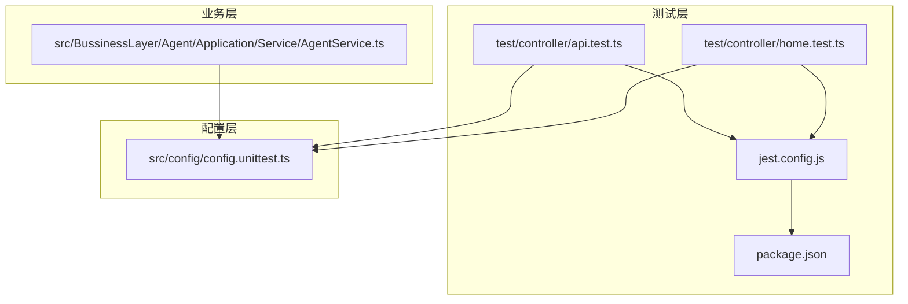
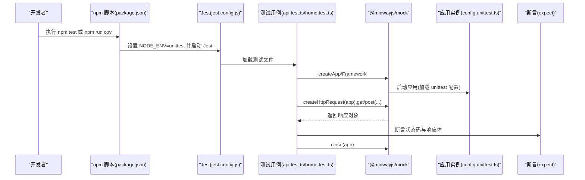
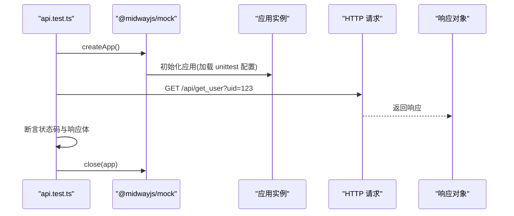
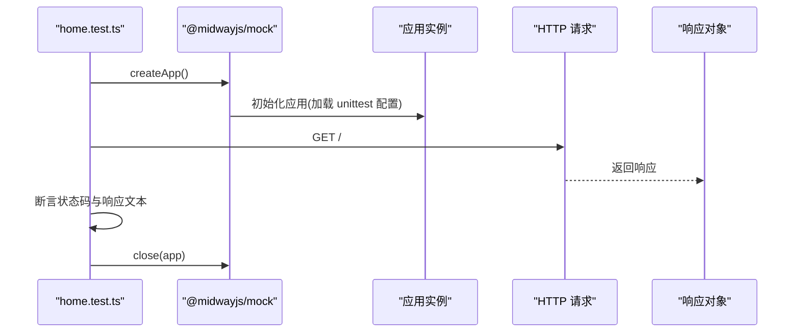
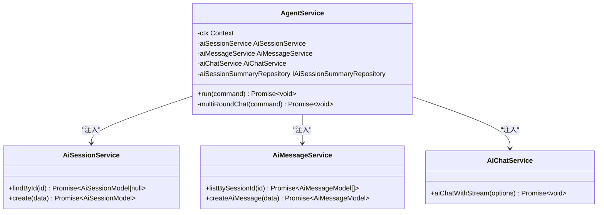
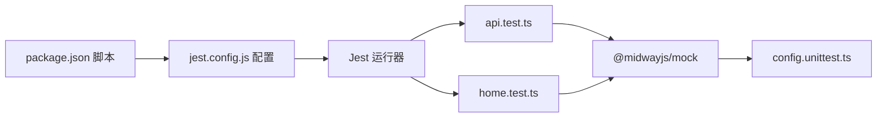

# 测试

<cite>
**本文引用的文件**
- [api.test.ts](file://test/controller/api.test.ts)
- [home.test.ts](file://test/controller/home.test.ts)
- [jest.config.js](file://jest.config.js)
- [package.json](file://package.json)
- [config.unittest.ts](file://src/config/config.unittest.ts)
- [AgentService.ts](file://src/BussinessLayer/Agent/Application/Service/AgentService.ts)
</cite>

## 目录
1. [简介](#简介)
2. [项目结构](#项目结构)
3. [核心组件](#核心组件)
4. [架构总览](#架构总览)
5. [详细组件分析](#详细组件分析)
6. [依赖分析](#依赖分析)
7. [性能考虑](#性能考虑)
8. [故障排查指南](#故障排查指南)
9. [结论](#结论)
10. [附录](#附录)

## 简介
本测试策略文档面向 schooberAi 项目，系统性阐述项目的测试方法与实践，覆盖单元测试与端到端测试两类场景。项目采用 Jest 框架进行测试，通过 npm scripts 提供统一入口：使用 npm test 执行测试套件；使用 npm run cov 生成覆盖率报告。测试环境通过 config.unittest.ts 配置，确保在单元测试环境下快速启动应用并隔离数据库与外部服务依赖。本文将以 api.test.ts 为例，说明如何对 API 端点进行正确性与错误处理验证，并给出模拟依赖（如数据库与外部 API）的最佳实践建议，以及如何提升测试覆盖率与质量。

## 项目结构
测试相关目录与文件组织如下：
- test/controller：存放控制器层面的端到端测试用例，包含 api.test.ts 与 home.test.ts
- jest.config.js：Jest 测试框架配置，指定 ts-jest 预设、Node 环境、忽略路径与覆盖率忽略路径
- package.json：定义测试脚本 test 与 cov，分别用于运行测试与生成覆盖率报告
- src/config/config.unittest.ts：单元测试环境配置，关闭端口监听，便于快速启动与销毁测试应用
- src/BussinessLayer/Agent/Application/Service/AgentService.ts：业务服务示例，展示如何注入依赖并通过上下文与外部服务交互，为编写可测试的服务层提供参考

图表来源
- [api.test.ts](file://test/controller/api.test.ts#L1-L21)
- [home.test.ts](file://test/controller/home.test.ts#L1-L22)
- [jest.config.js](file://jest.config.js#L1-L6)
- [package.json](file://package.json#L1-L103)
- [config.unittest.ts](file://src/config/config.unittest.ts#L1-L8)
- [AgentService.ts](file://src/BussinessLayer/Agent/Application/Service/AgentService.ts#L1-L200)

章节来源
- [api.test.ts](file://test/controller/api.test.ts#L1-L21)
- [home.test.ts](file://test/controller/home.test.ts#L1-L22)
- [jest.config.js](file://jest.config.js#L1-L6)
- [package.json](file://package.json#L1-L103)
- [config.unittest.ts](file://src/config/config.unittest.ts#L1-L8)
- [AgentService.ts](file://src/BussinessLayer/Agent/Application/Service/AgentService.ts#L1-L200)

## 核心组件
- 测试运行器与脚本
  - 使用 Jest 作为测试运行器，通过 ts-jest 预设支持 TypeScript 编译与类型检查
  - npm test 脚本设置 NODE_ENV=unittest 并调用 jest，确保加载单元测试配置
  - npm run cov 脚本启用覆盖率收集，输出覆盖率报告
- 测试环境配置
  - config.unittest.ts 将 Egg 的端口设置为 null，避免测试期间占用端口，便于快速启动与关闭
- 端到端测试示例
  - api.test.ts 展示如何使用 @midwayjs/mock 创建应用实例、发起 HTTP 请求并断言响应状态与内容
  - home.test.ts 展示根路径 GET 请求的断言流程
- 业务服务示例
  - AgentService.ts 展示服务层如何注入上下文与多个子服务，并通过回调方式处理流式响应，为后续编写可测试的服务层提供参考

章节来源
- [jest.config.js](file://jest.config.js#L1-L6)
- [package.json](file://package.json#L1-L103)
- [config.unittest.ts](file://src/config/config.unittest.ts#L1-L8)
- [api.test.ts](file://test/controller/api.test.ts#L1-L21)
- [home.test.ts](file://test/controller/home.test.ts#L1-L22)
- [AgentService.ts](file://src/BussinessLayer/Agent/Application/Service/AgentService.ts#L1-L200)

## 架构总览
下图展示了测试执行链路：npm scripts -> Jest -> 测试用例 -> Mock 应用 -> 断言结果；同时展示测试环境配置对应用启动的影响。

图表来源
- [package.json](file://package.json#L1-L103)
- [jest.config.js](file://jest.config.js#L1-L6)
- [api.test.ts](file://test/controller/api.test.ts#L1-L21)
- [home.test.ts](file://test/controller/home.test.ts#L1-L22)
- [config.unittest.ts](file://src/config/config.unittest.ts#L1-L8)

## 详细组件分析

### 端到端测试：api.test.ts
- 目标与流程
  - 验证 /api/get_user 接口的正确性：构造请求、断言状态码与响应字段
  - 使用 @midwayjs/mock 创建应用实例，确保在受控环境中运行
  - 在测试结束后关闭应用，避免资源泄漏
- 关键步骤
  - 创建应用：createApp<Framework>()
  - 发起请求：createHttpRequest(app).get('/api/get_user').query({ uid: 123 })
  - 断言：expect(result.status).toBe(200) 与 expect(result.body.message).toBe('OK')
  - 关闭应用：await close(app)
- 错误处理建议
  - 可扩展添加对 4xx/5xx 场景的断言，如查询参数缺失或无效时的状态码与错误信息
  - 对于需要鉴权的接口，可在请求头中注入 token 并断言权限相关响应

图表来源
- [api.test.ts](file://test/controller/api.test.ts#L1-L21)
- [config.unittest.ts](file://src/config/config.unittest.ts#L1-L8)

章节来源
- [api.test.ts](file://test/controller/api.test.ts#L1-L21)

### 端到端测试：home.test.ts
- 目标与流程
  - 验证根路径 GET 请求返回期望文本
  - 与 api.test.ts 类似，使用 @midwayjs/mock 创建应用实例并断言响应
- 错误处理建议
  - 可增加对不同 HTTP 方法与路由的断言，覆盖更多控制器行为

图表来源
- [home.test.ts](file://test/controller/home.test.ts#L1-L22)
- [config.unittest.ts](file://src/config/config.unittest.ts#L1-L8)

章节来源
- [home.test.ts](file://test/controller/home.test.ts#L1-L22)

### 单元测试：业务服务示例（AgentService）
- 设计要点
  - 通过 @Inject 注入上下文与多个子服务，便于在测试中替换为模拟实现
  - 通过回调函数处理流式响应，适合在测试中模拟 onMessage/onCompleted 行为
- 测试建议
  - 使用 jest.fn 替换 aiChatService.aiChatWithStream 的回调，断言回调被调用且参数符合预期
  - 使用 jest.mock 或 jest.spyOn 替换 aiSessionService 与 aiMessageService 的方法，断言其被调用次数与参数
  - 对异常分支进行断言，如会话不存在、历史消息为空等情况
- 依赖注入与可测试性
  - 保持服务无状态或最小状态，便于在测试中重置
  - 将外部依赖（如 LLM API）抽象为接口，便于替换为模拟实现

图表来源
- [AgentService.ts](file://src/BussinessLayer/Agent/Application/Service/AgentService.ts#L1-L200)

章节来源
- [AgentService.ts](file://src/BussinessLayer/Agent/Application/Service/AgentService.ts#L1-L200)

### 测试环境配置：config.unittest.ts
- 配置要点
  - 将 egg.port 设置为 null，避免测试期间占用端口
  - 其他配置项按需保留默认值或根据测试需求调整
- 影响范围
  - 使 @midwayjs/mock 能够快速启动与关闭应用实例
  - 保证测试之间互不干扰，避免端口冲突

章节来源
- [config.unittest.ts](file://src/config/config.unittest.ts#L1-L8)

### Jest 配置：jest.config.js
- 配置要点
  - preset: 'ts-jest'：启用 TypeScript 支持
  - testEnvironment: 'node'：在 Node 环境中运行测试
  - testPathIgnorePatterns：忽略 fixtures 目录
  - coveragePathIgnorePatterns：忽略 test 目录，避免覆盖率统计包含测试文件
- 与 npm scripts 的关系
  - npm test 通过 cross-env NODE_ENV=unittest 启动 Jest，确保加载 unittest 配置
  - npm run cov 直接调用 jest --coverage 生成覆盖率报告

章节来源
- [jest.config.js](file://jest.config.js#L1-L6)
- [package.json](file://package.json#L1-L103)

## 依赖分析
- 测试框架与工具
  - Jest：测试运行器与断言库
  - ts-jest：TypeScript 编译与类型支持
  - @midwayjs/mock：应用实例创建与 HTTP 请求模拟
  - @midwayjs/web：Web 框架集成
- 脚本与环境
  - npm test：设置 NODE_ENV=unittest 并运行 Jest
  - npm run cov：生成覆盖率报告
- 配置耦合
  - 测试脚本与 Jest 配置共同决定测试运行环境与编译选项
  - unittest 配置影响应用启动速度与资源占用

图表来源
- [package.json](file://package.json#L1-L103)
- [jest.config.js](file://jest.config.js#L1-L6)
- [api.test.ts](file://test/controller/api.test.ts#L1-L21)
- [home.test.ts](file://test/controller/home.test.ts#L1-L22)
- [config.unittest.ts](file://src/config/config.unittest.ts#L1-L8)

章节来源
- [package.json](file://package.json#L1-L103)
- [jest.config.js](file://jest.config.js#L1-L6)
- [api.test.ts](file://test/controller/api.test.ts#L1-L21)
- [home.test.ts](file://test/controller/home.test.ts#L1-L22)
- [config.unittest.ts](file://src/config/config.unittest.ts#L1-L8)

## 性能考虑
- 测试启动与关闭
  - 使用 config.unittest.ts 将端口设为 null，减少网络资源占用，提高测试启动速度
  - 在测试结束时及时 close 应用实例，避免进程残留
- 覆盖率收集
  - 使用 npm run cov 生成覆盖率报告，关注未覆盖的关键分支与异常路径
  - 将测试文件与源代码分离，避免覆盖率统计包含测试文件本身
- 并发与隔离
  - 确保测试之间相互独立，避免共享状态导致的竞态条件
  - 对外部依赖进行模拟，减少真实网络请求带来的性能开销

[本节为通用指导，无需列出具体文件来源]

## 故障排查指南
- 端口占用
  - 症状：测试启动失败或报错
  - 排查：确认 config.unittest.ts 中 egg.port 已设置为 null
- 路由未找到
  - 症状：GET / 或 /api/get_user 返回 404
  - 排查：确认控制器已注册，路由定义正确；检查应用启动日志
- 断言失败
  - 症状：状态码或响应体不符合预期
  - 排查：打印响应对象，核对请求参数与控制器实现；必要时增加更详细的断言
- 覆盖率过低
  - 症状：覆盖率报告中某些模块或分支未覆盖
  - 排查：补充针对异常分支与边界条件的测试用例；对服务层进行依赖注入模拟

章节来源
- [config.unittest.ts](file://src/config/config.unittest.ts#L1-L8)
- [api.test.ts](file://test/controller/api.test.ts#L1-L21)
- [home.test.ts](file://test/controller/home.test.ts#L1-L22)

## 结论
schooberAi 项目已建立基于 Jest 的测试体系，结合 @midwayjs/mock 实现端到端测试，并通过 config.unittest.ts 优化测试环境配置。建议在现有基础上进一步完善以下方面：
- 补充针对控制器与服务层的单元测试，重点覆盖异常分支与边界条件
- 对外部依赖（如数据库与 LLM API）进行接口抽象与模拟，提升测试稳定性与可重复性
- 持续关注覆盖率指标，确保关键路径与错误处理得到充分验证

[本节为总结性内容，无需列出具体文件来源]

## 附录

### 如何编写高质量测试的指导
- 使用 @midwayjs/mock 快速创建应用实例并发起 HTTP 请求
- 对控制器与服务层分别进行端到端与单元测试
- 使用 jest.fn/jest.mock/jest.spyOn 替换依赖，断言调用次数与参数
- 对异常场景进行断言，确保错误处理逻辑被覆盖
- 使用 npm run cov 生成覆盖率报告，持续改进测试覆盖面

[本节为通用指导，无需列出具体文件来源]