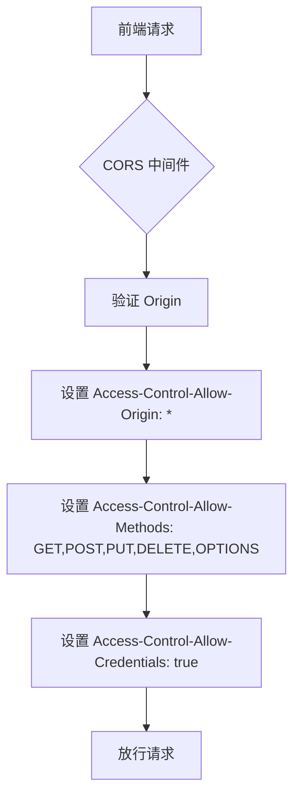
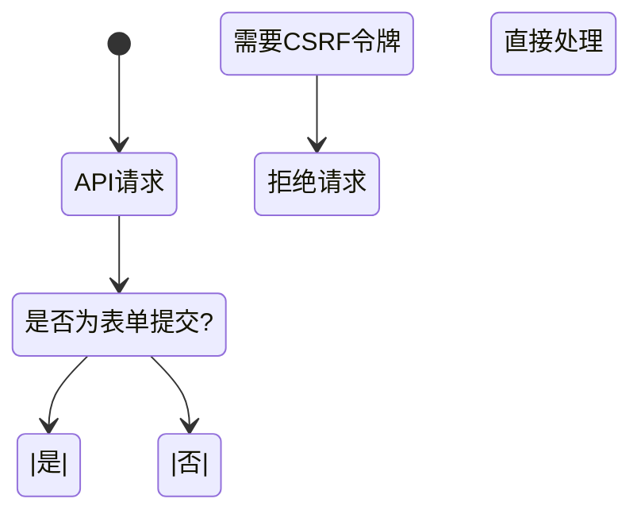
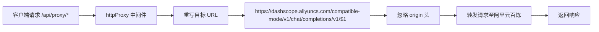

# 应用配置

<cite>
**本文档引用的文件**  
- [config.default.ts](file://src/config/config.default.ts)
- [config.unittest.ts](file://src/config/config.unittest.ts)
- [configuration.ts](file://src/configuration.ts)
- [package.json](file://package.json)
- [AgentController.ts](file://src/ApiGateway/aiController/AgentController.ts)
- [RagController.ts](file://src/ApiGateway/controller/RagController.ts)
</cite>

## 目录

1. [简介](#简介)
2. [核心配置项详解](#核心配置项详解)
3. [跨域配置（CORS）](#跨域配置cors)
4. [安全配置（Security）](#安全配置security)
5. [API文档配置（Swagger）](#api文档配置swagger)
6. [HTTP代理配置（httpProxy）](#http代理配置httpproxy)
7. [环境变量与配置覆盖](#环境变量与配置覆盖)

## 简介

本项目基于 MidwayJS 框架构建，采用模块化配置方式。核心配置文件位于 `src/config/config.default.ts`，定义了应用运行所需的基础参数。通过 `configuration.ts` 文件导入相关中间件（如跨域、Swagger），并结合环境变量或环境特定配置文件（如 `config.prod.ts`）实现灵活部署。

**Section sources**
- [config.default.ts](file://src/config/config.default.ts#L1-L40)
- [configuration.ts](file://src/configuration.ts#L1-L65)

## 核心配置项详解

### keys（Cookie 签名密钥）

`keys` 字段用于对 Cookie 进行签名，防止客户端篡改。当前默认值为 `'1762174792249_3022'`，仅用于开发环境。在生产环境中，必须更换为高强度、保密的密钥，以确保会话安全。

### egg.port（服务监听端口）

`egg.port` 设置应用监听的服务器端口号。默认配置为 `7001`，即应用将在 `http://localhost:7001` 启动。可通过环境变量或生产配置文件进行覆盖。

**Section sources**
- [config.default.ts](file://src/config/config.default.ts#L5-L7)

## 跨域配置（CORS）



**Diagram sources**
- [config.default.ts](file://src/config/config.default.ts#L9-L14)
- [configuration.ts](file://src/configuration.ts#L4-L5)

### 配置说明

- **origin**: 设置为 `'*'`，表示接受所有来源的跨域请求。适用于开发和测试环境，生产环境建议指定具体域名以增强安全性。
- **allowMethods**: 明确允许的 HTTP 方法，包括 `GET, POST, PUT, DELETE, OPTIONS`，满足 RESTful API 的基本需求。
- **credentials**: 设置为 `true`，允许携带凭据（如 Cookie），用于需要身份认证的场景。

### 前端集成注意事项

当 `credentials: true` 时，前端发起请求需设置 `withCredentials: true`，且 `origin` 不能为 `'*'`（必须为具体域名）。因此，在生产环境中应将 `origin` 配置为前端部署地址，例如 `'https://your-frontend.com'`。

**Section sources**
- [config.default.ts](file://src/config/config.default.ts#L9-L14)

## 安全配置（Security）

### CSRF 保护关闭



`security.csrf` 设置为 `false`，原因是本项目为纯 API 服务，不处理浏览器表单提交，因此无需 CSRF 防护。若未来接入 Web 表单功能，需重新启用并配置。

### X-Frame-Options 关闭

`security.xframe.enable` 设置为 `false`，因为 API 接口无需防止被嵌入 iframe。此设置不影响 API 安全性，仅影响页面嵌套行为，对后端服务无实际影响。

**Section sources**
- [config.default.ts](file://src/config/config.default.ts#L15-L19)

## API文档配置（Swagger）

```mermaid
graph TB
A[Swagger 配置] --> B[title: 代码审查API]
A --> C[description: 代码审查API]
A --> D[version: 1.0.0]
B --> E[@midwayjs/swagger 插件]
C --> E
D --> E
E --> F[自动生成 /swagger-ui 页面]
```

**Diagram sources**
- [config.default.ts](file://src/config/config.default.ts#L21-L24)
- [configuration.ts](file://src/configuration.ts#L5-L6)
- [AgentController.ts](file://src/ApiGateway/aiController/AgentController.ts#L3-L3)
- [RagController.ts](file://src/ApiGateway/controller/RagController.ts#L3-L3)

### 配置项说明

- **title**: API 文档标题，显示在 Swagger UI 页面顶部。
- **description**: API 描述信息，提供项目功能概览。
- **version**: 当前 API 版本号，遵循语义化版本规范。

### 与 @midwayjs/swagger 插件集成

在 `configuration.ts` 中通过 `imports: [swagger]` 引入插件，并在控制器中使用 `@ApiTags`、`@ApiOperation`、`@ApiResponse` 等装饰器标注接口信息。运行时自动生成 OpenAPI 规范文档，并提供可视化界面访问 `/swagger-ui`。

**Section sources**
- [config.default.ts](file://src/config/config.default.ts#L21-L24)
- [configuration.ts](file://src/configuration.ts#L5-L6)
- [AgentController.ts](file://src/ApiGateway/aiController/AgentController.ts#L1-L170)
- [RagController.ts](file://src/ApiGateway/controller/RagController.ts#L1-L181)

## HTTP代理配置（httpProxy）



**Diagram sources**
- [config.default.ts](file://src/config/config.default.ts#L26-L37)

### 配置说明

- **enable**: 启用 HTTP 代理功能。
- **target**: 代理目标地址，指向阿里云百炼的兼容模式 API 端点。使用 `$1` 占位符实现路径重写。
- **ingoreHeaders**: 忽略请求中的 `origin` 和 `Origin` 头部，防止因跨域头冲突导致代理失败。
- **strategy**: 当前为空，可扩展自定义代理策略（如负载均衡、重试机制）。

该配置用于将特定前缀的请求（如 `/api/proxy/`）透明转发至外部 AI 服务，实现接口聚合与协议适配。

**Section sources**
- [config.default.ts](file://src/config/config.default.ts#L26-L37)

## 环境变量与配置覆盖

项目支持通过环境变量或环境特定配置文件覆盖默认设置。例如：

- **开发环境**：使用 `config.default.ts` 和 `config.unittest.ts`
- **生产环境**：通过 `NODE_ENV=production` 触发 `config.prod.ts`（若存在）
- **端口覆盖**：可在 `config.prod.ts` 中重新定义 `egg.port`
- **密钥管理**：敏感信息（如数据库密码、API Key）应通过环境变量注入，避免硬编码

启动脚本 `bootstrap.js` 使用 `@midwayjs/bootstrap` 自动加载对应环境的配置。

**Section sources**
- [config.default.ts](file://src/config/config.default.ts#L1-L40)
- [config.unittest.ts](file://src/config/config.unittest.ts#L1-L8)
- [package.json](file://package.json#L7)
- [bootstrap.js](file://bootstrap.js#L1-L3)