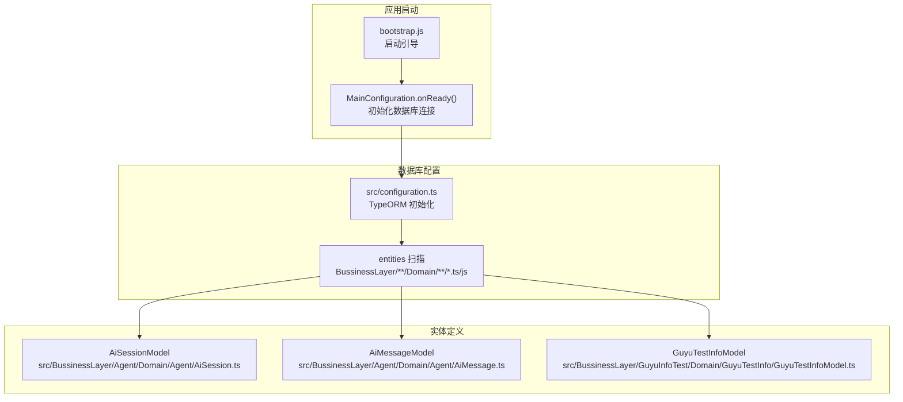
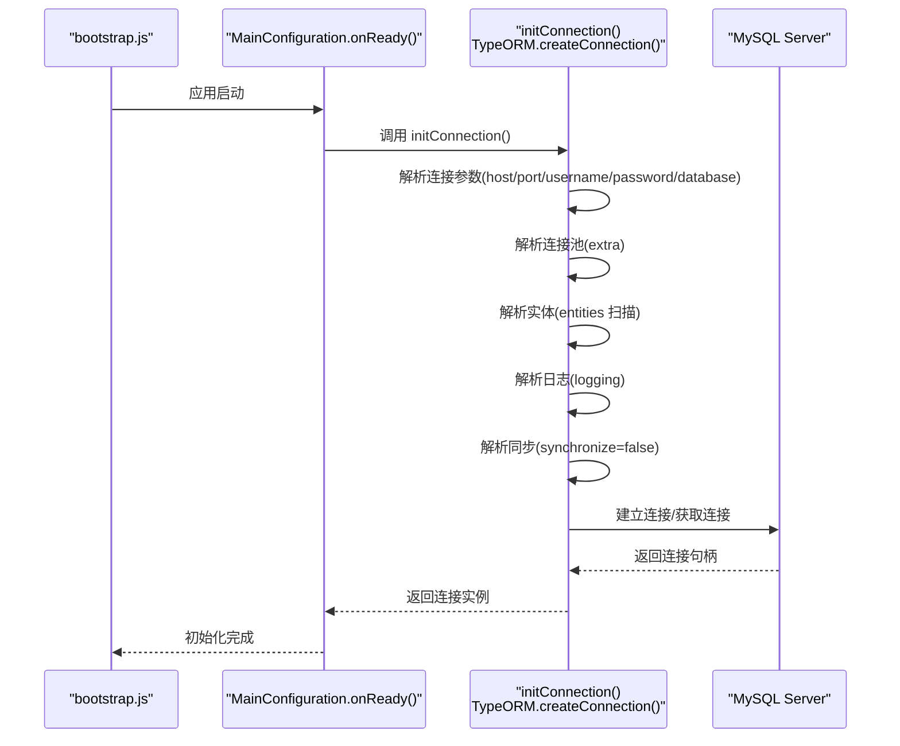
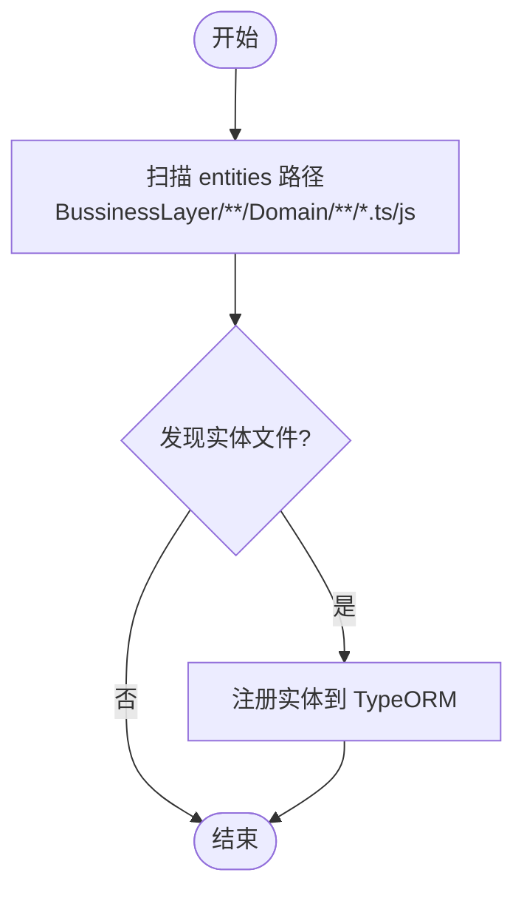
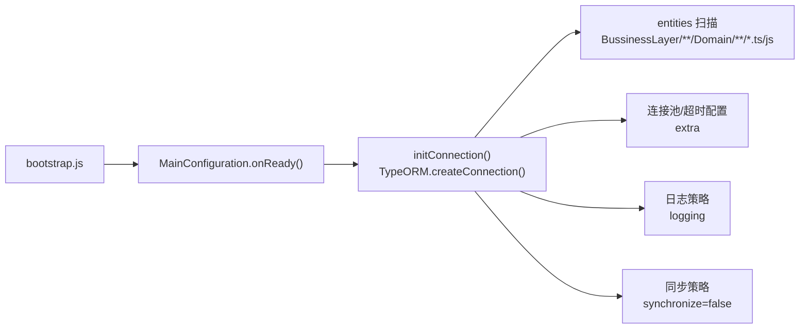

# 数据库配置

<cite>
**本文引用的文件**
- [src/configuration.ts](file://src/configuration.ts)
- [src/config/config.default.ts](file://src/config/config.default.ts)
- [src/config/config.unittest.ts](file://src/config/config.unittest.ts)
- [src/BussinessLayer/Agent/Domain/Agent/AiSession.ts](file://src/BussinessLayer/Agent/Domain/Agent/AiSession.ts)
- [src/BussinessLayer/Agent/Domain/Agent/AiMessage.ts](file://src/BussinessLayer/Agent/Domain/Agent/AiMessage.ts)
- [src/BussinessLayer/GuyuInfoTest/Domain/GuyuTestInfo/GuyuTestInfoModel.ts](file://src/BussinessLayer/GuyuInfoTest/Domain/GuyuTestInfo/GuyuTestInfoModel.ts)
- [package.json](file://package.json)
- [bootstrap.js](file://bootstrap.js)
</cite>

## 目录
1. [简介](#简介)
2. [项目结构](#项目结构)
3. [核心组件](#核心组件)
4. [架构总览](#架构总览)
5. [详细组件分析](#详细组件分析)
6. [依赖关系分析](#依赖关系分析)
7. [性能考量](#性能考量)
8. [故障排查指南](#故障排查指南)
9. [结论](#结论)
10. [附录：环境变量与部署示例](#附录环境变量与部署示例)

## 简介
本文件聚焦于 schooberAi 项目的数据库配置，围绕 src/configuration.ts 中通过 TypeORM 初始化 MySQL 连接的关键点进行系统化说明。内容涵盖：
- 主机地址、端口、用户名、密码、数据库名称的配置方式
- entities 自动加载机制（扫描 BussinessLayer 下 Domain 目录）
- 连接池与超时参数（connectionLimit、waitForConnections、queueLimit、connectTimeout、acquireTimeout、timeout）的作用与最佳实践
- synchronize: false 在生产环境的重要性
- logging 的日志级别控制策略
- 不同部署环境（开发、测试、生产）的环境变量覆盖方案

## 项目结构
数据库配置位于应用入口层，通过 Midway 生命周期在应用启动时初始化 TypeORM 连接，并在配置层统一管理连接参数与实体扫描范围。

图表来源
- [src/configuration.ts](file://src/configuration.ts#L1-L65)
- [src/BussinessLayer/Agent/Domain/Agent/AiSession.ts](file://src/BussinessLayer/Agent/Domain/Agent/AiSession.ts#L1-L72)
- [src/BussinessLayer/Agent/Domain/Agent/AiMessage.ts](file://src/BussinessLayer/Agent/Domain/Agent/AiMessage.ts#L1-L79)
- [src/BussinessLayer/GuyuInfoTest/Domain/GuyuTestInfo/GuyuTestInfoModel.ts](file://src/BussinessLayer/GuyuInfoTest/Domain/GuyuTestInfo/GuyuTestInfoModel.ts#L1-L50)
- [bootstrap.js](file://bootstrap.js#L1-L3)

章节来源
- [src/configuration.ts](file://src/configuration.ts#L1-L65)
- [bootstrap.js](file://bootstrap.js#L1-L3)

## 核心组件
- 数据库连接初始化：在应用生命周期 onReady 阶段调用 initConnection，基于 TypeORM 创建 MySQL 连接。
- 连接参数：host、port、username、password、database、charset、driver 等。
- 连接池与超时：通过 extra 字段配置 connectionLimit、waitForConnections、queueLimit、connectTimeout、acquireTimeout、timeout。
- 实体扫描：entities 使用通配符扫描 BussinessLayer 下所有 Domain 目录中的实体文件。
- 日志策略：logging 设置为仅记录错误与警告，降低生产环境日志开销。
- 模型同步：synchronize 设为 false，避免生产环境因自动同步导致数据丢失风险。

章节来源
- [src/configuration.ts](file://src/configuration.ts#L1-L65)

## 架构总览
下图展示数据库连接初始化流程与实体加载关系：

图表来源
- [src/configuration.ts](file://src/configuration.ts#L1-L65)
- [bootstrap.js](file://bootstrap.js#L1-L3)

## 详细组件分析

### 数据库连接初始化与参数解析
- 类型与驱动：type 为 mysql，driver 使用 mysql2。
- 连接参数：host、port、username、password、database、charset。
- 连接池与超时：extra 字段包含 connectionLimit、waitForConnections、queueLimit、connectTimeout、acquireTimeout、timeout。
- 实体扫描：entities 使用通配符匹配 BussinessLayer 下所有 Domain 目录中的实体文件（支持 .ts 与 .js）。
- 日志策略：logging 仅记录 error 与 warn，有助于生产环境降噪。
- 模型同步：synchronize 为 false，确保生产环境不自动迁移数据库结构。

章节来源
- [src/configuration.ts](file://src/configuration.ts#L1-L65)

### 实体加载机制（entities）
- 扫描范围：BussinessLayer/**/Domain/**/*.ts 与 BussinessLayer/**/Domain/**/*.js。
- 典型实体示例：
  - AiSessionModel：用于会话相关数据持久化。
  - AiMessageModel：用于消息内容与元信息持久化。
  - GuyuTestInfoModel：用于测试数据模型持久化。
- 加载方式：TypeORM 依据 entities 配置自动发现并注册实体。

图表来源
- [src/configuration.ts](file://src/configuration.ts#L50-L60)
- [src/BussinessLayer/Agent/Domain/Agent/AiSession.ts](file://src/BussinessLayer/Agent/Domain/Agent/AiSession.ts#L1-L72)
- [src/BussinessLayer/Agent/Domain/Agent/AiMessage.ts](file://src/BussinessLayer/Agent/Domain/Agent/AiMessage.ts#L1-L79)
- [src/BussinessLayer/GuyuInfoTest/Domain/GuyuTestInfo/GuyuTestInfoModel.ts](file://src/BussinessLayer/GuyuInfoTest/Domain/GuyuTestInfo/GuyuTestInfoModel.ts#L1-L50)

章节来源
- [src/configuration.ts](file://src/configuration.ts#L50-L60)
- [src/BussinessLayer/Agent/Domain/Agent/AiSession.ts](file://src/BussinessLayer/Agent/Domain/Agent/AiSession.ts#L1-L72)
- [src/BussinessLayer/Agent/Domain/Agent/AiMessage.ts](file://src/BussinessLayer/Agent/Domain/Agent/AiMessage.ts#L1-L79)
- [src/BussinessLayer/GuyuInfoTest/Domain/GuyuTestInfo/GuyuTestInfoModel.ts](file://src/BussinessLayer/GuyuInfoTest/Domain/GuyuTestInfo/GuyuTestInfoModel.ts#L1-L50)

### 连接池与超时参数详解
- connectionLimit：最大并发连接数，建议根据数据库最大连接限制与应用吞吐量综合评估。
- waitForConnections：当连接池耗尽时是否等待可用连接；开启可避免瞬时高并发直接拒绝请求。
- queueLimit：等待队列上限；0 表示不限制，需结合 waitForConnections 与业务峰值流量谨慎设置。
- connectTimeout：建立连接的超时时间；过短可能导致网络抖动时频繁失败，过长会拉长请求排队时间。
- acquireTimeout：从连接池获取连接的超时时间；与 queueLimit 协同，避免无限等待。
- timeout：查询执行超时时间；建议与业务查询复杂度匹配，避免长事务占用连接。

最佳实践
- 生产环境优先启用 waitForConnections 并设置合理的 queueLimit，避免突发流量导致大量请求被拒绝。
- 将 connectTimeout、acquireTimeout、timeout 与数据库最大连接数、慢查询监控联动调整。
- 结合连接池监控指标（活跃连接数、等待队列长度、超时次数）持续优化。

章节来源
- [src/configuration.ts](file://src/configuration.ts#L39-L47)

### 日志策略（logging）
- 当前配置仅记录 error 与 warn，有助于减少生产环境日志体量，提升 I/O 性能。
- 建议在开发/测试环境开启更详细的 SQL 日志以便调试，但需注意生产环境应保持精简。

章节来源
- [src/configuration.ts](file://src/configuration.ts#L58-L60)

### 模型同步（synchronize: false）
- synchronize: false 是生产环境的关键安全开关，避免自动迁移导致表结构变更、索引重建、数据丢失等风险。
- 建议通过版本化的数据库迁移工具（如 TypeORM 自带迁移或第三方工具）在受控环境下执行结构变更。

章节来源
- [src/configuration.ts](file://src/configuration.ts#L61-L63)

### 配置文件与默认值
- 默认配置（config.default.ts）：包含应用端口、跨域、安全、Swagger 等通用配置，数据库连接不在此处定义。
- 测试配置（config.unittest.ts）：用于单元测试场景的端口等配置，不影响数据库连接。
- package.json：脚本中通过 NODE_ENV 控制运行模式（local、unittest、production），便于区分不同环境的配置加载与行为差异。

章节来源
- [src/config/config.default.ts](file://src/config/config.default.ts#L1-L40)
- [src/config/config.unittest.ts](file://src/config/config.unittest.ts#L1-L8)
- [package.json](file://package.json#L1-L103)

## 依赖关系分析
- Midway 引导：bootstrap.js 负责启动应用，MainConfiguration.onReady 在应用就绪阶段初始化数据库连接。
- TypeORM：负责连接 MySQL、实体注册、查询执行与连接池管理。
- 实体模块：各领域实体文件通过 entities 配置被自动加载。

图表来源
- [bootstrap.js](file://bootstrap.js#L1-L3)
- [src/configuration.ts](file://src/configuration.ts#L1-L65)

章节来源
- [bootstrap.js](file://bootstrap.js#L1-L3)
- [src/configuration.ts](file://src/configuration.ts#L1-L65)

## 性能考量
- 连接池大小：根据数据库最大连接数与应用 QPS 合理设置 connectionLimit，避免过度占用数据库资源。
- 等待队列：queueLimit 与 waitForConnections 需与业务峰值流量匹配，防止请求堆积导致延迟放大。
- 超时参数：connectTimeout、acquireTimeout、timeout 应与数据库响应时间分布相匹配，避免长尾延迟影响整体吞吐。
- 日志级别：生产环境仅记录 error/warn，减少磁盘 I/O 与日志解析成本。
- 实体扫描：entities 通配符扫描在启动时一次性完成，建议保持目录结构清晰，避免无关文件干扰。

## 故障排查指南
常见问题与定位思路
- 连接失败（ER_BAD_DB_ERROR）：检查 host、port、username、password、database 是否正确；确认数据库服务可达且账号权限正常。
- 连接池耗尽：观察等待队列长度与超时次数，适当提高 connectionLimit 或优化业务并发。
- 查询超时：检查 timeout 设置与慢查询，必要时拆分复杂查询或增加索引。
- 实体未加载：确认 entities 路径与文件后缀（.ts/.js）是否匹配，实体文件是否符合 TypeORM 注解规范。

章节来源
- [src/configuration.ts](file://src/configuration.ts#L39-L63)

## 结论
本项目的数据库配置以 TypeORM 为核心，通过 Midway 生命周期在应用启动时完成连接初始化。entities 采用通配符扫描 BussinessLayer 下 Domain 目录，实现按领域自动加载实体。连接池与超时参数通过 extra 字段集中配置，配合 logging 与 synchronize 的生产安全策略，形成稳定可靠的数据库访问层。建议在生产环境严格遵循 synchronize=false 与最小化日志的原则，并结合监控指标持续优化连接池与超时参数。

## 附录：环境变量与部署示例
说明
- 当前仓库中数据库连接参数在 src/configuration.ts 内部硬编码，未直接读取 process.env。
- 若需通过环境变量覆盖，请在 initConnection 中从 process.env 读取对应键值，并在不同环境（local、unittest、production）分别设置。

建议的环境变量命名与用途
- DATABASE_HOST：数据库主机地址
- DATABASE_PORT：数据库端口
- DATABASE_USERNAME：数据库用户名
- DATABASE_PASSWORD：数据库密码
- DATABASE_NAME：数据库名
- DATABASE_CHARSET：字符集
- DATABASE_CONNECTION_LIMIT：连接池最大连接数
- DATABASE_WAIT_FOR_CONNECTIONS：是否等待可用连接
- DATABASE_QUEUE_LIMIT：等待队列上限
- DATABASE_CONNECT_TIMEOUT：连接超时（毫秒）
- DATABASE_ACQUIRE_TIMEOUT：获取连接超时（毫秒）
- DATABASE_TIMEOUT：查询超时（毫秒）
- DATABASE_LOGGING：日志级别（error/warn）
- DATABASE_SYNCHRONIZE：是否自动同步（true/false）

部署环境示例
- 开发环境（local）
  - 启动命令：NODE_ENV=local npm run dev
  - 配置要点：可开启更详细的 SQL 日志，便于本地调试；synchronize 可临时设为 true 以快速迭代模型。
- 测试环境（unittest）
  - 启动命令：NODE_ENV=unittest npm run test
  - 配置要点：使用独立测试数据库，synchronize 可临时设为 true；logging 保持 warn/error。
- 生产环境（production）
  - 启动命令：NODE_ENV=production npm start
  - 配置要点：synchronize 必须为 false；logging 仅 error/warn；连接池参数与超时需结合监控指标优化。

注意事项
- 若需要从环境变量读取配置，请在 initConnection 中添加对 process.env 的读取逻辑，并在 package.json 的 scripts 中为不同环境设置对应的环境变量。
- 对于生产环境，建议使用只读账号与最小权限原则，避免误操作造成数据风险。

章节来源
- [package.json](file://package.json#L1-L103)
- [src/configuration.ts](file://src/configuration.ts#L1-L65)