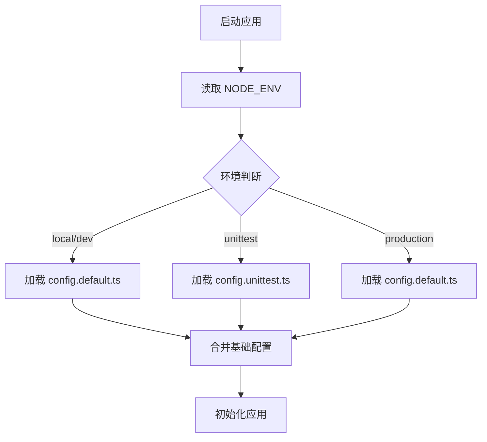
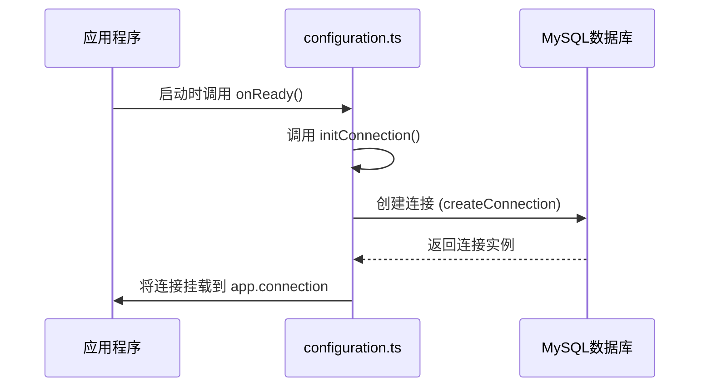

# 配置管理

<cite>
**本文档中引用的文件**  
- [configuration.ts](file://src/configuration.ts)
- [config.default.ts](file://src/config/config.default.ts)
- [config.unittest.ts](file://src/config/config.unittest.ts)
- [package.json](file://package.json)
- [bootstrap.js](file://bootstrap.js)
</cite>

## 目录
1. [简介](#简介)
2. [项目结构与配置系统概述](#项目结构与配置系统概述)
3. [核心配置文件分析](#核心配置文件分析)
4. [数据库连接初始化](#数据库连接初始化)
5. [默认配置详解](#默认配置详解)
6. [环境变量覆盖机制](#环境变量覆盖机制)
7. [数据库连接池配置说明](#数据库连接池配置说明)
8. [生产环境配置最佳实践](#生产环境配置最佳实践)
9. [总结](#总结)

## 简介
本文档详细说明schooberAi项目如何使用Midway框架的配置系统来管理不同环境（开发、测试、生产）的设置。重点介绍数据库连接配置、默认服务参数、环境变量覆盖机制以及生产环境的安全配置策略。

## 项目结构与配置系统概述
schooberAi项目采用Midway框架的标准配置体系，通过`configuration.ts`作为主配置入口，结合`src/config/`目录下的环境特定配置文件实现多环境支持。项目通过`importConfigs`机制自动加载配置目录，支持基于`NODE_ENV`环境变量的配置合并与覆盖。

**Section sources**
- [configuration.ts](file://src/configuration.ts#L9-L16)
- [package.json](file://package.json#L7-L8)

## 核心配置文件分析
项目包含两个核心配置文件：`config.default.ts`定义全局默认配置，`config.unittest.ts`为测试环境提供特定覆盖。Midway框架根据运行环境自动选择并合并配置，确保各环境行为一致性的同时允许必要差异。

**Diagram sources**
- [config.default.ts](file://src/config/config.default.ts#L3-L39)
- [config.unittest.ts](file://src/config/config.unittest.ts#L3-L7)

**Section sources**
- [config.default.ts](file://src/config/config.default.ts#L1-L40)
- [config.unittest.ts](file://src/config/config.unittest.ts#L1-L8)

## 数据库连接初始化
`configuration.ts`文件中的`initConnection`函数负责初始化MySQL数据库连接。该函数使用TypeORM的`createConnection`方法，配置了主机、端口、认证信息和数据库名称等关键参数。

**Diagram sources**
- [configuration.ts](file://src/configuration.ts#L21-L64)

**Section sources**
- [configuration.ts](file://src/configuration.ts#L7-L64)

## 默认配置详解
`config.default.ts`文件定义了系统的默认行为参数：

- **服务器端口**：通过`egg.port`设置为7001
- **CORS策略**：允许所有来源（`origin: '*'`），支持常见HTTP方法，启用凭据传输
- **安全配置**：禁用CSRF和X-Frame保护
- **Swagger文档**：配置API文档标题为"代码审查API"，版本1.0.0
- **HTTP代理**：配置阿里云百炼API的兼容模式代理

这些默认配置为开发环境提供了便利，同时为生产环境的定制化覆盖奠定了基础。

**Section sources**
- [config.default.ts](file://src/config/config.default.ts#L3-L39)

## 环境变量覆盖机制
项目通过`package.json`中的脚本命令实现环境变量控制：

- 开发环境：`npm run dev` 使用`NODE_ENV=local`
- 生产环境：`npm start` 使用`NODE_ENV=production`

虽然当前配置文件未直接使用环境变量进行参数覆盖，但Midway框架支持通过环境变量动态修改配置。建议在部署时通过环境变量覆盖敏感信息（如数据库密码），避免硬编码。

**Section sources**
- [package.json](file://package.json#L7-L8)
- [bootstrap.js](file://bootstrap.js#L2)

## 数据库连接池配置说明
数据库连接配置包含详细的连接池参数，确保系统在高并发下的稳定性和性能：

- **最大连接数**：`connectionLimit: 10`，限制同时活跃连接数量
- **连接超时**：`connectTimeout: 60000`（60秒），防止连接挂起
- **获取连接超时**：`acquireTimeout: 60000`（60秒），控制等待时间
- **查询超时**：`timeout: 60000`（60秒），避免长时间运行查询
- **队列限制**：`queueLimit: 0`，允许无限排队请求
- **等待连接**：`waitForConnections: true`，启用连接等待机制

这些配置平衡了资源利用率和系统响应性，适合中等负载的应用场景。

**Section sources**
- [configuration.ts](file://src/configuration.ts#L40-L47)

## 生产环境配置最佳实践
生产环境配置中包含两个关键安全设置：

1. **`synchronize: false`**：禁用TypeORM的自动模式同步，防止生产环境数据库结构被意外修改导致数据丢失
2. **日志级别控制**：仅记录错误和警告信息（`logging: ['error', 'warn']`），避免敏感数据泄露和日志文件过度增长

此外，建议在生产环境中：
- 使用环境变量管理数据库密码等敏感信息
- 调整CORS策略，限制可信来源
- 监控连接池使用情况，根据实际负载调整连接数

**Section sources**
- [configuration.ts](file://src/configuration.ts#L58-L62)

## 总结
schooberAi项目通过Midway框架的配置系统实现了灵活的多环境管理。`configuration.ts`集中管理数据库连接，`config.default.ts`提供合理的默认配置，通过环境变量和配置文件的组合实现不同部署环境的适配。建议进一步强化环境变量的使用，特别是在处理敏感配置时，以提高部署的安全性和灵活性。