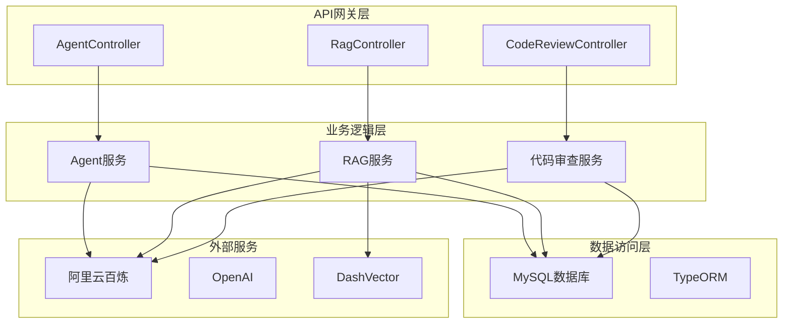
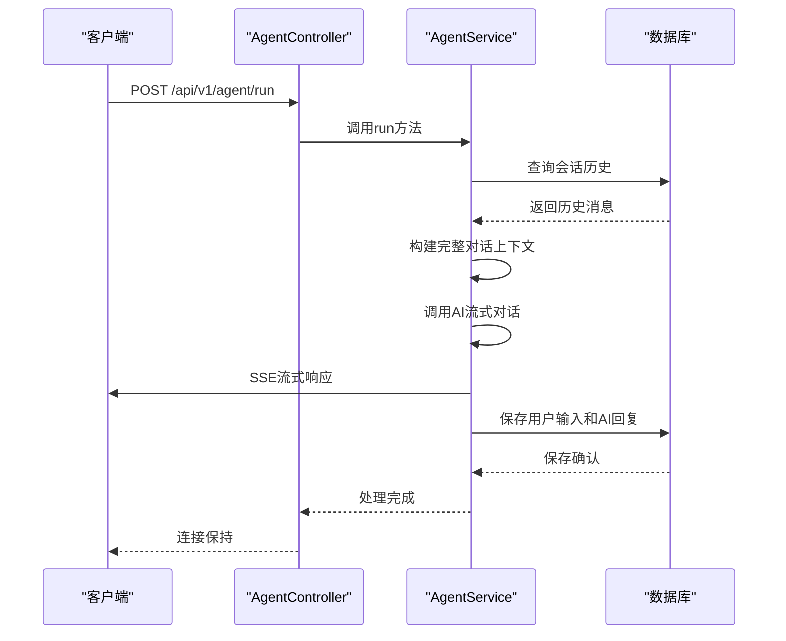
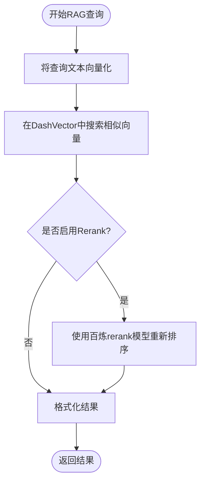
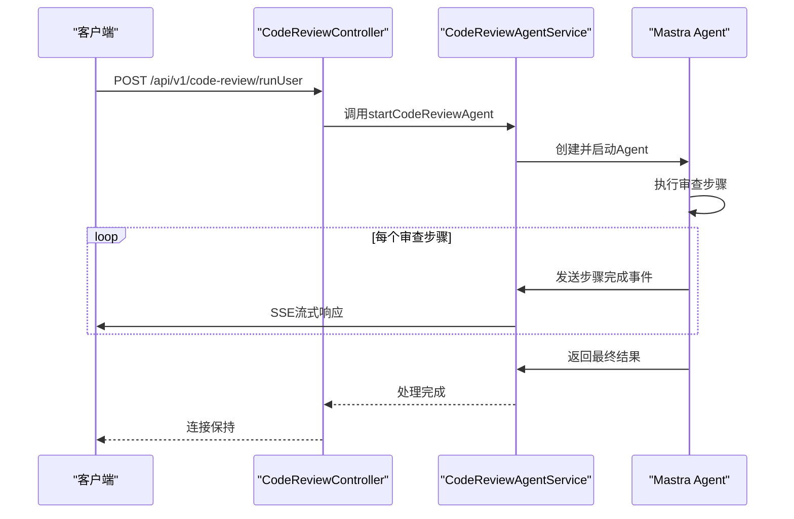
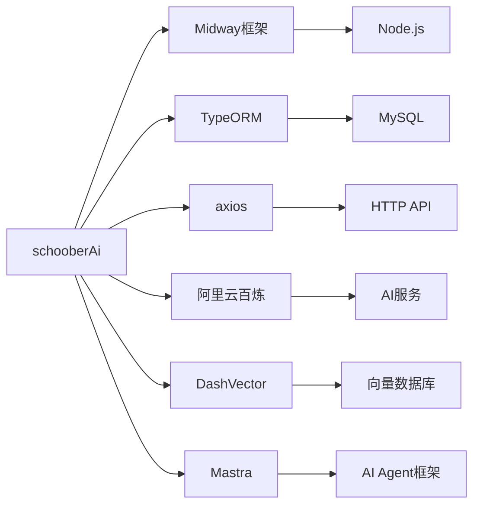

# 项目概述

<cite>
**本文档中引用的文件**   
- [AgentController.ts](file://src/ApiGateway/aiController/AgentController.ts)
- [AgentService.ts](file://src/BussinessLayer/Agent/Application/Service/AgentService.ts)
- [RagController.ts](file://src/ApiGateway/controller/RagController.ts)
- [RagService.ts](file://src/BussinessLayer/Rag/Application/service/RagService.ts)
- [CodeReviewcontroller.ts](file://src/ApiGateway/controller/CodeReviewcontroller.ts)
- [codeReviewAgentService.ts](file://src/BussinessLayer/AiSummary/Application/service/codeReviewAgentService.ts)
- [configuration.ts](file://src/configuration.ts)
- [config.default.ts](file://src/config/config.default.ts)
- [AiSession.ts](file://src/BussinessLayer/Agent/Domain/Agent/AiSession.ts)
- [AiMessage.ts](file://src/BussinessLayer/Agent/Domain/Agent/AiMessage.ts)
- [parse.ts](file://src/Helper/ParseSSE/parse.ts)
- [agent.ts](file://src/Helper/Types/agent.ts)
</cite>

## 目录
1. [简介](#简介)
2. [项目结构](#项目结构)
3. [核心功能](#核心功能)
4. [架构设计](#架构设计)
5. [详细组件分析](#详细组件分析)
6. [依赖分析](#依赖分析)
7. [性能考虑](#性能考虑)
8. [故障排除指南](#故障排除指南)
9. [结论](#结论)

## 简介
schooberAi 是一个基于 Midway 框架构建的后端应用，旨在提供智能 AI 会话服务、上下文压缩、代码审查和检索增强生成（RAG）等高级功能。该项目采用领域驱动设计（DDD）、依赖注入（DI）和分层架构原则，实现了高内聚、低耦合的系统设计。通过 API 网关、业务逻辑层和数据访问层的清晰分离，系统能够高效地处理复杂的 AI 交互场景。本项目支持与外部 AI 服务（如 OpenAI 和阿里云百炼）的集成，并利用 SSE 流式传输机制实现实时响应。用户可以通过 RESTful API 与系统交互，执行代码审查、智能对话和知识检索等任务。

## 项目结构
schooberAi 项目遵循清晰的分层架构，将代码组织为多个逻辑层，包括 API 网关、业务层、共享工作单元和辅助工具。这种结构化的方法有助于维护代码的可读性和可维护性，同时支持团队协作开发。



**Diagram sources**
- [AgentController.ts](file://src/ApiGateway/aiController/AgentController.ts)
- [RagController.ts](file://src/ApiGateway/controller/RagController.ts)
- [CodeReviewcontroller.ts](file://src/ApiGateway/controller/CodeReviewcontroller.ts)

## 核心功能
schooberAi 提供了三大核心功能：AI Agent 服务、RAG 服务和代码审查服务。AI Agent 服务支持智能对话和上下文记忆，能够根据会话历史生成连贯的回复。RAG 服务实现了基于向量的知识检索，支持文本插入、查询和更新操作，结合 rerank 技术提高检索精度。代码审查服务利用 AI 技术对代码进行自动化分析和审查，提供实时反馈。所有服务均支持流式传输，确保用户能够获得即时响应。

**Section sources**
- [AgentController.ts](file://src/ApiGateway/aiController/AgentController.ts)
- [RagController.ts](file://src/ApiGateway/controller/RagController.ts)
- [CodeReviewcontroller.ts](file://src/ApiGateway/controller/CodeReviewcontroller.ts)

## 架构设计
schooberAi 采用分层架构设计，严格遵循领域驱动设计（DDD）原则。系统分为表现层、业务逻辑层和数据访问层，各层之间通过明确定义的接口进行通信。依赖注入（DI）机制贯穿整个应用，确保组件之间的松耦合。领域模型（如 AiSession 和 AiMessage）封装了业务逻辑和数据，Repository 模式提供了统一的数据访问接口。配置文件集中管理应用设置，支持不同环境的灵活部署。

```mermaid
classDiagram
class AgentService {
+run(command) void
+multiRoundChat(command) void
}
class RagService {
+queryVector(command) Promise~any~
+insertVector(command) Promise~any~
+updateVector(command) Promise~any~
+rerankResults(command) Promise~any~
+textToVector(text, apiKey) Promise~any~
}
class CodeReviewAgentService {
+startCodeReviewAgent(workDir, question, stream) Promise~void~
}
class AiSessionModel {
-workerId : string
-businessType? : string
-name? : string
-curPwd? : string
-ext? : any
}
class AiMessageModel {
-sessionId? : string
-fromType? : string
-messageContent? : AiPrompt[]
-workerId? : string
-llmConfig? : any
}
AgentService --> AiSessionModel : "使用"
AgentService --> AiMessageModel : "使用"
RagService --> "阿里云百炼" : "调用"
RagService --> "DashVector" : "调用"
CodeReviewAgentService --> "Mastra框架" : "集成"
```

**Diagram sources**
- [AgentService.ts](file://src/BussinessLayer/Agent/Application/Service/AgentService.ts)
- [RagService.ts](file://src/BussinessLayer/Rag/Application/service/RagService.ts)
- [codeReviewAgentService.ts](file://src/BussinessLayer/AiSummary/Application/service/codeReviewAgentService.ts)
- [AiSession.ts](file://src/BussinessLayer/Agent/Domain/Agent/AiSession.ts)
- [AiMessage.ts](file://src/BussinessLayer/Agent/Domain/Agent/AiMessage.ts)

## 详细组件分析

### AI Agent 服务分析
AI Agent 服务是系统的核心组件，负责处理智能对话和会话管理。该服务通过流式传输机制与客户端保持长连接，实时推送 AI 响应。服务支持多轮对话，能够根据会话历史和上下文摘要生成连贯的回复。会话状态通过数据库持久化，确保用户在不同会话间能够保持上下文连续性。



**Diagram sources**
- [AgentController.ts](file://src/ApiGateway/aiController/AgentController.ts)
- [AgentService.ts](file://src/BussinessLayer/Agent/Application/Service/AgentService.ts)

### RAG 服务分析
RAG 服务实现了完整的向量知识库功能，包括文本向量化、向量存储和相似性检索。服务集成阿里云百炼的 embedding 和 rerank 模型，通过 DashVector 进行向量数据管理。查询过程分为三个阶段：文本向量化、向量相似性搜索和结果重排序，确保检索结果的准确性和相关性。



**Diagram sources**
- [RagController.ts](file://src/ApiGateway/controller/RagController.ts)
- [RagService.ts](file://src/BussinessLayer/Rag/Application/service/RagService.ts)

### 代码审查服务分析
代码审查服务利用 Mastra 框架构建 AI Agent，能够对指定目录下的代码进行自动化审查。服务支持流式输出，实时返回审查过程中的中间结果和最终建议。通过工具调用机制，Agent 可以读取文件、分析代码结构并生成审查报告，为开发者提供有价值的反馈。



**Diagram sources**
- [CodeReviewcontroller.ts](file://src/ApiGateway/controller/CodeReviewcontroller.ts)
- [codeReviewAgentService.ts](file://src/BussinessLayer/AiSummary/Application/service/codeReviewAgentService.ts)

## 依赖分析
schooberAi 项目依赖于多个外部服务和库，形成了一个复杂的集成生态系统。核心依赖包括 Midway 框架用于后端服务构建，TypeORM 用于数据库操作，axios 用于 HTTP 请求，以及阿里云百炼和 DashVector 用于 AI 和向量服务。这些依赖通过清晰的接口隔离，确保系统的可维护性和可扩展性。



**Diagram sources**
- [package.json](file://package.json)
- [configuration.ts](file://src/configuration.ts)

## 性能考虑
系统在设计时充分考虑了性能因素。数据库连接池配置优化了 MySQL 连接管理，SSE 流式传输减少了响应延迟，向量检索的分阶段处理提高了查询效率。日志记录仅在错误和警告级别启用，减少了生产环境的性能开销。连接和查询超时设置为 60 秒，平衡了用户体验和资源利用率。

**Section sources**
- [configuration.ts](file://src/configuration.ts)
- [config.default.ts](file://src/config/config.default.ts)

## 故障排除指南
当系统出现问题时，首先检查日志输出，特别是错误和警告信息。对于 API 调用失败，验证请求参数和认证信息是否正确。数据库连接问题可能与配置或网络有关，需要检查连接字符串和防火墙设置。AI 服务调用失败通常与 API 密钥或网络连接有关，确保相关环境变量已正确设置。

**Section sources**
- [AgentService.ts](file://src/BussinessLayer/Agent/Application/Service/AgentService.ts)
- [RagService.ts](file://src/BussinessLayer/Rag/Application/service/RagService.ts)

## 结论
schooberAi 项目成功实现了一个功能丰富的智能 AI 服务平台，通过合理的架构设计和先进的技术集成，提供了高质量的 AI 服务。系统的模块化设计使其易于扩展和维护，为未来的功能增强奠定了坚实基础。通过持续优化和监控，该平台有望成为企业级 AI 应用的重要组成部分。